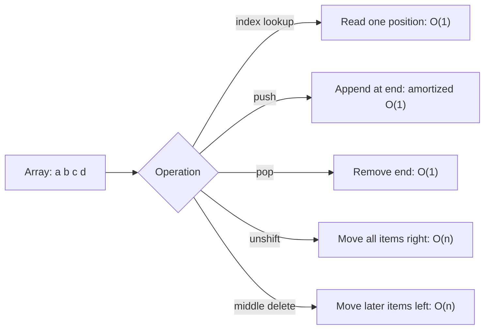

# Arrays: Data Structures and Interview Notes

This note follows `array_data_structures.js`. An array stores elements in an ordered sequence, and each element is identified by an index.

```text
index:  0    1    2    3    4
value: [ a,   b,   c,   d,   e ]
```

JavaScript arrays are dynamic. They can grow and shrink automatically, but the operations still have different time costs.

## 1. Big-O operations

| Operation              |     Typical time | Why                                                |
| ---------------------- | ---------------: | -------------------------------------------------- |
| Lookup by index        |           `O(1)` | The index directly identifies the position         |
| `push(item)`           | Amortized `O(1)` | Adds at the end; occasional resize can cost `O(n)` |
| `pop()`                |           `O(1)` | Removes the last item                              |
| `unshift(item)`        |           `O(n)` | Existing items must move right                     |
| Insert in the middle   |           `O(n)` | Items after the insertion point must move          |
| Delete from the middle |           `O(n)` | Items after the deleted item must move left        |
| Search by value        |           `O(n)` | May inspect every item                             |

`O(n/2)` is still reported as `O(n)` in Big-O notation because constant factors are ignored. In the worst case, a middle insertion or deletion still grows linearly with the array size.

## 2. Built-in array operations

```js
const strings = ["a", "b", "c", "d", "e"];

strings.push("f"); // ["a", "b", "c", "d", "e", "f"]
strings.pop(); // removes "f"
strings.unshift("x"); // inserts at index 0; shifts existing values
strings.splice(2, 0, "alien"); // inserts at index 2
```

### Access by index

```js
console.log(strings[0]); // O(1)
strings[0] = "first"; // O(1)
```

The first element is index `0`, not index `1`. For an array with `length === 5`, the valid indexes are `0` through `4`.

### `push` and `pop`

These are efficient because they operate at the end of the array:

```js
const values = [1, 2, 3];

values.push(4); // [1, 2, 3, 4]
values.pop(); // returns 4; values is [1, 2, 3]
```

`push` is amortized `O(1)`: most calls are constant time, but a resize and copy may occasionally cost `O(n)`.

### `unshift`

Adding at the beginning requires shifting every existing item one position:

```text
Before: [a, b, c, d]
After:  [x, a, b, c, d]
					<- every old item moves
```

Therefore `unshift` is `O(n)`. For frequent front insertion and removal, consider a queue structure or a deque implementation.

### `splice`

The signature is `splice(start, deleteCount, ...items)`:

```js
const letters = ["a", "b", "c", "d"];

letters.splice(2, 0, "x"); // insert "x" at index 2
// ["a", "b", "x", "c", "d"]

letters.splice(1, 2); // remove two items starting at index 1
// ["a", "c", "d"]
```

`splice` mutates the original array. Inserting or deleting in the middle is generally `O(n)`.

## 3. Static versus dynamic arrays

### Static array

A static array has a fixed capacity. Its memory is reserved before use. When it becomes full, it cannot accept another item without creating a larger array.

### Dynamic array

A dynamic array grows when it runs out of capacity. A common strategy is:

1. Allocate a larger block of memory.
2. Copy the existing elements.
3. Add the new element.
4. Release the old block.

This explains why a single append can cost `O(n)`, even though appending is `O(1)` amortized over many operations. JavaScript manages this capacity internally.

## 4. Building an array-like structure

`MyArray` uses an object as indexed storage:

```js
class MyArray {
  constructor() {
    this.length = 0;
    this.data = {};
  }
}
```

The intended invariant is:

```text
length = number of logical elements
data[0] ... data[length - 1] = stored values
```

### `get`

```js
get(index) {
	return this.data[index];
}
```

This retrieves a value by key and is treated as `O(1)` average time for this simple implementation.

### `push`

```js
push(item) {
	this.data[this.length] = item;
	this.length++;
	return this.length;
}
```

The current `length` is the next available index. The method stores the item, increments the length, and returns the new length.

Time: `O(1)` average, space: `O(1)` additional space per item.

### `pop`

```js
pop() {
	const lastItem = this.data[this.length - 1];
	delete this.data[this.length - 1];
	this.length--;
	return lastItem;
}
```

This removes the final item without shifting other values, so it is `O(1)` average.

Edge case to consider: calling `pop()` on an empty `MyArray` produces an invalid negative length. A production implementation should guard it:

```js
if (this.length === 0) {
  return undefined;
}
```

### `delete` and `shiftItems`

```js
delete(index) {
	const item = this.data[index];
	this.shiftItems(index);
	return item;
}
```

`shiftItems` closes the gap by copying every later item one position to the left:

```text
Delete index 1:
Before: [a, b, c, d]
After:  [a, c, d]
						 c -> index 1
								 d -> index 2
```

The loop visits the items after the deleted index, so deletion is `O(n)` in the worst case. It also uses `O(1)` additional space.

## 5. Safer `MyArray` version

The original exercise is useful for learning, but these guards make its behavior clearer:

```js
class SafeArray {
  constructor() {
    this.length = 0;
    this.data = {};
  }

  get(index) {
    if (index < 0 || index >= this.length) {
      return undefined;
    }
    return this.data[index];
  }

  push(item) {
    this.data[this.length] = item;
    this.length += 1;
    return this.length;
  }

  pop() {
    if (this.length === 0) {
      return undefined;
    }

    const lastIndex = this.length - 1;
    const item = this.data[lastIndex];
    delete this.data[lastIndex];
    this.length -= 1;
    return item;
  }

  delete(index) {
    if (index < 0 || index >= this.length) {
      return undefined;
    }

    const item = this.data[index];
    for (
      let currentIndex = index;
      currentIndex < this.length - 1;
      currentIndex += 1
    ) {
      this.data[currentIndex] = this.data[currentIndex + 1];
    }

    delete this.data[this.length - 1];
    this.length -= 1;
    return item;
  }
}
```

## 6. Interview explanation

When asked why array lookup is `O(1)`, explain that a contiguous array can calculate an element's address from its starting address and index:

```text
address of item = base address + (index * item size)
```

When asked why insertion at the beginning is `O(n)`, explain that all existing elements must shift to make room. When asked about `push`, mention amortized `O(1)` and the occasional resize cost.

### Common follow-up questions

**Why is `pop` faster than `shift`?**

`pop` removes the last item and does not move other items. `shift` removes index `0`, so every remaining item must move left.

**Why can `push` occasionally be `O(n)`?**

The internal capacity may be full. The runtime allocates more space and copies existing elements before appending.

**What is the difference between an array and a linked list?**

Arrays provide fast indexed lookup, usually `O(1)`, but middle insertion requires shifting. Linked lists require `O(n)` traversal for indexed lookup, but insertion can be `O(1)` once the insertion node is known.

**What is the space complexity of an array?**

Storing `n` elements requires `O(n)` space. An operation such as middle deletion in the shown implementation uses `O(1)` extra space.

## Array operation diagram



## Source-file corrections to remember

- `array_data_structures.js` calls `string.pop()`, but the declared variable is `strings`. That line should be `strings.pop()` before running the file.
- The comment `5 * 4 = 20` is not a reliable description of JavaScript string memory. JavaScript engines manage representation and memory internally; use Big-O for algorithm analysis rather than estimating character storage this way.
- The custom class is educational. Native arrays provide many more behaviors, validation rules, and runtime optimizations.

## Quick revision checklist

1. Index lookup is `O(1)`.
2. `push` is amortized `O(1)`; `pop` is `O(1)`.
3. `unshift`, middle insertion, and middle deletion are `O(n)`.
4. A dynamic array occasionally resizes and copies elements.
5. `splice` mutates the original array.
6. A custom array must keep `length` and indexed storage consistent.
7. Always define behavior for empty arrays and invalid indexes.
