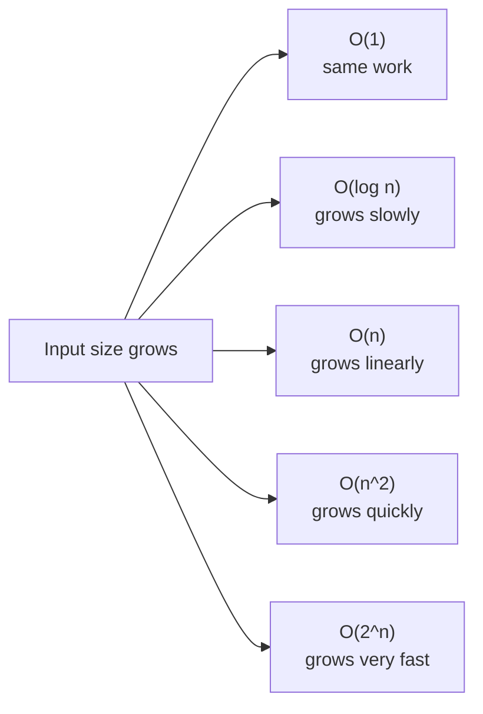

# Big O Notation in JavaScript

## 1) What is Big O?

Big O notation describes how the running time or space usage of an algorithm grows as the input size grows.

It helps us answer one simple question:

> If the input gets bigger, how much slower or larger does the solution become?

Big O focuses on the worst-case growth pattern, not the exact number of milliseconds.

### Why it matters

- it helps compare algorithms
- it shows whether code scales
- it helps you write readable and efficient solutions

## 2) Common Big O classes

| Big O | Name | Example |
|------|------|---------|
| O(1) | Constant | Accessing an array element by index |
| O(log n) | Logarithmic | Binary search |
| O(n) | Linear | Looping through an array once |
| O(n log n) | Linearithmic | Merge sort, quicksort |
| O(n^2) | Quadratic | Nested loops |
| O(2^n) | Exponential | Recursive Fibonacci |
| O(n!) | Factorial | Generating all permutations |

## 3) Big picture diagram



The larger the growth rate, the less scalable the algorithm becomes for large inputs.

## 4) Example from `app.js`: O(n)

Your `findNemo` example checks every item until it finds `"nemo"`:

```js
function findNemo(array) {
  let t0 = performance.now();

  for (let i = 0; i < array.length; i++) {
    if (array[i] === "nemo") {
      console.log("Found Nemo!");
      break;
    }
  }

  let t1 = performance.now();
  console.log("Call to findNemo took " + (t1 - t0) + " milliseconds.");
}
```

### Why this is O(n)

- the loop may inspect each element once
- if the array is bigger, the work can grow proportionally
- worst case: `"nemo"` is near the end or not present

### Example calls

```js
findNemo(["nemo"]); // O(1) in practice for this tiny array, but the algorithm is still O(n)
findNemo(everyone); // O(n)
findNemo(largeArray); // O(n)
```

> Important: Big O describes the algorithm, not one specific run.

## 5) Constant time: O(1)

Accessing a single array item by index is constant time:

```js
const firstCompression = (array) => {
  console.log(array[0]);
};
```

No matter whether the array has 5 items or 5 million items, `array[0]` is still one direct lookup.

Another example:

```js
function logFirstTwoBoxes(boxes) {
  console.log(boxes[0]);
  console.log(boxes[1]);
}
```

This is still O(1) because the number of operations does not grow with input size.

## 6) Linear time: O(n)

If you loop through every element once, the time is linear.

```js
for (let i = 0; i < array.length; i++) {
  console.log(array[i]);
}
```

If the input doubles, the work roughly doubles too.

## 7) Nested loops: O(n^2)

If one loop runs inside another loop, the complexity usually becomes quadratic.

```js
for (let i = 0; i < n; i++) {
  for (let j = 0; j < n; j++) {
    console.log(i, j);
  }
}
```

This grows much faster than O(n), so it can become expensive very quickly.

## 8) Binary search: O(log n)

Binary search cuts the search space in half each step.

```js
function binarySearch(sortedArray, target) {
  let left = 0;
  let right = sortedArray.length - 1;

  while (left <= right) {
    const mid = Math.floor((left + right) / 2);

    if (sortedArray[mid] === target) return mid;
    if (sortedArray[mid] < target) left = mid + 1;
    else right = mid - 1;
  }

  return -1;
}
```

Because the search space shrinks by half each time, the growth is much slower than linear.

## 9) How to analyze the examples in `app.js`

### `funChallenge(array)`

```js
function funChallenge(array) {
  let a = 10;
  a = 50 + 3;

  for (let i = 0; i < array.length; i++) {
    anotherFunction();
    let stranger = true;
    a++;
  }

  return a;
}
```

This is O(n) because the loop depends on the input size.

### `printFirstItemThenFirstHalfThenSayHi100Times(items)`

```js
function printFirstItemThenFirstHalfThenSayHi100Times(items) {
  console.log(items[0]);

  var middleIndex = Math.floor(items.length / 2);
  var index = 0;

  while (index < middleIndex) {
    console.log(items[index]);
    index++;
  }

  for (var i = 0; i < 100; i++) {
    console.log("hi");
  }
}
```

This becomes O(n) because:

- `items[0]` is O(1)
- the `while` loop runs about `n/2` times, which simplifies to O(n)
- the `for` loop runs 100 times, which is O(1)

Final answer: **O(n)**

### `anotherFunChallenge(input)`

```js
function anotherFunChallenge(input) {
  let a = 5;
  let b = 10;
  let c = 50;

  for (let i = 0; i < input.length; i++) {
    let x = i + 1;
    let y = i + 2;
    let z = i + 3;
  }

  for (let j = 0; j < input.length; j++) {
    let p = j * 2;
    let q = j * 2;
  }

  let whoAmI = "I am a mysterious variable";
}
```

This is also O(n).

Even though there are two loops, they run one after the other, not inside each other:

- first loop: O(n)
- second loop: O(n)
- constants are ignored

So the total becomes:

```text
O(n + n) = O(2n) = O(n)
```

## 10) Simplifying rules

### Rule 1: Drop constants

```text
O(2n) -> O(n)
O(100) -> O(1)
```

### Rule 2: Drop non-dominant terms

```text
O(n^2 + n) -> O(n^2)
O(n + log n) -> O(n)
```

### Rule 3: Different inputs may use different variables

```js
function twoArrays(a, b) {
  for (let i = 0; i < a.length; i++) {}
  for (let j = 0; j < b.length; j++) {}
}
```

This is **O(a + b)**, not just O(n), because there are two separate inputs.

## 11) Good code = readable + scalable

From your notes:

1. readable
2. scalable

That is a great way to think about good code:

- readable code is easy to understand
- scalable code performs well as input grows

## 12) Quick recap

- Big O describes growth, not exact speed
- O(1) is constant time
- O(n) grows with input size
- O(n^2) gets expensive fast
- O(log n) is very efficient for large inputs
- remove constants and lower-order terms when simplifying

## 13) Interview-ready answer

**What is Big O?**  
Big O notation is a way to describe how an algorithm scales in time or space as input size increases.

**Why is it useful?**  
It helps compare solutions and choose the one that will still perform well for large inputs.

**How do you simplify Big O?**  
Ignore constants and non-dominant terms, and keep the most important growth factor.

## 14) Final mental model

Think of Big O as a growth chart:

- O(1): flat line
- O(log n): slow climb
- O(n): steady climb
- O(n^2): steep climb

The goal is to prefer algorithms with slower growth whenever possible.
