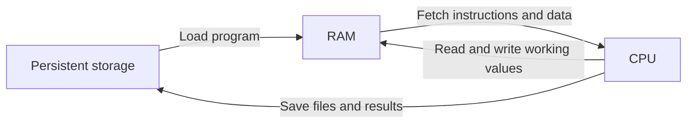
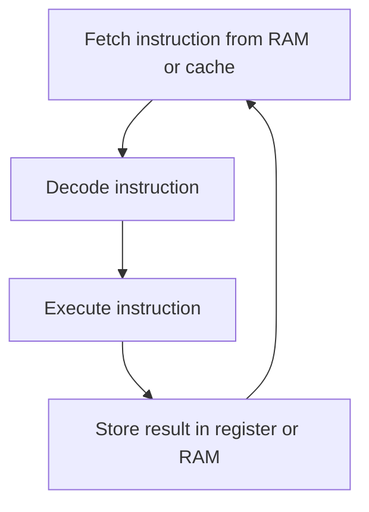
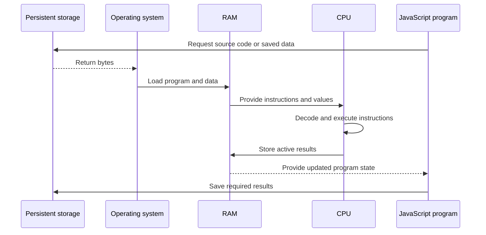
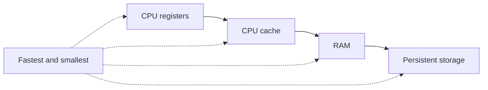

# Data Structures and Computer Fundamentals

These notes are based on the outline in [DSA/app.js](app.js). They explain what data structures and algorithms are, how to choose a data structure, and how a computer executes a program using the CPU, RAM, and persistent storage.

---

## 1. What Is a Data Structure?

A data structure is a way to organize and store data so that we can use it efficiently.

The best data structure depends on what the program needs to do:

- store items in order
- find an item quickly
- add or remove items
- represent relationships between items
- process items in a particular order

### Simple example

```js
const shoppingList = ["milk", "bread", "eggs"];

shoppingList.push("fruit");
console.log(shoppingList[0]); // milk
```

Here, an array stores values in an ordered collection. It gives fast access when we already know the index.

### Interview answer

A data structure is a way of organizing data in memory so that operations such as access, search, insertion, and deletion can be performed efficiently.

---

## 2. What Is an Algorithm?

An algorithm is a clear sequence of steps used to solve a problem.

For example, to find a name in an unsorted list, we can check each item from left to right until we find a match.

```js
function findName(names, target) {
  for (const name of names) {
    if (name === target) {
      return true;
    }
  }

  return false;
}

console.log(findName(["Ana", "Ravi", "Maya"], "Ravi")); // true
```

This is a linear search. If there are `n` names, the worst case checks all `n` values, so its time complexity is $O(n)$.

### Data structure plus algorithm

The data structure stores the data. The algorithm describes how we process that data.

Example:

- array: stores the names
- linear search: checks the names one by one

---

## 3. How to Choose a Data Structure

Before choosing a data structure, ask these questions:

1. Do I need to preserve insertion order?
2. Do I need fast lookup by a key?
3. Do I need fast insertion or deletion at the beginning or end?
4. Do the values have parent-child relationships?
5. Do the values form a network of connections?
6. What is the expected time and memory complexity?

### Common data structures

| Data structure | Useful for                      | Typical example      |
| -------------- | ------------------------------- | -------------------- |
| Array          | Ordered values and index access | List of products     |
| Object / Map   | Key-value lookup                | User ID to user data |
| Set            | Unique values                   | Removing duplicates  |
| Stack          | Last-in, first-out processing   | Undo history         |
| Queue          | First-in, first-out processing  | Print jobs           |
| Linked list    | Sequential nodes with links     | Playlist navigation  |
| Tree           | Hierarchical data               | File system          |
| Graph          | Connected entities              | Social network       |
| Heap           | Priority-based removal          | Task scheduler       |

---

## 4. Important Data Structure Examples

### Array

An array stores values in an ordered collection.

```js
const numbers = [10, 20, 30];

numbers.push(40); // add at the end
numbers.pop(); // remove from the end
console.log(numbers[1]); // 20
```

Access by index is usually $O(1)$. Searching for an unknown value is usually $O(n)$.

### Stack

A stack follows **LIFO**: last in, first out.

```js
const stack = [];

stack.push("first");
stack.push("second");
console.log(stack.pop()); // second
```

Common uses include function calls, undo actions, and browser history.

### Queue

A queue follows **FIFO**: first in, first out.

```js
const queue = [];

queue.push("first");
queue.push("second");
console.log(queue.shift()); // first
```

For a large queue, repeatedly using `shift()` can be expensive because remaining elements may need to be re-indexed. A head index or a dedicated queue implementation is often better.

### Map and Set

```js
const users = new Map();
users.set("user-1", { name: "Maya" });
console.log(users.get("user-1"));

const uniqueNumbers = new Set([1, 1, 2, 3]);
console.log(uniqueNumbers); // Set { 1, 2, 3 }
```

- `Map` stores key-value pairs.
- `Set` stores unique values.

---

## 5. What Happens When a Program Runs?

The program is stored on persistent storage, loaded into RAM, and then processed by the CPU.



This is a simplified model. Modern computers also use caches, registers, an operating system, and many other components, but the model is useful for interview fundamentals.

---

## 6. CPU: The Processor

The CPU executes instructions. It performs calculations, comparisons, control flow, and other operations requested by a program.

The CPU commonly contains:

- **Control unit:** coordinates instruction execution.
- **Arithmetic Logic Unit:** performs arithmetic and logical operations.
- **Registers:** very small and very fast storage inside the CPU.
- **Cache:** fast memory close to the CPU that stores frequently used data.

### Simplified instruction cycle



### Example

For this code:

```js
const total = 2 + 3;
```

The program needs to:

1. load the instruction and values
2. decode the addition operation
3. calculate the result
4. store `5` so the program can use it

The actual JavaScript engine performs many additional steps, but this is the useful high-level model.

---

## 7. RAM: Working Memory

RAM is temporary working memory used by running programs.

When a program is running, its instructions and active data are loaded into RAM. RAM is much faster than persistent storage, but it is volatile: its contents are lost when the machine powers off.

```js
const activeUser = {
  name: "Maya",
  loggedIn: true,
};
```

While the program is running, values such as `activeUser` are held in memory managed by the JavaScript runtime. Objects and arrays use memory, and unused values can later be removed by garbage collection.

### Important RAM ideas

- more RAM allows more programs and data to stay active
- RAM is temporary, not permanent storage
- memory usage contributes to space complexity
- a memory leak happens when unused objects remain reachable

---

## 8. Persistent Storage

Persistent storage keeps data after the computer is turned off. Examples include SSDs, hard drives, and external storage.

Storage is used for:

- source code
- installed applications
- databases
- images and documents
- saved program state

Storage is generally slower than RAM, so a program usually loads the data it needs into RAM before processing it.

### RAM versus storage

| Feature    | RAM                         | Persistent storage               |
| ---------- | --------------------------- | -------------------------------- |
| Purpose    | Active working data         | Long-term saved data             |
| Volatility | Loses data when powered off | Keeps data when powered off      |
| Speed      | Faster                      | Slower than RAM                  |
| Example    | Running variables           | JavaScript file or database file |
| Capacity   | Usually smaller             | Usually larger                   |

---

## 9. Complete Data Flow



### In one sentence

Storage keeps the program, RAM holds the active program, and the CPU executes the instructions.

---

## 10. How This Connects to DSA

Data structures affect how data is stored in memory, and algorithms affect how much work the CPU performs.

For example:

```js
const scores = [40, 80, 95, 60];

function containsScore(scores, target) {
  for (const score of scores) {
    if (score === target) {
      return true;
    }
  }

  return false;
}
```

- the array stores the scores in RAM while the program runs
- the CPU compares each score with `target`
- the algorithm may inspect every item, giving $O(n)$ time complexity
- the input array takes $O(n)$ space

### Interview connection

When explaining a DSA solution, describe:

1. the data structure you selected
2. the algorithm steps
3. time complexity
4. space complexity
5. why this choice fits the problem

---

## 11. Quick Interview Revision

### What is a data structure?

A data structure organizes data so operations can be performed efficiently.

### What is an algorithm?

An algorithm is a finite sequence of steps that solves a problem.

### What is the difference between RAM and storage?

RAM is fast, temporary memory for active programs. Storage is slower, persistent memory for files and saved data.

### What does the CPU do?

The CPU fetches, decodes, and executes instructions, then stores the results in registers, cache, or RAM.

### What should I mention in a DSA interview?

Explain the chosen data structure, the algorithm, the time complexity, the space complexity, and the trade-offs.

---

## Final Summary

The computer fundamentals are connected:

- persistent storage keeps the program permanently
- RAM holds the running program and active data
- the CPU executes the instructions
- data structures organize the data
- algorithms tell the CPU how to process it
- Big O describes how time and memory usage grow as input size increases

Understanding this connection makes DSA solutions easier to explain in interviews.

---

## 12. CPU Cache and Bits

The latest notes in `app.js` mention CPU cache and how many values can be represented with different numbers of bits.

### CPU cache

CPU cache is very fast memory located close to the CPU. It stores frequently used instructions and data so the CPU does not always need to wait for RAM.



In general, moving from storage toward CPU registers gives faster access but less capacity and higher cost.

### What does a bit represent?

A bit can hold either `0` or `1`. With `n` bits, there are $2^n$ possible bit patterns.

For an unsigned value, the range is:

$$0 \text{ through } 2^n - 1$$

| Bits |          Possible values |             Unsigned maximum |
| ---: | -----------------------: | ---------------------------: |
|    8 |              $2^8 = 256$ |                        $255$ |
|   16 |        $2^{16} = 65,536$ |                     $65,535$ |
|   32 | $2^{32} = 4,294,967,296$ |              $4,294,967,295$ |
|   64 |                 $2^{64}$ | $18,446,744,073,709,551,615$ |

This table describes unsigned integer storage. It should not be interpreted as the exact internal representation of every JavaScript number.

---

## 13. JavaScript Number Limits

JavaScript uses the `Number` type for ordinary numeric values. It is based on the IEEE 754 double-precision floating-point format, not a simple unsigned 64-bit integer.

```js
console.log(Number.MAX_SAFE_INTEGER); // 9007199254740991
console.log(Math.pow(6, 1000)); // Infinity
```

### Important points

- `Number.MAX_SAFE_INTEGER` is $2^{53} - 1$.
- Integers larger than the safe range may lose precision.
- Very large floating-point results can become `Infinity`.
- `BigInt` can represent arbitrarily large integers, but it cannot be mixed directly with `Number` in arithmetic.

```js
const safeNumber = Number.MAX_SAFE_INTEGER;
const largeInteger = 123456789012345678901234567890n;

console.log(safeNumber);
console.log(largeInteger);
```

### Interview answer

JavaScript numbers are usually 64-bit floating-point values, but that does not mean every integer up to $2^{64} - 1$ is represented exactly. Safe integer precision ends at $2^{53} - 1$ for the `Number` type.

---

## 14. JavaScript Data Types

The `app.js` notes divide values into primitive and non-primitive types.

### Primitive values

Primitive values are individual, immutable values:

```js
const count = 10; // number
const message = "hello"; // string
const isReady = true; // boolean
let result; // undefined
const emptyValue = null;
```

Common primitive types include:

- `number`
- `string`
- `boolean`
- `undefined`
- `null`
- `bigint`
- `symbol`

### Non-primitive values

Objects, arrays, and functions are reference values.

```js
const numbers = [1, 2, 3];
const user = { name: "Maya" };
const sayHello = function () {
  return "Hello";
};
```

The variable stores a reference to the object in memory. Two variables can refer to the same object:

```js
const firstUser = { name: "Maya" };
const secondUser = firstUser;

secondUser.name = "Ravi";
console.log(firstUser.name); // Ravi
```

### Interview answer

Primitive values are copied by value. Objects and arrays are reference values, so assigning them to another variable copies the reference to the same object.

---

## 15. Common Data Structure Operations

The notes in `app.js` list the main operations we perform on data structures.

### 1. Insertion

Adding a new value.

```js
const values = [10, 20];
values.push(30);
```

### 2. Deletion

Removing a value.

```js
values.pop();
```

### 3. Traversal

Visiting each value.

```js
for (const value of values) {
  console.log(value);
}
```

### 4. Searching

Checking whether a value exists.

```js
values.includes(20); // true
```

### 5. Sorting

Reordering values according to a rule.

```js
const scores = [30, 10, 20];
scores.sort((left, right) => left - right);
```

### 6. Access

Reading a value at a known location.

```js
console.log(values[0]);
```

The cost of each operation depends on the data structure. For example, array access by index is usually $O(1)$, while searching an unsorted array is usually $O(n)$.

---

## 16. Final Interview Summary

When explaining these fundamentals in an interview, connect the layers:

1. Bits represent low-level binary information.
2. CPU cache, RAM, and storage hold data at different speeds and capacities.
3. JavaScript values are represented in memory as primitives or objects.
4. Data structures organize those values.
5. Algorithms perform operations such as insertion, search, traversal, and sorting.
6. Big O explains how the time and memory cost changes as the input grows.
