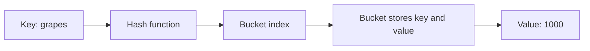
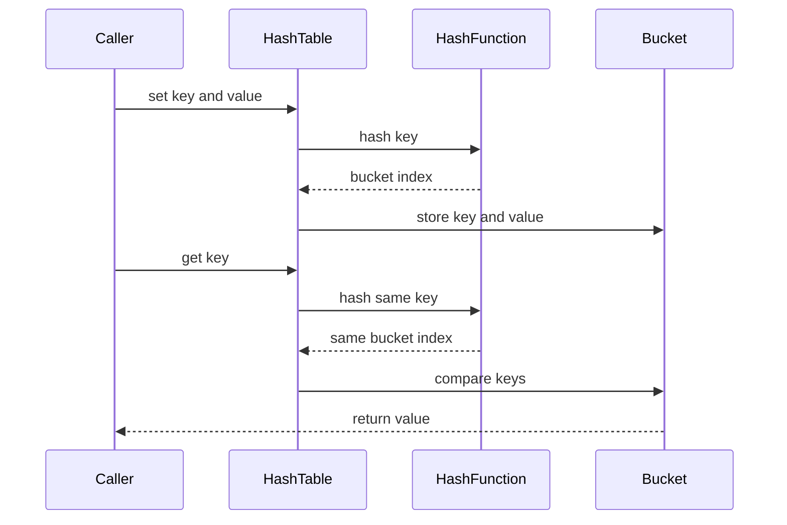
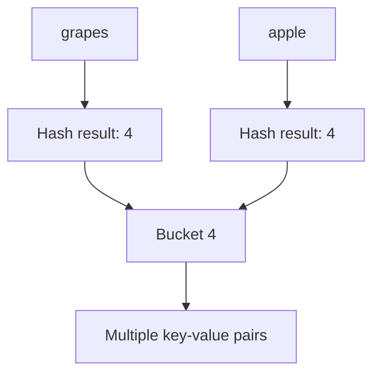
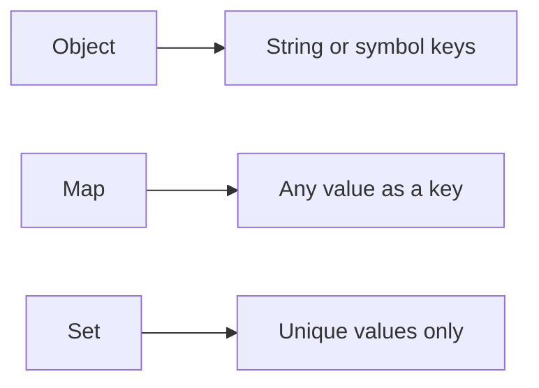
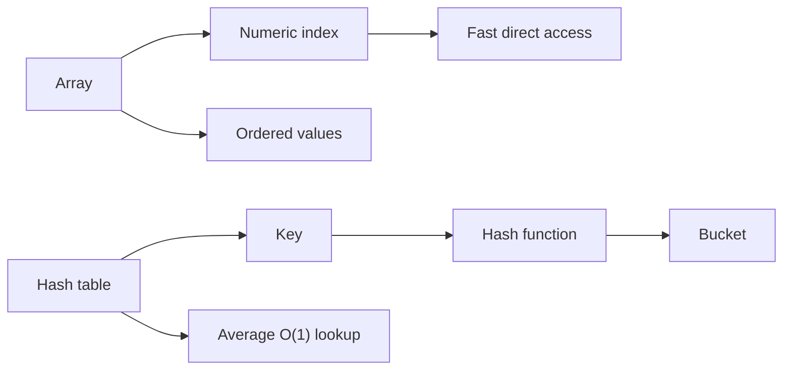

# Hash Tables in JavaScript

A **hash table** stores data as key-value pairs. Given a key, a hash function converts that key into an array index called a **bucket address**. This lets us find values quickly without scanning every item.

In JavaScript, plain objects and `Map` are common hash-table-like data structures.



## 1. Key-value pairs

A key identifies a value. In this object, `age`, `name`, `magic`, and `scream` are keys or properties.

```js
const user = {
  age: 54,
  name: "Kylie",
  magic: true,
  scream() {
    console.log("ahhhhhhh");
  },
};

user.age; // 54
user.spell = "abracadabra";
user.scream();
```

Reading and writing a known object property are usually described as average **O(1)** operations:

```js
user.name; // O(1) average lookup
user.name = "Maya"; // O(1) average write
```

`O(1)` means that the operation does not normally become slower as the number of stored items grows. It is an average case, not a guarantee for every implementation or workload.

## 2. How a hash table works

The process has several steps:

1. Start with a key such as `"grapes"`.
2. Pass the key to a hash function.
3. Convert the hash into a valid array index with modulo `%`.
4. Store the key and value in that bucket.
5. To read a value, hash the same key and inspect that bucket.



## 3. The hash function

A hash function turns a string into a number. The example from `app.js` uses each character's UTF-16 code unit and keeps the result inside the backing array with `%`.

```js
function hash(key, tableSize) {
  let hashValue = 0;

  for (let index = 0; index < key.length; index += 1) {
    hashValue = (hashValue + key.charCodeAt(index) * index) % tableSize;
  }

  return hashValue;
}

hash("grapes", 50); // an integer from 0 through 49
```

The modulo operation guarantees that the result is a valid index:

$$
  ext{bucketIndex} = \text{hashValue} \bmod \text{tableSize}
$$

A good hash function should be deterministic, reasonably fast, and distribute keys across buckets. The same key must always produce the same index for the same table size.

## 4. Collisions

A **collision** happens when different keys produce the same bucket index. Different keys cannot always be assigned different indexes because the number of possible keys is much larger than the number of buckets.



The usual solution is **separate chaining**: each bucket stores a small collection of key-value pairs. When reading, hash the key and then search only that bucket.

```text
bucket 4 -> [ ["grapes", 1000], ["apple", 100] ]
```

With collisions, a lookup can become **O(n / k)** in the simplified explanation from the source file, where `n` is the number of stored entries and `k` is the number of buckets. In a well-distributed table, each bucket stays small and average lookup remains close to O(1). A heavily overloaded or poorly distributed table can approach O(n).

## 5. A working hash table implementation

This implementation uses an array of buckets. Each bucket contains entries in the form `[key, value]`.

```js
class HashTable {
  constructor(size = 10) {
    this.data = new Array(size);
  }

  _hash(key) {
    let hashValue = 0;

    for (let index = 0; index < key.length; index += 1) {
      hashValue =
        (hashValue + key.charCodeAt(index) * index) % this.data.length;
    }

    return hashValue;
  }

  set(key, value) {
    const address = this._hash(key);

    if (!this.data[address]) {
      this.data[address] = [];
    }

    const bucket = this.data[address];
    const existingEntry = bucket.find((entry) => entry[0] === key);

    if (existingEntry) {
      existingEntry[1] = value;
    } else {
      bucket.push([key, value]);
    }

    return this;
  }

  get(key) {
    const address = this._hash(key);
    const bucket = this.data[address];

    if (!bucket) {
      return undefined;
    }

    const entry = bucket.find((item) => item[0] === key);
    return entry ? entry[1] : undefined;
  }

  keys() {
    const keys = [];

    for (const bucket of this.data) {
      if (bucket) {
        for (const [key] of bucket) {
          keys.push(key);
        }
      }
    }

    return keys;
  }

  values() {
    const values = [];

    for (const bucket of this.data) {
      if (bucket) {
        for (const [, value] of bucket) {
          values.push(value);
        }
      }
    }

    return values;
  }
}

const table = new HashTable(50);

table.set("grapes", 1000);
table.set("apple", 100);
table.set("oranges", 50);

table.get("grapes"); // 1000
table.get("missing"); // undefined
table.keys(); // ["grapes", "apple", "oranges"]
table.values(); // [1000, 100, 50]
```

### How `set` works

1. Hash the key to calculate `address`.
2. Create an empty bucket if the address has no bucket yet.
3. Search the bucket for the same key.
4. Update the old value if the key exists.
5. Otherwise, append a new `[key, value]` entry.

### How `get` works

1. Hash the key again.
2. Jump directly to the same address.
3. Search only that bucket.
4. Return the value for the matching key.
5. Return `undefined` when the key is missing.

### Important correction in the source example

The original `app.js` uses:

```js
this.data[address].push(key, value);
```

But its `get` method expects each bucket item to be a pair, such as `[key, value]`. The compatible version is:

```js
this.data[address].push([key, value]);
```

Without the nested pair, collisions and lookups do not work as intended. The `keys` and `values` methods also need to loop through every entry in each bucket, as shown in the working implementation above.

## 6. JavaScript `Object`, `Map`, and `Set`

### Object

An object is convenient when keys are strings or symbols and the data represents named properties.

```js
const scores = {
  Maya: 95,
  Rohan: 88,
};

scores.Maya; // 95
```

Plain objects do not guarantee that arbitrary values such as arrays or functions will work as distinct keys. Object keys are generally strings or symbols.

### Map

`Map` is designed for key-value storage and allows keys of any data type. It also preserves insertion order when iterated.

```js
const map = new Map();
const objectKey = { id: 1 };
const functionKey = () => "key";

map.set("name", "Maya");
map.set(objectKey, "object value");
map.set(functionKey, "function value");

map.get(objectKey); // "object value"
map.has("name"); // true
map.size; // 3
```

### Set

`Set` stores unique values rather than key-value pairs. It is useful for membership checks and removing duplicates.

```js
const uniqueNumbers = new Set([1, 2, 2, 3]);

uniqueNumbers.has(2); // true
uniqueNumbers.size; // 3
```



## 7. Complexity summary

| Operation       | Average case | Collision-heavy case |
| --------------- | ------------ | -------------------- |
| Set or insert   | O(1)         | O(n) bucket search   |
| Get or lookup   | O(1)         | O(n) bucket search   |
| Delete          | O(1)         | O(n) bucket search   |
| Search all keys | O(n)         | O(n)                 |

The exact complexity depends on the hash function, number of buckets, load factor, and collision strategy.

## Hash table checklist

- What is the key and what is the value?
- Which hash function maps the key to an address?
- How are collisions handled?
- Does each bucket store complete `[key, value]` pairs?
- What happens when a key is missing?
- Does setting an existing key update or duplicate its value?
- Should this data use an object, `Map`, or `Set`?

## 8. Hash tables versus arrays

Choose the structure based on how the data will be accessed:

- Use an **array** when items are naturally ordered and you access them by numeric index.
- Use a **hash table** when you access values by a key such as a name or ID.



### Time complexity comparison

Let `n` be the number of stored items. For a hash table, the average cases assume a good hash function and a reasonable load factor.

| Operation                           | Array          | Hash table average | Hash table worst case |
| ----------------------------------- | -------------- | ------------------ | --------------------- |
| Access by index or key              | O(1)           | O(1)               | O(n)                  |
| Search by value                     | O(n)           | O(n)               | O(n)                  |
| Insert at the end                   | O(1) amortized | O(1)               | O(n)                  |
| Insert at the beginning or middle   | O(n)           | O(1) average       | O(n)                  |
| Update a known item                 | O(1) by index  | O(1) average       | O(n)                  |
| Delete from the end                 | O(1)           | O(1) average       | O(n)                  |
| Delete from the beginning or middle | O(n)           | O(1) average       | O(n)                  |
| Iterate through all items           | O(n)           | O(n)               | O(n)                  |

### Array example

An array gives direct access when the numeric index is known. Inserting or deleting in the middle shifts later items, which makes that operation O(n).

```js
const users = ["Maya", "Rohan", "Sally"];

users[1]; // "Rohan" - O(1)
users.push("Tim"); // O(1) amortized
users.unshift("Ava"); // O(n), shifts existing items
users.includes("Sally"); // O(n), searches values
```

### Hash table example

A hash table gives average O(1) access when the key is known. It does not need to shift unrelated entries when a new key is added.

```js
const userAges = new Map([
  ["Maya", 29],
  ["Rohan", 32],
  ["Sally", 27],
]);

userAges.get("Rohan"); // 32 - O(1) average
userAges.set("Tim", 35); // O(1) average
userAges.has("Sally"); // O(1) average
userAges.delete("Maya"); // O(1) average
```

### Space complexity

Both structures use O(n) space for `n` stored items, but their memory layout is different:

| Structure  | Stored data                 | Space complexity | Extra memory                       |
| ---------- | --------------------------- | ---------------- | ---------------------------------- |
| Array      | Values in indexed positions | O(n)             | Small; may include unused capacity |
| Hash table | Key-value entries           | O(n)             | Bucket array and collision chains  |

If a hash table has `m` buckets and `n` entries, its total space can be described as:

$$
O(m + n)
$$

The bucket array contributes `O(m)`, and the stored key-value entries contribute `O(n)`. A larger bucket array can reduce collisions but uses more memory.

### Which one should you choose?

| Requirement                           | Better choice                        | Reason                                      |
| ------------------------------------- | ------------------------------------ | ------------------------------------------- |
| Preserve order and access by position | Array                                | Numeric indexes are direct and simple       |
| Find a value by a unique key          | Hash table or `Map`                  | Average O(1) key lookup                     |
| Search for a value without its key    | Array                                | Both require a scan, but arrays are simpler |
| Frequent insertions in the middle     | Hash table if key-based access works | Arrays must shift items                     |
| Store unique values only              | `Set`                                | Uniqueness is built in                      |

The important distinction is **index versus key**: arrays are optimized for positions, while hash tables are optimized for key-based lookup.
