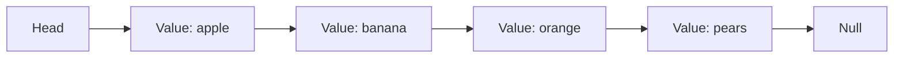
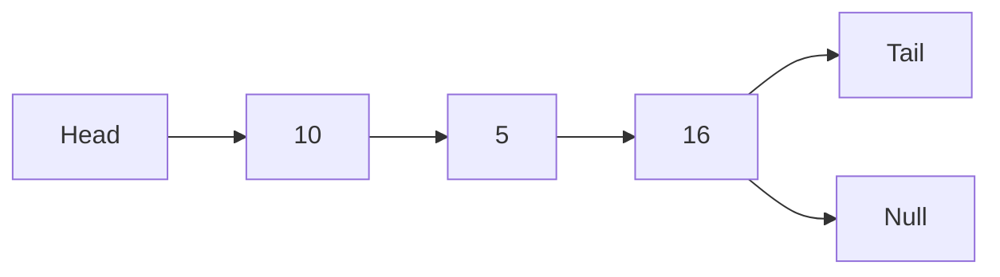
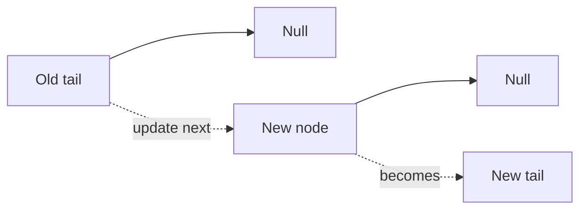
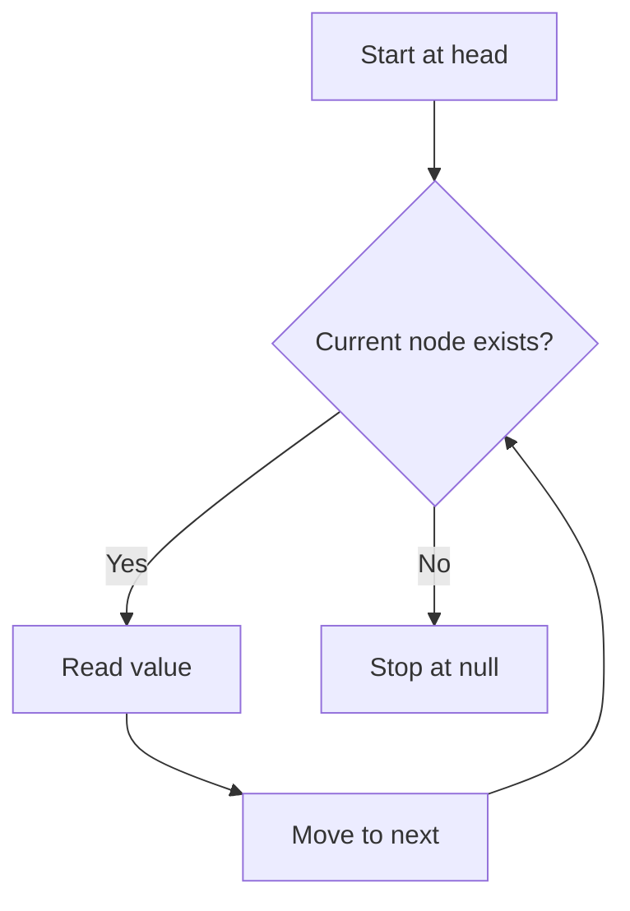
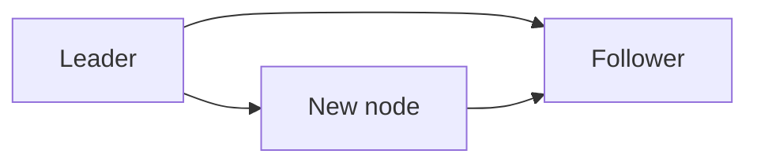
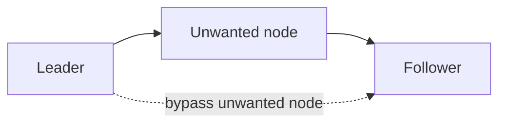
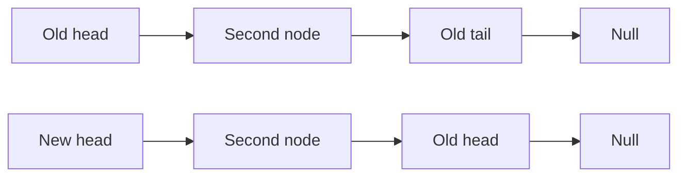
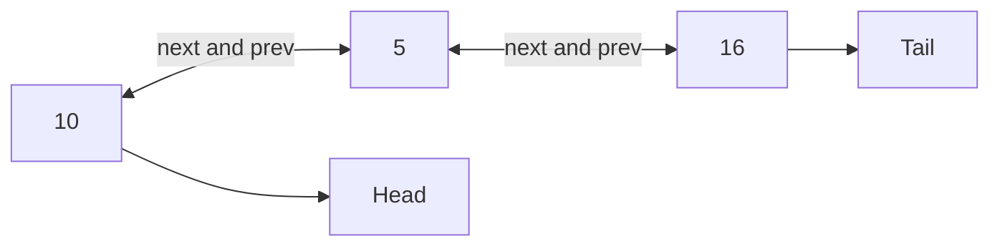

# Linked Lists in JavaScript

A **linked list** is a sequence of nodes. Each node stores a value and a reference to another node. The reference is commonly called a **pointer**, although JavaScript exposes it as an object reference rather than a raw memory address.



## 1. Node and pointer basics

A node contains data and a link to the next node. The last node points to `null`, which marks the end of the list.

```js
class Node {
  constructor(value) {
    this.value = value;
    this.next = null;
  }
}

const firstNode = new Node(10);
const secondNode = new Node(5);

firstNode.next = secondNode;

firstNode.value; // 10
firstNode.next.value; // 5
secondNode.next; // null
```

In JavaScript, assigning an object does not copy the object. It copies the reference:

```js
const original = { value: true };
const reference = original;

original.value = "updated";
reference.value; // "updated"
```

This reference behavior allows one node to point to another node without copying the whole node.

## 2. Singly linked list

In a **singly linked list**, each node points only to the next node. A list usually tracks:

- `head`: the first node.
- `tail`: the last node.
- `length`: the number of nodes.



### Creating a list

```js
class LinkedList {
  constructor(value) {
    const firstNode = new Node(value);
    this.head = firstNode;
    this.tail = firstNode;
    this.length = 1;
  }
}

const list = new LinkedList(10);
list.head.value; // 10
list.tail.value; // 10
list.length; // 1
```

## 3. Append

Appending adds a node to the end. Because the list keeps a `tail` reference, the operation does not need to traverse the entire list.

```js
append(value) {
  const newNode = new Node(value);
  this.tail.next = newNode;
  this.tail = newNode;
  this.length += 1;
  return this;
}
```

Step by step:

1. Create a new node.
2. Point the old tail's `next` to the new node.
3. Move `tail` to the new node.
4. Increase `length`.



Time complexity: **O(1)** when `tail` is stored.

## 4. Prepend

Prepending adds a node to the beginning.

```js
prepend(value) {
  const newNode = new Node(value);
  newNode.next = this.head;
  this.head = newNode;
  this.length += 1;
  return this;
}
```

Step by step:

1. Create a new node.
2. Point the new node to the current head.
3. Move `head` to the new node.
4. Increase `length`.

Time complexity: **O(1)**.

## 5. Traversal and printing

To visit every node, start at `head` and repeatedly follow `next` until the current node is `null`.

```js
printList() {
  const values = [];
  let currentNode = this.head;

  while (currentNode !== null) {
    values.push(currentNode.value);
    currentNode = currentNode.next;
  }

  return values;
}
```



Time complexity: **O(n)**. Space complexity for the returned values array: **O(n)**.

## 6. Finding a node by index

Linked lists do not provide direct numeric indexing like arrays. To reach an index, walk from the head one node at a time.

```js
traverseToIndex(index) {
  let currentNode = this.head;
  let counter = 0;

  while (currentNode !== null && counter < index) {
    currentNode = currentNode.next;
    counter += 1;
  }

  return currentNode;
}
```

The method returns `null` when the requested index is outside the list. Traversal takes **O(n)** time in the worst case.

## 7. Insert at an index

To insert in the middle, connect the new node between the node before the index and the node currently at the index.

```js
insert(index, value) {
  if (index <= 0) {
    return this.prepend(value);
  }

  if (index >= this.length) {
    return this.append(value);
  }

  const leader = this.traverseToIndex(index - 1);
  const follower = leader.next;
  const newNode = new Node(value);

  leader.next = newNode;
  newNode.next = follower;
  this.length += 1;

  return this;
}
```

The important pointer order is:



The list first saves the old follower, then changes the leader's pointer, and finally connects the new node to the follower. The traversal makes the general operation **O(n)**; inserting at the head is **O(1)**.

## 8. Remove at an index

Removing a node means bypassing it by connecting the previous node directly to the removed node's next node.

```js
remove(index) {
  if (index < 0 || index >= this.length) {
    return this;
  }

  if (index === 0) {
    this.head = this.head.next;
    this.length -= 1;

    if (this.length === 0) {
      this.tail = null;
    }

    return this;
  }

  const leader = this.traverseToIndex(index - 1);
  const unwantedNode = leader.next;
  leader.next = unwantedNode.next;

  if (unwantedNode === this.tail) {
    this.tail = leader;
  }

  this.length -= 1;
  return this;
}
```



Removal is **O(n)** in the general case because the leader must be found. Removing the head is **O(1)**.

## 9. Reverse a singly linked list

Reversing changes every `next` reference so that the old tail becomes the new head.

```js
reverse() {
  let previousNode = null;
  let currentNode = this.head;

  this.tail = this.head;

  while (currentNode !== null) {
    const nextNode = currentNode.next;
    currentNode.next = previousNode;
    previousNode = currentNode;
    currentNode = nextNode;
  }

  this.head = previousNode;
  return this;
}
```

The temporary `nextNode` is essential. Without it, changing `currentNode.next` would lose the rest of the list.



Time complexity: **O(n)**. Extra space: **O(1)**.

## 10. Complete singly linked list example

```js
class Node {
  constructor(value) {
    this.value = value;
    this.next = null;
  }
}

class LinkedList {
  constructor(value) {
    const firstNode = new Node(value);
    this.head = firstNode;
    this.tail = firstNode;
    this.length = 1;
  }

  append(value) {
    const newNode = new Node(value);
    this.tail.next = newNode;
    this.tail = newNode;
    this.length += 1;
    return this;
  }

  prepend(value) {
    const newNode = new Node(value);
    newNode.next = this.head;
    this.head = newNode;
    this.length += 1;
    return this;
  }

  toArray() {
    const values = [];
    let currentNode = this.head;

    while (currentNode !== null) {
      values.push(currentNode.value);
      currentNode = currentNode.next;
    }

    return values;
  }

  reverse() {
    let previousNode = null;
    let currentNode = this.head;
    this.tail = this.head;

    while (currentNode !== null) {
      const nextNode = currentNode.next;
      currentNode.next = previousNode;
      previousNode = currentNode;
      currentNode = nextNode;
    }

    this.head = previousNode;
    return this;
  }
}

const linkedList = new LinkedList(10);
linkedList.append(5).append(16).prepend(1);
linkedList.toArray(); // [1, 10, 5, 16]
linkedList.reverse().toArray(); // [16, 5, 10, 1]
```

## 11. Doubly linked list

A **doubly linked list** stores two references in each node: `next` and `prev`. This allows traversal in both directions and makes some removals easier, at the cost of extra memory.



### Doubly node

```js
class DoublyNode {
  constructor(value) {
    this.value = value;
    this.next = null;
    this.prev = null;
  }
}
```

### Append to a doubly linked list

```js
append(value) {
  const newNode = new DoublyNode(value);
  newNode.prev = this.tail;
  this.tail.next = newNode;
  this.tail = newNode;
  this.length += 1;
  return this;
}
```

### Prepend to a doubly linked list

```js
prepend(value) {
  const newNode = new DoublyNode(value);
  newNode.next = this.head;
  this.head.prev = newNode;
  this.head = newNode;
  this.length += 1;
  return this;
}
```

When updating a doubly linked list, remember both directions. If `A` is before `B`, then:

```js
A.next = B;
B.prev = A;
```

Forgetting one direction leaves an inconsistent list.

### Remove from a doubly linked list

```js
remove(index) {
  if (index < 0 || index >= this.length) {
    return this;
  }

  const unwantedNode = this.traverseToIndex(index);

  if (unwantedNode.prev) {
    unwantedNode.prev.next = unwantedNode.next;
  } else {
    this.head = unwantedNode.next;
  }

  if (unwantedNode.next) {
    unwantedNode.next.prev = unwantedNode.prev;
  } else {
    this.tail = unwantedNode.prev;
  }

  this.length -= 1;
  return this;
}
```

## 12. Complexity summary

| Operation               | Singly linked list   | Doubly linked list                   | Notes                        |
| ----------------------- | -------------------- | ------------------------------------ | ---------------------------- |
| Access by index         | O(n)                 | O(n), or faster from the nearest end | No direct indexing           |
| Search by value         | O(n)                 | O(n)                                 | Sequential traversal         |
| Append with tail        | O(1)                 | O(1)                                 | Update tail pointers         |
| Prepend                 | O(1)                 | O(1)                                 | Update head pointers         |
| Insert after known node | O(1)                 | O(1)                                 | Pointer changes only         |
| Insert by index         | O(n)                 | O(n)                                 | Find the position first      |
| Remove after known node | O(1)                 | O(1)                                 | Pointer changes only         |
| Remove by index         | O(n)                 | O(n)                                 | Find the node first          |
| Reverse                 | O(n)                 | O(n)                                 | Visit every node             |
| Extra pointer space     | One `next` reference | `next` and `prev` references         | Doubly lists use more memory |

## 13. Linked list versus array

| Feature             | Linked list                                | Array                                   |
| ------------------- | ------------------------------------------ | --------------------------------------- |
| Access by index     | O(n)                                       | O(1)                                    |
| Insert at beginning | O(1)                                       | O(n) because items shift                |
| Delete at beginning | O(1)                                       | O(n) because items shift                |
| Append              | O(1) with a tail                           | O(1) amortized                          |
| Memory layout       | Nodes connected by references              | Contiguous indexed storage conceptually |
| Extra memory        | Pointer per node                           | Usually less per value                  |
| Best use            | Frequent pointer-based insertions/removals | Fast indexing and iteration             |

## 14. Common mistakes

- Forgetting to update `tail` when removing the last node.
- Forgetting to update `length` after insertion or removal.
- Losing the rest of the list by changing `next` before saving it during reversal.
- Updating `next` but forgetting `prev` in a doubly linked list.
- Traversing past `null` without checking that a node exists.
- Assuming linked lists support O(1) index access like arrays.
- Allowing invalid indexes to corrupt the list.

## Revision checklist

- Can you explain what a node and pointer are?
- Can you draw a list from `head` to `tail` and `null`?
- Can you append and prepend without traversing?
- Can you insert by saving the old follower before changing pointers?
- Can you remove a node by bypassing it?
- Can you reverse a list without losing the remaining nodes?
- Can you update both `next` and `prev` in a doubly linked list?
- Can you explain why linked-list indexing is O(n) while array indexing is O(1)?
<!--  -->
