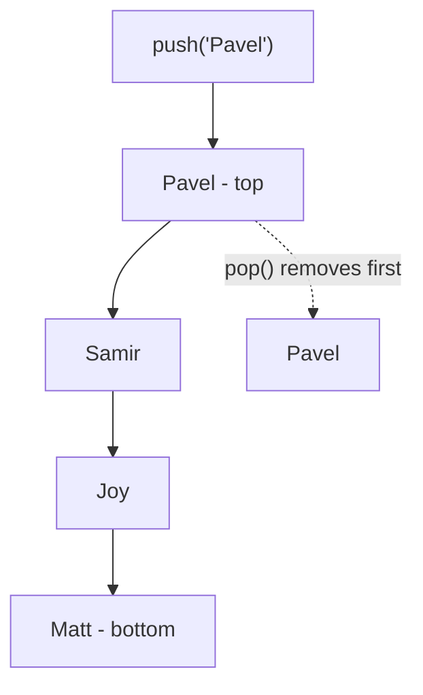
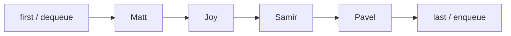
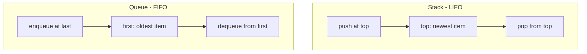

# Stacks and Queues

Stacks and queues are **linear data structures**. Their elements are processed in a specific order, and they do not provide direct random access like an array index does.

The main difference is the removal rule:

| Structure | Rule                      | First item removed           |
| --------- | ------------------------- | ---------------------------- |
| Stack     | LIFO: Last In, First Out  | The most recently added item |
| Queue     | FIFO: First In, First Out | The oldest item              |

## Stack: LIFO

A stack is like a pile of plates. New values are added to the top, and values are also removed from the top.



Common examples are browser back history, undo operations, expression parsing, depth-first search, and the JavaScript call stack.

### Stack operations and complexity

| Operation     | Meaning                                | Complexity |
| ------------- | -------------------------------------- | ---------- |
| `push(value)` | Add a value to the top                 | $O(1)$     |
| `pop()`       | Remove the top value                   | $O(1)$     |
| `peek()`      | Read the top value without removing it | $O(1)$     |
| `isEmpty()`   | Check whether the stack has no values  | $O(1)$     |
| Lookup/search | Find an arbitrary value                | $O(n)$     |

### Linked-list stack from `app.js`

Each node stores a value and a pointer to the next node. The `top` points to the first node, while `bottom` points to the last node.

```js
class Node {
  constructor(value) {
    this.value = value;
    this.next = null;
  }
}

class Stack {
  constructor() {
    this.top = null;
    this.bottom = null;
    this.length = 0;
  }

  peek() {
    return this.top;
  }

  push(value) {
    const newNode = new Node(value);

    if (this.length === 0) {
      this.top = newNode;
      this.bottom = newNode;
    } else {
      newNode.next = this.top;
      this.top = newNode;
    }

    this.length++;
    return this;
  }

  pop() {
    if (!this.top) return null;

    const poppedNode = this.top;
    this.top = this.top.next;
    this.length--;

    if (this.length === 0) {
      this.bottom = null;
    }

    return poppedNode;
  }

  isEmpty() {
    return this.length === 0;
  }
}

const stack = new Stack();
stack.push("Matt").push("Joy").push("Samir").push("Pavel");
console.log(stack.peek().value); // Pavel
console.log(stack.pop().value); // Pavel
```

The `length === 0` check in `pop()` keeps the empty-stack invariant correct: when the last node is removed, both `top` and `bottom` must be `null`.

### Array-backed stack

An array is also a practical stack when values are added and removed only at the end. JavaScript's `push()` and `pop()` already provide the required operations.

```js
class ArrayStack {
  constructor() {
    this.array = [];
  }

  peek() {
    return this.array[this.array.length - 1];
  }

  push(value) {
    this.array.push(value);
    return this;
  }

  pop() {
    return this.array.pop();
  }

  isEmpty() {
    return this.array.length === 0;
  }
}
```

Arrays provide good cache locality because their values are stored contiguously, while linked lists can grow and shrink without resizing an array. The best choice depends on the application's memory and performance needs.

## Queue: FIFO

A queue is like a line of people. New values enter at the back, and values leave from the front.



Common examples are task scheduling, breadth-first search, web-server requests, print jobs, and data buffering.

### Queue operations and complexity

| Operation        | Meaning                                  | Complexity |
| ---------------- | ---------------------------------------- | ---------- |
| `enqueue(value)` | Add a value at the back                  | $O(1)$     |
| `dequeue()`      | Remove the value at the front            | $O(1)$     |
| `peek()`         | Read the front value without removing it | $O(1)$     |
| `isEmpty()`      | Check whether the queue has no values    | $O(1)$     |
| Lookup/search    | Find an arbitrary value                  | $O(n)$     |

Using `shift()` repeatedly on a normal array can be costly because the remaining elements may need to be re-indexed. A linked-list queue avoids that cost by moving the `first` pointer.

### Linked-list queue from `app.js`

The queue stores pointers named `first` and `last`. `enqueue()` adds a node after `last`, and `dequeue()` moves `first` to the next node.

```js
class QueueNode {
  constructor(value) {
    this.value = value;
    this.next = null;
  }
}

class Queue {
  constructor() {
    this.first = null;
    this.last = null;
    this.length = 0;
  }

  peek() {
    return this.first;
  }

  enqueue(value) {
    const newNode = new QueueNode(value);

    if (this.length === 0) {
      this.first = newNode;
      this.last = newNode;
    } else {
      this.last.next = newNode;
      this.last = newNode;
    }

    this.length++;
    return this;
  }

  dequeue() {
    if (!this.first) return null;

    const removedNode = this.first;

    if (this.first === this.last) {
      this.last = null;
    }

    this.first = this.first.next;
    this.length--;
    return removedNode;
  }

  isEmpty() {
    return this.length === 0;
  }
}

const queue = new Queue();
queue.enqueue("Matt").enqueue("Joy").enqueue("Samir").enqueue("Pavel");
console.log(queue.peek().value); // Matt
console.log(queue.dequeue().value); // Matt
```

## Stack versus queue



Choose a **stack** when the newest item should be handled first. Choose a **queue** when items should be handled in arrival order.

## Important invariants

- An empty stack has `top === null`, `bottom === null`, and `length === 0`.
- A non-empty stack has both `top` and `bottom` pointing to nodes.
- An empty queue has `first === null`, `last === null`, and `length === 0`.
- A queue with one item has `first === last`.
- Adding or removing at the correct end keeps stack and queue operations at $O(1)$.
