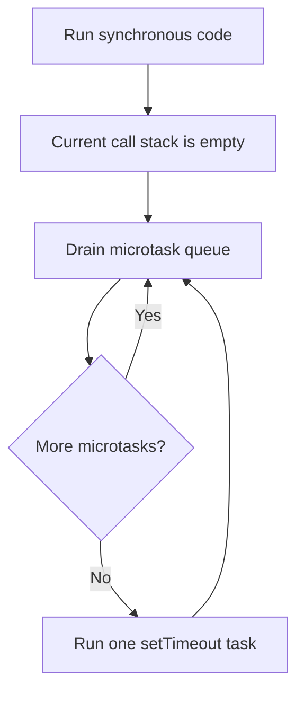

# JavaScript Interview Preparation

A practical interview guide built from the examples and notes in this repository. It is aimed at a mid-level engineer with about three years of experience building web and mobile applications and additional Node.js training.

Use this document in three ways:

1. Read the short answers before an interview.
2. Open the linked source file and explain the example aloud.
3. Practice the coding prompts without looking at the solution first.

## Repository Map

| Area                     | Topics                                                                        | Useful examples                                                                                                                                                            |
| ------------------------ | ----------------------------------------------------------------------------- | -------------------------------------------------------------------------------------------------------------------------------------------------------------------------- |
| Language fundamentals    | Types, coercion, scope, hoisting, functions, closures, copying                | [basic_javascript.js](basic_javascript.js), [types_in_javascript/types.js](types_in_javascript/types.js), [advance/fundamental/hosting.js](advance/fundamental/hosting.js) |
| Runtime                  | Engine, call stack, heap, garbage collection, memory leaks, execution context | [new_way_to_learn/javascript_engine.js](new_way_to_learn/javascript_engine.js), [fundamental/call_stack.js](fundamental/call_stack.js)                                     |
| Async JavaScript         | Promises, async/await, event loop, queues, concurrency                        | [async_function/async.js](async_function/async.js), [async_function/sequence.js](async_function/sequence.js)                                                               |
| Functions and objects    | `this`, call/apply/bind, currying, memoization, prototypes, classes           | [async_function/keyword_this.js](async_function/keyword_this.js), [advance/fundamental/function-invocation.js](advance/fundamental/function-invocation.js)                 |
| Events and reactive code | Event emitters, subscriptions, mapping, teardown                              | [event_emitter_advance.js](event_emitter_advance.js), [rxjs.js](rxjs.js), [mapped_source.js](mapped_source.js)                                                             |
| Browser performance      | Debounce, throttle, DOM events, scroll handling                               | [throttle/throttle.js](throttle/throttle.js), [debounce/index.html](debounce/index.html)                                                                                   |
| DSA                      | Arrays, strings, hashing, stacks, Big O, space complexity                     | [DSA/Arrays/two-sum.js](DSA/Arrays/two-sum.js), [DSA/Big-O/index.js](DSA/Big-O/index.js)                                                                                   |
| Broader roadmap          | React, React Native, APIs, auth, micro-frontends, system design               | [inteview_prep.md](inteview_prep.md)                                                                                                                                       |

## Detailed Exercise Notes

This repository contains two layers of study material:

1. A concise interview guide in this file.
2. A deeper, in-file learning guide in [excercise/README.md](excercise/README.md) created from the examples in [excercise/index.js](excercise/index.js).

The exercise notes cover the runtime internals and conceptual topics in much more detail than the short summary here. They include:

- interpreter/compiler behavior and engine optimization
- inline caching, hidden classes, memory heap, and call stack
- execution context, lexical environment, and scope chain
- hoisting, temporal dead zone, function expressions, and IIFEs
- `this`, `call`, `apply`, `bind`, and closures
- currying, first-class functions, default parameters, and nested closures
- primitive vs object values, pass-by-value, shallow vs deep cloning
- type coercion, equality, dynamic/static typing, and practical type safety
- prototypes, constructor functions, and class-based inheritance
- closure-based encapsulation, timer behavior, and memory-retention warnings

This means the root README should be used as a quick interview checklist, while [excercise/README.md](excercise/README.md) is the more complete reference for understanding the code examples and the reasoning behind them.

Use these files as the main source of truth:

- [excercise/README.md](excercise/README.md)
- [excercise/index.js](excercise/index.js)
- [inteview_prep.md](inteview_prep.md)
- [async_function](async_function)
- [DSA](DSA)
- [throttle](throttle)

### Latest updates reflected from the exercise file

The newest examples in [excercise/index.js](excercise/index.js) reinforce these core ideas:

- Interpreter vs compiler behavior and how the engine optimizes hot paths.
- Inline caching and hidden classes as optimization strategies for repeated property access.
- Memory heap, call stack, and the difference between synchronous execution and async callbacks.
- Memory leak patterns from global variables, event listeners, and intervals.
- Preventing stack overflow by removing work iteratively instead of recursing endlessly.
- Execution context, lexical environment, static scope, and hoisting behavior for `var`, function declarations, and `let`/`const`.
- Function expressions, IIFEs, `this`, `call`, `apply`, `bind`, and prototype-based inheritance.
- OOP patterns using factory functions, constructor functions, `Object.create()`, and classes.
- Functional programming patterns such as currying, pure functions, idempotence, immutability, and declarative style.

> Some exercises are intentionally written as learning examples or practice prompts, so verify the actual runtime behavior before presenting them as final interview answers.

## How To Answer At Mid-Level

For technical questions, use this structure:

1. Define the concept precisely.
2. Explain the runtime or trade-off.
3. Give a small example from a real application.
4. Mention an edge case, failure mode, or performance consequence.

For project questions, use **Situation, Decision, Trade-off, Result**. A mid-level answer should show ownership and judgment, not just API knowledge.

## Core JavaScript Questions and Answers

### 1. What is the difference between primitive and reference values?

Primitives such as strings, numbers, booleans, `bigint`, symbols, `undefined`, and `null` are immutable values. Assigning a primitive creates an independent value. Objects, arrays, and functions are mutable objects; a variable stores a reference to the object, so two variables can refer to the same object.

```js
let first = "one";
let second = first;
second = "two"; // first is still "one"

const userA = { name: "Raushan" };
const userB = userA;
userB.name = "Updated"; // userA.name is also "Updated"
```

JavaScript is best described as **pass-by-value**. For objects, the value passed is a copy of the reference, which explains why object mutation is visible to the caller while reassigning the parameter is not. See [advance/passByValueVsPassR/index.js](advance/passByValueVsPassR/index.js).

### 2. What is shallow copying, and when is it insufficient?

A shallow copy creates a new outer object but keeps references to nested objects.

```js
const copy = { ...source };
const arrayCopy = [...items];
```

Changing a nested object can still change the original. `structuredClone(value)` is usually a better general deep-copy option for supported data. JSON serialization is limited: it loses `undefined`, functions, symbols, special number values, dates, maps, sets, and object identity. Choose copying based on the data model instead of copying everything defensively.

### 3. Explain `==`, `===`, `Object.is`, `null`, and `NaN`

`===` compares without implicit type conversion and is the normal default. `==` performs coercion and is harder to reason about, although `value == null` is sometimes intentionally used to match both `null` and `undefined`. `Object.is` is similar to strict equality but treats `NaN` as equal to itself and distinguishes `0` from `-0`.

```js
Number.isNaN(value); // reliable NaN check
Object.is(NaN, NaN); // true
Object.is(0, -0); // false
```

### 4. What is hoisting and what is the temporal dead zone?

Before execution, declarations are registered in their scope. Function declarations can be called before their declaration. `var` is initialized with `undefined`. `let` and `const` are registered but cannot be accessed between entering the scope and their declaration; this interval is the temporal dead zone and accessing them throws a `ReferenceError`.

Hoisting does not mean the code is physically moved. It describes how the execution context initializes bindings. See [advance/fundamental/hosting.js](advance/fundamental/hosting.js).

### 5. What is a closure?

A closure is a function together with access to variables in its lexical environment, even after the outer function has returned. Closures are useful for private state, factories, memoization, event handlers, and creating callbacks.

```js
function createCounter() {
  let count = 0;
  return () => ++count;
}

const next = createCounter();
next(); // 1
next(); // 2
```

A common practical concern is lifecycle: a long-lived callback can keep a large object reachable. Remove listeners and subscriptions when the owning screen or component is destroyed.

### 6. How does `this` work?

For a normal function, `this` is determined by the call site: `obj.method()` gives `obj`, `call` and `apply` explicitly set it, `new` binds it to the new instance, and a detached call has `undefined` in strict mode. Arrow functions do not create their own `this`; they capture it lexically.

Do not rely on a method remaining attached to its object when passing it as a callback. Bind it, wrap it, or use an arrow callback where appropriate. See [async_function/keyword_this.js](async_function/keyword_this.js) and [async_function/call_apply_bind.js](async_function/call_apply_bind.js).

### 7. What are `call`, `apply`, and `bind`?

`call` invokes immediately with separate arguments, `apply` invokes immediately with an array-like argument list, and `bind` returns a new function with a fixed `this` and optionally preset arguments.

```js
function introduce(role) {
  return `${this.name}: ${role}`;
}

introduce.call({ name: "A" }, "engineer");
introduce.apply({ name: "A" }, ["engineer"]);
const bound = introduce.bind({ name: "A" });
```

Use them when the call-site context is part of the API. Avoid using `bind` repeatedly inside a render path when a stable callback strategy is more appropriate.

### 8. What are higher-order functions, currying, and memoization?

A higher-order function accepts a function, returns a function, or both. Currying transforms a function with multiple arguments into a sequence of single-argument functions. Memoization caches results for repeated inputs and is useful only when the function is deterministic and the cache has a sensible lifetime and size.

```js
const add = (a) => (b) => a + b;
const addFive = add(5);
addFive(3); // 8
```

Memoization can waste memory or return stale results when inputs are mutable or external state changes. See [advance/fundamental/curryin.js](advance/fundamental/curryin.js) and [advance/fundamental/function-invocation.js](advance/fundamental/function-invocation.js).

### 9. How do `map`, `filter`, and `reduce` differ?

`map` transforms every item and preserves length. `filter` keeps items matching a predicate. `reduce` combines items into one accumulated result, which may be a number, object, array, or other structure. Prefer readable loops when `reduce` makes control flow obscure. Always provide a correct initial accumulator when the input may be empty.

### 10. What are prototypes and classes?

Every ordinary object has a prototype chain used for property lookup. A class is syntax over prototype-based behavior: instance methods are placed on the class prototype, while fields usually belong to each instance. `extends` sets up inheritance and `super` invokes the parent constructor or method.

Prefer composition when behavior does not represent a true subtype. Prototype and class examples are in [oops/first_class.js](oops/first_class.js) and [DSA/Arrays/classes.js](DSA/Arrays/classes.js).

### 10a. What is object-oriented programming in JavaScript?

Object-oriented programming groups behavior and data into objects and supports reuse through inheritance, encapsulation, and polymorphism. In JavaScript, this is usually implemented with factory functions, constructor functions, or classes.

A factory function creates an object and returns it:

```js
function createElf(name, weapon) {
  return {
    name,
    weapon,
    attack() {
      return `Attack with ${this.weapon}`;
    },
  };
}
```

A constructor function uses `new` and stores instance state on `this`:

```js
function Elf(name, weapon) {
  this.name = name;
  this.weapon = weapon;
}

Elf.prototype.attack = function () {
  return `Attack with ${this.weapon}`;
};
```

Class syntax is the modern form of the same idea:

```js
class Character {
  constructor(name, weapon) {
    this.name = name;
    this.weapon = weapon;
  }

  attack() {
    return `Attack with ${this.weapon}`;
  }
}

class Elf extends Character {
  constructor(name, weapon, type) {
    super(name, weapon);
    this.type = type;
  }
}
```

Polymorphism means different classes can implement the same method differently. In the exercise file, the `Queen` example overrides `attack()` and adds a more specific message, while still calling the parent behavior with `super.attack()` when needed. This is a good interview answer for OOP in JavaScript, especially if you can explain the trade-offs between inheritance and composition.

See the pattern examples in [excercise/index.js](excercise/index.js) and [oops/first_class.js](oops/first_class.js).

### 10b. What is functional programming?

Functional programming emphasizes pure functions, immutability, predictable data flow, and composing smaller operations into larger behavior. In JavaScript, this often means using functions as values, avoiding shared mutable state, and keeping side effects at the edges of the system.

Important ideas from the exercise file:

- Pure function: same input, same output; no mutation of outside state.
- Higher-order function: a function that accepts or returns a function.
- Currying: breaking a multi-argument function into one-argument steps.
- Partial application: fixing some arguments in advance.
- Composition: build bigger logic from smaller functions.
- Pipe: pass output from one function to the next.

```js
const multiplyBy = (a) => (b) => a * b;
const double = multiplyBy(2);

double(5); // 10
```

A functional cart example often keeps state immutable and models operations as transformations:

```js
const user = {
  name: "Rohan",
  active: true,
  cart: [],
  purchases: [],
};
```

The exercise file then models operations like add-to-cart, tax calculation, purchase, and empty cart as separate transformations rather than mutating external state without structure. This style is helpful for reasoning, testing, and avoiding hidden side effects.

Functional programming is not an all-or-nothing rule in JavaScript. Most applications mix OOP and FP: classes are useful for domain models, while pure functions and immutability are excellent for predictable logic and easier testing.

### 10c. What functional principles appear in the exercise notes?

The exercise file also highlights several practical FP ideas that appear often in interviews and production code:

- Pure function: deterministic output for the same input and no hidden mutation of external state.
- Idempotence: running the same operation multiple times should not produce different results when the operation is meant to be repeated safely.
- Imperative style: step-by-step instructions that describe how to do something.
- Declarative style: describing the result or transformation rather than the exact control flow.
- Immutability: creating new data instead of mutating existing objects or arrays.

```js
function notGood(num) {
  return Math.random() * num;
}
```

This function is not pure because it returns a different value each time, even with the same input. A pure function should not depend on randomness, time, or hidden global state.

```js
for (let i = 0; i < 10; i += 1) {
  console.log(i);
}
```

This is imperative code: it manually describes the loop and mutation steps.

```js
[1, 2, 3, 4, 5].forEach((i) => console.log(i));
```

This is declarative: it describes the action without exposing the lower-level loop mechanics.

Immutability is commonly implemented by cloning before updating:

```js
const objR = { name: "Rohan" };

function updateName(obj) {
  return { ...obj, name: "Rishu" };
}
```

This keeps the original object unchanged and makes behavior easier to reason about, test, and debug. In a real system, this style is especially useful for state updates, reducers, UI state, and data pipelines.

### 10d. What do the latest closure and higher-order function examples show?

The most recent examples in [excercise/index.js](excercise/index.js) reinforce two common interview ideas:

- Higher-order functions: a function that either takes another function as an argument or returns a function.
- Closure for private state: an inner function keeps access to outer variables even after the outer function has returned.

```js
const hof = () => () => 5;
const hof1 = (fn) => fn(6);

hof1((num) => num * 10); // 60
```

```js
function makeCount() {
  let count = 55;
  return function getCount() {
    return count;
  };
}

const getCounter = makeCount();
getCounter(); // 55
```

This is a strong interview pattern because it shows data encapsulation: the outer variable is not directly exposed, but the returned function can still read it. It is a classic example of how closures help build private state and reusable logic while keeping APIs small and predictable.

### 10e. What are currying, partial application, memoization, and composition?

The latest exercise section adds the following functional-programming patterns that are commonly tested in JavaScript interviews:

- Currying: a function that takes one argument at a time and returns a new function until all arguments are provided.
- Partial application: fixing some arguments in advance so the remaining function is smaller and more reusable.
- Memoization: caching computed results so repeated calls with the same input do not recompute work.
- Composition and pipe: combining functions so data flows through a sequence of transformations.

```js
const curriedMultiply = (a) => (b) => a * b;
const multiplyBy5 = curriedMultiply(5);

multiplyBy5(10); // 50
```

Partial application is similar but often implemented by fixing arguments in advance:

```js
const multiply = (a, b, c) => a * b * c;
const partialMultiplyBy5 = multiply.bind(null, 5);

partialMultiplyBy5(4, 10); // 200
```

Memoization is a cache that stores values for reuse:

```js
function memoizedAddTo80Closure() {
  const cache = {};

  return (n) => {
    if (n in cache) return cache[n];
    cache[n] = n + 80;
    return cache[n];
  };
}
```

Composition and pipe are about function flow:

```js
const pipe = (f, g) => (data) => g(f(data));
const multiplyBy3 = (num) => num * 3;
const makePositive = (num) => Math.abs(num);

const multiplyBy3AbsolutePipe = pipe(makePositive, multiplyBy3);
console.log(multiplyBy3AbsolutePipe(-50)); // 150
```

These patterns are useful because they make code easier to reason about, easier to test, and easier to reuse in larger systems. The interview answer is usually: use these techniques when you need to reduce repetition, hide internal state, and compose predictable transformations.

## Runtime, Memory, and Engine

### 11. What is the call stack?

The call stack tracks active execution contexts in last-in, first-out order. A function call adds a frame and returning removes it. Unbounded recursion eventually causes a stack overflow. The heap stores dynamically allocated objects; the exact stack and heap implementation is engine-specific, so avoid claiming that every primitive always lives only on the stack.

### 12. How does garbage collection work?

A JavaScript engine finds objects that are reachable from roots such as active stack variables and global references. Unreachable objects can be reclaimed. Garbage collection is automatic, but memory leaks still happen when an application accidentally keeps references alive.

Typical causes are forgotten event listeners, uncleared timers, unbounded caches, retained closures, and detached DOM subtrees. Use cleanup functions, `clearInterval`, bounded caches, and heap snapshots when diagnosing growth.

Several runtime files intentionally recurse forever or access browser globals. Treat them as demonstrations, not scripts to run blindly: [fundamental/call_stack.js](fundamental/call_stack.js), [new_way_to_learn/call_stack.js](new_way_to_learn/call_stack.js), and [async_function/index.js](async_function/index.js).

### 13. What are hidden classes and inline caches?

Modern engines optimize repeated object access by observing stable object shapes and caching property lookups. Creating objects with consistent properties and initialization order can help optimization. This is an implementation optimization, not a language guarantee, so correctness and clear data modeling come first. See [basic_javascript.js](basic_javascript.js) and [new_way_to_learn/javascript_engine.js](new_way_to_learn/javascript_engine.js).

### 14. What is an execution context?

An execution context contains the state needed to run code, including bindings, scope information, and `this`. JavaScript creates a global context and function contexts as functions are invoked. Lexical environments connect a context to its outer scope, which is how closures resolve variables.

## Async JavaScript and the Event Loop

### 15. Explain the event loop

JavaScript runs synchronous code on a call stack. Host APIs such as timers and network operations complete outside that stack. When the stack is empty, queued callbacks are scheduled for execution. Promise reactions and `queueMicrotask` use the microtask queue, which is drained before the next task such as a timer callback.

```js
console.log("A");
setTimeout(() => console.log("B"), 0);
Promise.resolve().then(() => console.log("C"));
console.log("D");
// A, D, C, B
```

Microtasks can starve timers if code continually schedules more microtasks. See [interview_question.js](interview_question.js).

#### Promise callbacks versus `setTimeout`

Promise handlers registered with `.then()` and callbacks registered with `queueMicrotask()` go into the **microtask queue**. A `setTimeout` callback goes into the **task queue** (also called the macrotask or callback queue). After the current synchronous code finishes, the event loop drains all available microtasks before it starts the next timer task.



Example from [challenge.js](challenge.js):

```js
console.log("1");
setTimeout(() => console.log("2"), 0);
Promise.resolve().then(() => console.log("3"));
queueMicrotask(() => console.log("4"));
setTimeout(() => {
  console.log("5");
  Promise.resolve().then(() => console.log("6"));
}, 0);
console.log("7");

// Output:
// 1
// 7
// 3
// 4
// 2
// 5
// 6
```

Why this order occurs:

1. `1` and `7` run synchronously.
2. Promise callback `3` and microtask callback `4` run next, in registration order.
3. The first timer prints `2`.
4. The second timer prints `5`, then schedules Promise callback `6`.
5. The event loop drains `6` before it starts another task.

The same rule explains [interview_question.js](interview_question.js):

```js
console.log("1");
setTimeout(() => console.log("2"), 0);
Promise.resolve().then(() => console.log("3"));
console.log("4");
Promise.resolve().then(() => {
  console.log("5");
  setTimeout(() => console.log("6"), 0);
});
console.log("7");

// Output:
// 1
// 4
// 7
// 3
// 5
// 2
// 6
```

Important: `setTimeout(..., 0)` does not mean "run immediately." It means "place this callback in the task queue after the timer is ready." Pending microtasks get priority before that task runs.

### 16. What does `async/await` do?

An `async` function always returns a promise. `await` pauses that function until the awaited promise settles, allowing other work on the event loop to continue; it does not block the JavaScript thread. Rejected promises become thrown errors at the await point and can be handled with `try/catch`.

Use `Promise.all` for independent operations that should run concurrently. Do not put independent awaits in series unless ordering or rate limits require it.

### 17. Compare `Promise.all`, `allSettled`, `race`, and `any`

- `Promise.all`: fulfills when all fulfill; rejects as soon as one rejects.
- `Promise.allSettled`: always fulfills with the status of every operation.
- `Promise.race`: settles when the first promise settles.
- `Promise.any`: fulfills when the first promise fulfills; rejects with `AggregateError` if all reject.

The right choice depends on whether one failure invalidates the entire operation. Examples are in [async_function/promise_allsettled.js](async_function/promise_allsettled.js) and [async_function/sequence.js](async_function/sequence.js).

### 18. How do you handle fetch errors?

`fetch` rejects for network failures, but a `404` or `500` normally resolves. Check `response.ok` and throw a domain error before parsing the response. Add cancellation with `AbortController`, timeouts where needed, validation of response data, and a retry policy only for transient failures. Do not retry non-idempotent operations blindly.

### 19. How do you run work sequentially versus concurrently?

For independent work:

```js
const results = await Promise.all(urls.map(load));
```

For dependent or rate-limited work, await inside a loop. If partial success matters, use `allSettled` and report each result. The example in [async_function/async_await.js](async_function/async_await.js) demonstrates concurrent requests and `for await...of`.

## Events and Reactive Patterns

### 20. What makes a useful event emitter?

A robust emitter needs listener registration, emission, removal, and often one-time listeners. It should define behavior when listeners mutate the listener list during emission, preserve useful error context, and avoid retaining listeners after their owner is gone. Returning an unsubscribe function is convenient for UI lifecycle cleanup.

Compare the basic and advanced implementations in [event_emitter.js](event_emitter.js) and [event_emitter_advance.js](event_emitter_advance.js). The repository mixes CommonJS `require` with ES module `export`, so module configuration must be made consistent before using those files together in Node.js.

### 21. What is an observable, and how is it different from a promise?

A promise represents one eventual result. An observable-like source can emit zero, one, or many values over time, can be subscribed to by multiple consumers, and can provide teardown on unsubscribe. Mapping should ideally be lazy and should unsubscribe upstream when the downstream subscription ends. The repository implements a small RxJS-inspired version in [rxjs.js](rxjs.js) and [mapped_source.js](mapped_source.js); it does not use the actual RxJS library.

## Browser Performance

### 22. What is debounce?

Debounce delays execution until calls stop for a specified period. It is useful for search input, validation, and resize handling. A production implementation should preserve the intended `this` and arguments and expose `cancel` when a pending action must be discarded.

### 23. What is throttle?

Throttle limits execution to at most once per interval. It is useful for scroll, pointer movement, and resize events. Decide whether the first call, the last call, or both should run. The repository contains leading and leading/trailing variants in [throttle/throttle.js](throttle/throttle.js). The debounce HTML page is currently only a shell: [debounce/index.html](debounce/index.html).

## DSA and Complexity

### 24. What is Big O?

Big O describes how time or auxiliary space grows as input size grows, ignoring constants and lower-order terms. Separate input sizes when they are independent: two sequential loops over `a` and `b` are $O(a+b)$, while nested loops are often $O(a \times b)$. A loop over half the input is still $O(n)$.

Common complexities:

| Complexity    | Example                                        |
| ------------- | ---------------------------------------------- |
| $O(1)$        | Array index lookup, fixed number of operations |
| $O(\log n)$   | Binary search on sorted data                   |
| $O(n)$        | One pass through an array                      |
| $O(n \log n)$ | Efficient comparison sorting                   |
| $O(n^2)$      | Comparing every pair                           |

### 25. How do you solve Two Sum?

Store values already seen in a `Map`. For each number, check whether `target - number` exists. This gives $O(n)$ time and $O(n)$ space, compared with $O(n^2)$ brute force.

```js
function twoSum(numbers, target) {
  const seen = new Map();
  for (let index = 0; index < numbers.length; index += 1) {
    const complement = target - numbers[index];
    if (seen.has(complement)) return [seen.get(complement), index];
    seen.set(numbers[index], index);
  }
  return [];
}
```

Practice related solutions in [DSA/find-two-sum.js](DSA/find-two-sum.js) and [DSA/Arrays/two-sum.js](DSA/Arrays/two-sum.js).

### 26. How do you validate parentheses?

Use a stack. Push opening brackets and, for each closing bracket, check that it matches the most recent opening bracket. The string is valid only if no mismatch occurs and the stack is empty at the end. This is $O(n)$ time and $O(n)$ space in the worst case. See [DSA/valid-parentheses.js](DSA/valid-parentheses.js).

### 27. What sliding-window problems should you know?

Use a moving left and right boundary when the answer concerns a contiguous range. Maintain only the state needed to make the window valid, such as a frequency map for longest substring without repeats. For maximum values in a window, a monotonic deque can reduce the solution to $O(n)$.

### 28. What should you say about unfinished algorithms in this repository?

Be honest and correct them before presenting them in an interview. The repository includes practice stubs and known issues: an incomplete rotation solution, a palindrome implementation with incorrect validation, a matrix-zeroing exercise that only prints coordinates, and a likely infinite loop in [DSA/array.js](DSA/array.js). Also inspect [DSA/Arrays/index.js](DSA/Arrays/index.js), where `getMethod()` appears to read `this.date` instead of `this.data`.

## Node.js and API Interview Questions

The repository contains Node-oriented concepts but no complete Express server, filesystem service, or database example. Use the following as the Node.js preparation layer for the Node course you completed.

### 29. What is the Node.js event loop?

Node.js runs JavaScript on a main thread and uses the event loop to coordinate non-blocking I/O. Some operations use the libuv worker pool, such as filesystem, DNS, and certain crypto tasks. CPU-heavy JavaScript still blocks the event loop, so move expensive work to worker threads, separate processes, or a job system.

### 30. How do CommonJS and ES modules differ?

CommonJS uses `require` and `module.exports`; ES modules use `import` and `export`. A project should choose a consistent module configuration, including the `package.json` `type` field and file extensions where relevant. Mixing systems requires explicit interoperability rules.

### 31. How would you design an API handler?

Keep transport concerns separate from business logic. Validate input at the boundary, authenticate and authorize the request, call a service, map domain errors to stable HTTP responses, and log a correlation ID without leaking secrets. A shared client can centralize base URL handling, timeouts, response parsing, and auth refresh, but retry decisions belong to request semantics.

### 32. REST versus GraphQL?

REST exposes resource-oriented endpoints and works well with HTTP caching and simple ownership boundaries. GraphQL lets clients select fields through one schema, which can reduce overfetching and underfetching but adds schema, resolver, caching, and authorization complexity. Choose based on client diversity, data relationships, caching needs, and operational maturity.

### 33. How should authentication tokens be stored?

A secure design considers XSS, CSRF, token rotation, expiration, revocation, and device behavior. HttpOnly, Secure, appropriately scoped cookies protect tokens from JavaScript access but require CSRF defenses. Browser storage is accessible to JavaScript and therefore increases the impact of XSS. Refresh tokens should be short-lived or rotated, stored securely, and invalidated on reuse or logout according to the threat model.

### 34. What is rate limiting?

Rate limiting protects a service from abuse and accidental overload. Token bucket supports bursts within a refill rate; leaky bucket smooths output; fixed windows are simple but can have boundary spikes; sliding windows are more precise but cost more. Define the key, limits, response status, retry guidance, and distributed-storage strategy.

## React, React Native, and Product Experience

These topics are in [inteview_prep.md](inteview_prep.md) but have limited implementation examples in this repository. Prepare to connect them to your real web and mobile work.

### 35. When should you use Context or Redux?

Context is useful for low-frequency, broadly shared values such as theme, locale, or authenticated identity. Redux is a better fit when many parts of the application need predictable state transitions, centralized debugging, middleware, caching, or complex asynchronous workflows. Avoid putting every local input into global state.

### 36. What is the React rendering cycle?

A state or prop change schedules a render. React calculates the next element tree, reconciles it with the previous tree, commits required DOM or native changes, and then runs effects according to their timing. Rendering should be pure. Effects synchronize with external systems such as subscriptions, timers, network requests, and imperative APIs.

### 37. `useEffect` versus `useLayoutEffect`?

`useEffect` runs after the browser has painted in normal cases and is appropriate for most external synchronization. `useLayoutEffect` runs after DOM mutations but before paint, so it is useful for measuring or synchronously correcting layout; overuse can delay painting. In React Native, reason about the native commit and interaction cost rather than assuming browser timing is identical.

### 38. How do you optimize a large list?

Virtualize the list so only visible rows are mounted, use stable keys, keep row rendering cheap, avoid creating unnecessary work for every item, paginate or incrementally fetch data, and profile before optimizing. In React Native, use platform-appropriate list components and inspect JS-thread, UI-thread, memory, and bridge or native-module costs.

### 39. What is code splitting?

Code splitting loads less JavaScript initially by dividing bundles and loading routes or features on demand. Pair it with loading, error, and retry states. It is a trade-off: too many small chunks increase request overhead and can make navigation feel slower.

## System Design Prompts

For a chat app or dashboard, begin with requirements and scale assumptions. Then describe clients, API boundaries, storage, caching, real-time transport, background jobs, observability, security, failure handling, and the main trade-offs.

Practice these prompts from [inteview_prep.md](inteview_prep.md):

- Design a chat application with message ordering, reconnects, delivery state, unread counts, and horizontal scaling.
- Design a dashboard with pagination, filtering, caching, permissions, and predictable refresh behavior.
- Design a parking lot or elevator using clear domain objects and state transitions.
- Explain Observer and Pub/Sub, including ownership, delivery semantics, retries, and unsubscribe behavior.
- Implement or explain Singleton and Factory, then discuss why dependency injection may be easier to test.

A strong answer calls out what is intentionally out of scope. For example, a chat design may initially use a single region and later add partitioning, replication, and cross-region delivery once requirements justify the complexity.

## Coding Practice Checklist

- Explain and implement `map`, `filter`, `reduce`, `bind`, `Promise.all`, and a debounce function.
- Solve Two Sum, contains-duplicate, valid-parentheses, reverse string, palindrome, merge sorted arrays, move zeroes, and maximum subarray.
- Practice a sliding-window problem and one graph BFS problem.
- State time and auxiliary-space complexity before coding.
- Test empty input, one item, duplicates, negative values, very large input, invalid input, and asynchronous failure.
- For every UI or Node.js answer, name cleanup, cancellation, observability, security, and performance considerations where they apply.

## Project and Behavioral Questions

Prepare concise stories for:

- A project you are proud of and the measurable result.
- A difficult production bug and how you isolated it.
- A performance problem in a web or mobile app and what profiling showed.
- An API or state-management decision and the trade-off you accepted.
- A disagreement with a teammate and how you reached a technical decision.
- A time you improved testing, release safety, monitoring, or developer experience.
- A failure or incident, what you learned, and what changed afterward.

Do not claim experience with a technology only because it appears in this repository. Use these examples to demonstrate understanding, then anchor answers in your actual applications and Node.js work.

## Six-Week Revision Plan

### Week 1: JavaScript foundations

Types, coercion, scope, hoisting, closures, `this`, prototypes, copying, and engine basics. Explain one example from the repository each day.

### Week 2: Async and browser behavior

Event loop ordering, promises, cancellation, concurrency, event emitters, observables, debounce, throttle, and memory cleanup.

### Week 3: Web, mobile, and Node.js

React rendering, hooks, state management, list performance, React Native debugging, API clients, authentication, modules, and Node event-loop behavior.

### Week 4: DSA

Arrays and strings first, then stacks, queues, linked lists, trees, graphs, sliding windows, and basic dynamic programming. Complete two medium problems in 30 minutes and explain the approach before coding.

### Week 5: System design

Practice chat, dashboard, rate limiting, Observer/Pub-Sub, and one object-oriented design. Always state requirements, scale, bottlenecks, failure modes, and trade-offs.

### Week 6: Mock interviews

Alternate JavaScript, React/React Native, Node/API, DSA, system design, and project stories. Record answers, then tighten them to definition, example, trade-off, and result.

## Safe Study Notes

Many examples intentionally produce console output, use timers, access `document`, call public APIs, or demonstrate stack overflow. Read them before running them. Browser-only files need a browser, network examples need connectivity, and recursion demonstrations should be commented out before normal execution.

This README is a study guide, not a replacement for testing. Verify behavior in the target runtime and check current framework and Node.js documentation for version-specific details.
