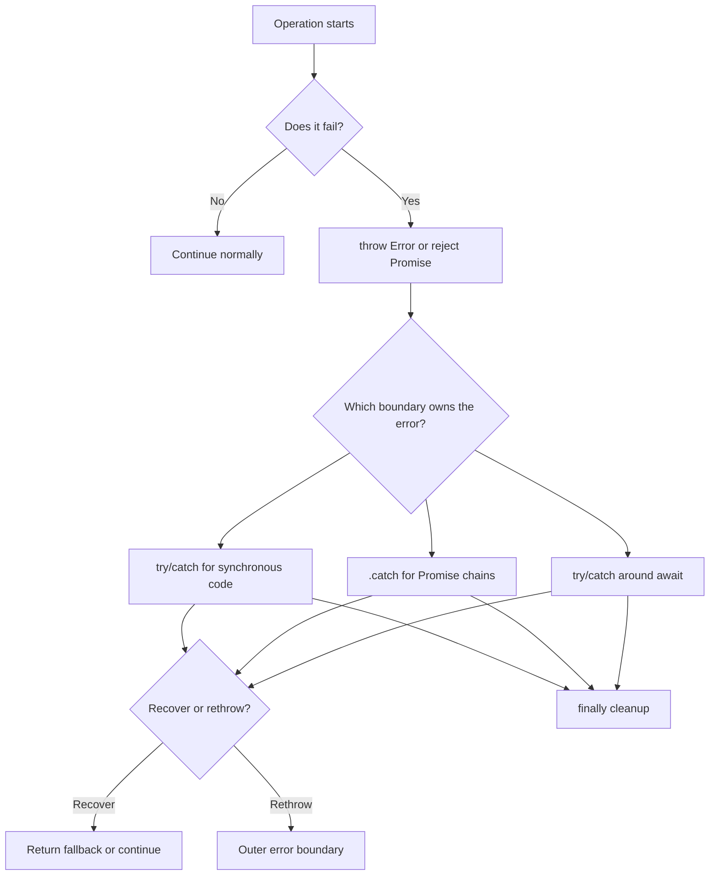

# JavaScript Error Handling

This note is based on the examples in `app.js`. The main rule is:

> An error must be thrown or rejected, and it must be handled at the correct boundary.

## 1. The `Error` object

`Error` creates an object that describes a failure. It does not stop the program until it is thrown.

```js
const error = new Error("Something went wrong");

console.log(error.name); // Error
console.log(error.message); // Something went wrong
console.log(error.stack); // Error location and call stack
```

Useful built-in error types include:

```js
new SyntaxError("Invalid JavaScript syntax");
new ReferenceError("A variable does not exist");
new TypeError("A value has the wrong type");
```

`stack` is especially useful while debugging because it shows where the error was created and the calls that led there.

## 2. `throw`

`throw` interrupts the current flow and searches for the nearest matching `catch`.

```js
function divide(firstNumber, secondNumber) {
  if (secondNumber === 0) {
    throw new Error("Cannot divide by zero");
  }

  return firstNumber / secondNumber;
}

try {
  divide(10, 0);
} catch (error) {
  console.log(error.message);
}
```

Prefer throwing an `Error` object instead of a string. Error objects include a name, message, and stack trace.

## 3. `try`, `catch`, and `finally`

- `try`: code that may fail.
- `catch`: runs only when an error is thrown in the matching synchronous flow.
- `finally`: runs whether the operation succeeds or fails.

```js
try {
  JSON.parse("not valid JSON");
} catch (error) {
  console.log("Could not parse JSON:", error.message);
} finally {
  console.log("Cleanup always runs");
}
```

Code after `throw` in the same block is unreachable:

```js
try {
  throw new Error("Failure");
  // This line never runs.
  console.log("Success");
} catch (error) {
  console.log(error.message);
}
```

## 4. Nested `try/catch`

An inner `catch` can log, recover, or rethrow the error. Rethrowing lets an outer layer decide what to do.

```js
try {
  try {
    throw new Error("Database request failed");
  } catch (error) {
    throw new Error("Could not load account", { cause: error });
  }
} catch (error) {
  console.log(error.message);
  console.log(error.cause.message);
}
```

The `cause` property preserves the original error while adding useful context.

## 5. Asynchronous boundaries

A `try/catch` around `setTimeout` does **not** catch an error thrown later inside the timer. The outer `try` has already finished before the callback runs.

```js
try {
  setTimeout(() => {
    try {
      throw new Error("Timer failed");
    } catch (error) {
      console.log(error.message);
    }
  }, 0);
} catch (error) {
  // This does not run for the error inside the timer callback.
  console.log(error.message);
}
```

Handle the error inside the callback, or convert the asynchronous operation into a Promise and use `.catch()` or `await`.

## 6. Promise errors and `.catch()`

Throwing inside a `.then()` callback turns that Promise into a rejected Promise. The rejection moves down the chain until a `.catch()` handles it.

```js
Promise.resolve("start")
  .then(() => {
    throw new Error("Step 1 failed");
  })
  .then((value) => {
    // Skipped because the previous step rejected.
    console.log(value);
  })
  .catch((error) => {
    console.log("Handled:", error.message);
  });
```

Important Promise rules:

```js
Promise.resolve()
  .then(() => {
    throw new Error("Inner failure");
  })
  .catch((error) => {
    console.log("Recovered:", error.message);
    return "fallback value";
  })
  .then((value) => {
    console.log(value); // fallback value
  });
```

- A `.catch()` can recover by returning a normal value.
- A `.catch()` can continue failure by throwing another error.
- A returned Promise is also followed by the outer chain.
- If a nested Promise is created but not returned, the outer chain cannot wait for or catch it.

Correct nested Promise example:

```js
Promise.resolve()
  .then(() => {
    return Promise.resolve().then(() => {
      throw new Error("Nested failure");
    });
  })
  .catch((error) => {
    console.log("Handled:", error.message);
  });
```

## 7. `async/await`

An `async` function always returns a Promise. Use `try/catch` around the `await` expression that may reject.

```js
async function loadData() {
  try {
    const response = await Promise.reject(new Error("Request failed"));
    return response;
  } catch (error) {
    console.log(error.message);
    return null;
  }
}

loadData().catch((error) => {
  // Catches an error that was not handled inside loadData().
  console.log("Final boundary:", error.message);
});
```

After a handled error, execution continues after the `catch` block. In the example from `app.js`, this is why `"is this still good"` is printed.

## 8. Catch-block variables

The variable declared by `catch (error)` is scoped to the catch block. However, `var` is function-scoped, which is why the exercise in `app.js` can expose a value outside the catch block.

```js
function example() {
  try {
    throw new Error("failure");
  } catch (error) {
    var errorValue = 5;
    let blockValue = 10;
    console.log(errorValue, blockValue);
  }

  console.log(errorValue); // 5: var is function-scoped
  // console.log(blockValue); // ReferenceError: let is block-scoped
}
```

Use different names and prefer `const` or `let` so the original error is not accidentally shadowed.

## 9. Custom error classes

Custom errors make it possible to handle different failure categories with `instanceof`.

```js
class AuthenticationError extends Error {
  constructor(message) {
    super(message);
    this.name = "AuthenticationError";
  }
}

class DatabaseError extends Error {
  constructor(message) {
    super(message);
    this.name = "DatabaseError";
  }
}

try {
  throw new AuthenticationError("Please sign in again");
} catch (error) {
  if (error instanceof AuthenticationError) {
    console.log("Authentication failed:", error.message);
  } else if (error instanceof DatabaseError) {
    console.log("Database failed:", error.message);
  } else {
    throw error;
  }
}
```

Call `super(message)` first so the built-in `Error` state is initialized. Set `name` consistently; JavaScript is case-sensitive.

## Error flow diagram



## Quick checklist

1. Throw `Error` objects, not plain strings.
2. Add a `catch` to Promise chains that can reject.
3. Do not expect an outer `try/catch` to catch a later timer callback.
4. Return nested Promises so the parent chain can observe failures.
5. Use `finally` for cleanup, regardless of success or failure.
6. Use custom error classes when callers need different recovery behavior.
7. Keep one final error boundary at the edge of the application for unexpected failures.

## Notes about `app.js`

- `app.js` currently does not parse because it declares the function `a()` near the top and later declares `const a`. Rename one of those bindings before expecting the browser to run the examples.
- The final `throw new AuthenticationError("oopsie!!!")` is intentionally uncaught, so loading `index.html` ends with an uncaught error in the browser console.
- The first Promise example also creates an unhandled rejection because it has no `.catch()`.
- Several examples run one after another, so their console output is mixed together. Run one example at a time when studying a specific flow.
