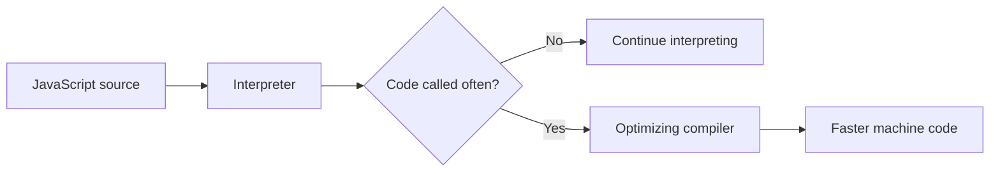
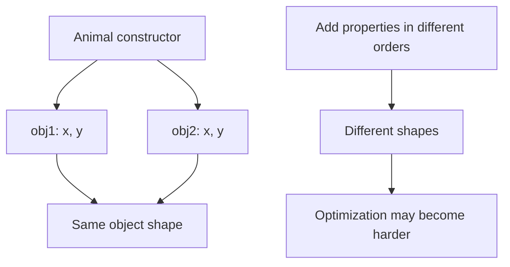
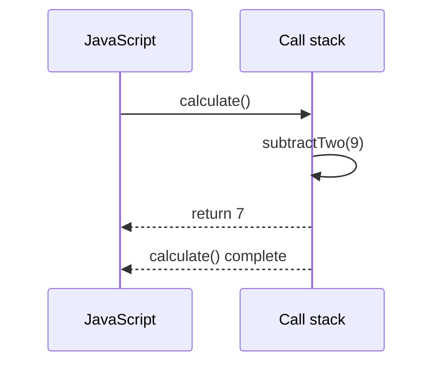
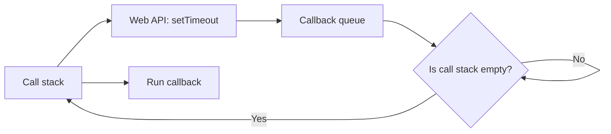
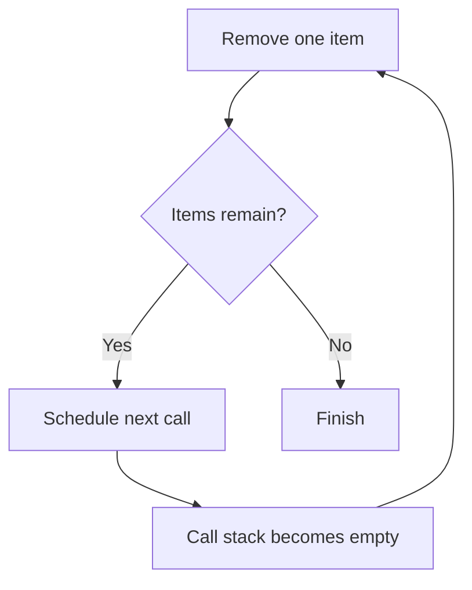
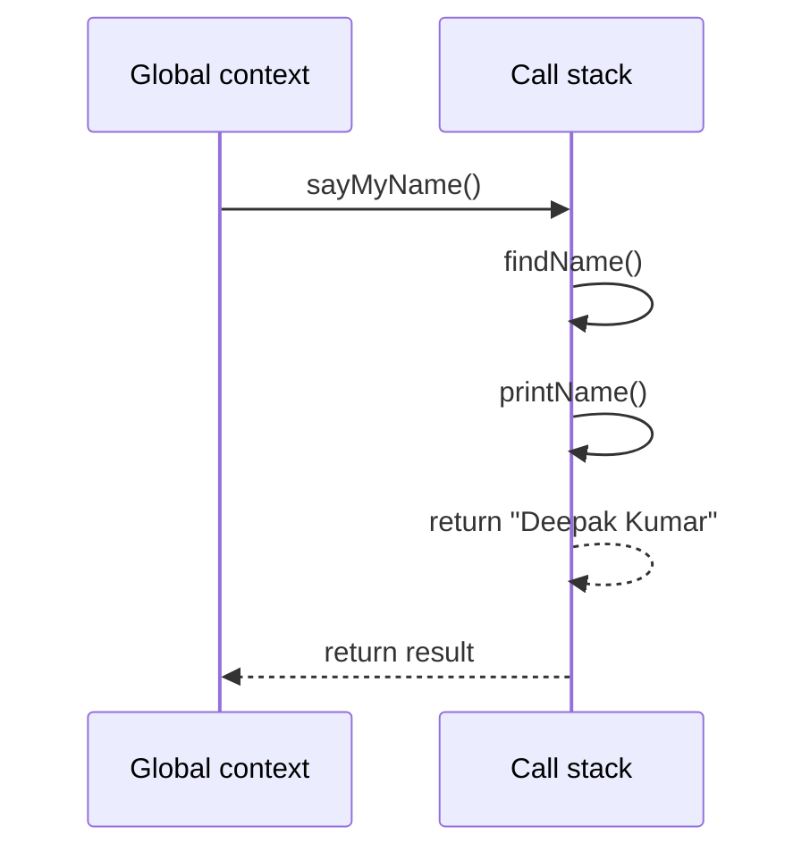
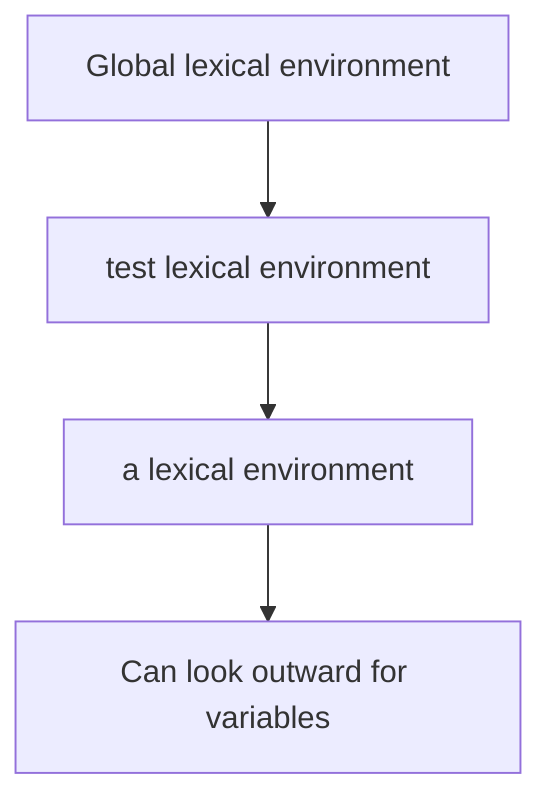
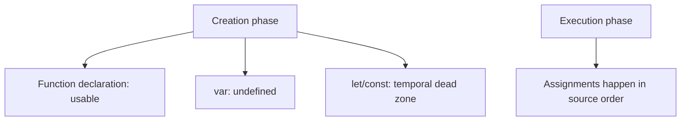
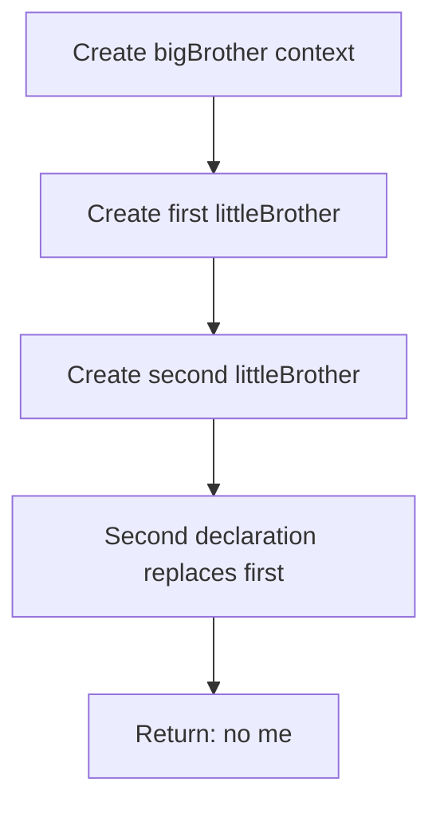

# JavaScript Exercise Notes

These notes summarize the concepts currently explored in `index.js`.

## 1. Interpreter and Compiler

JavaScript engines use both interpretation and compilation:

- An interpreter can start executing code quickly.
- A compiler can optimize frequently executed code while the program runs.
- Frequently called functions are good candidates for optimization.

The `someCalulation` function is called 1,000 times to illustrate repeated execution. The function name could be corrected to `someCalculation`.



## 2. Inline Caching

Inline caching is an engine optimization. When the engine repeatedly reads a property from objects with the same structure, it can remember where that property is located and access it faster next time.

Example idea:

```js
function findUser(user) {
  return `Found ${user.firstName} ${user.lastName}`;
}
```

The original example uses `user` and `UserActivation` without defining them inside the function. The intended property is `user.lastName`, and passing the user as an argument makes the example self-contained.

## 3. Hidden Classes

JavaScript engines can give objects with the same property layout an internal shape, sometimes called a hidden class. Objects created from the same constructor can then be accessed efficiently.

```js
function Animal(x, y) {
  this.x = x;
  this.y = y;
}

const obj1 = new Animal(1, 2);
const obj2 = new Animal(3, 4);
```

Keep objects created from the same constructor consistent when possible. Adding properties later in different orders can create different internal shapes and reduce optimization opportunities:

```js
obj1.a = 30;
obj2.a = 30;
```

The important idea is consistent object structure, not that every property must be declared in the constructor.



## 4. The `delete` Keyword

`delete` removes an object property:

```js
delete obj1.x;
```

It is not used as an assignment such as `delete obj1.x = 40`. Deleting properties can change an object's internal shape, so it may make repeated property access less predictable for the engine.

## 5. Memory Heap and Call Stack

JavaScript uses two important runtime areas:

- **Memory heap:** stores values such as objects, arrays, and function data.
- **Call stack:** tracks the functions currently being executed.

In the example:

```js
function subtractTwo(num) {
  return num - 2;
}

function calculate() {
  const sumTotal = 4 + 5;
  return subtractTwo(sumTotal);
}

calculate();
```

The call stack briefly looks like this:

1. `calculate()` is added to the stack.
2. `subtractTwo()` is added while `calculate()` is running.
3. `subtractTwo()` returns and is removed.
4. `calculate()` returns and is removed.



Example output order:

```js
function subtractTwo(number) {
  return number - 2;
}

function calculate() {
  const total = 4 + 5;
  return subtractTwo(total);
}

console.log(calculate()); // 7
```

## 6. Memory Leaks

A memory leak happens when memory is still reachable even though the application no longer needs it. Common examples in the file are:

### Unintended global variables

```js
var a = 1;
var b = 1;
var c = 1;
```

Long-lived global values stay reachable for the lifetime of the page. Prefer block-scoped variables with `const` or `let`, and keep values in the smallest useful scope.

### Event listeners that are never removed

```js
const element = document.getElementById("button");
element.addEventListener("click", onClick);
```

When a listener is no longer needed, remove it:

```js
element.removeEventListener("click", onClick);
```

The same function reference must be used when adding and removing the listener.

In the current `index.js`, the listener registration is commented out, so that line is only a warning example.

### Intervals that are never cleared

```js
const intervalId = setInterval(() => {}, 0);
clearInterval(intervalId);
```

Use `clearInterval` when the repeating work should stop.

The current file creates an interval without clearing it. In a real application, keep the interval ID and clear it when the work is finished.

## 7. JavaScript Is Single-Threaded

JavaScript code runs on one main call stack. It executes synchronous statements one at a time. The browser can still handle asynchronous work through the runtime APIs, allowing JavaScript to remain responsive while waiting for timers, network requests, or user actions.

## 8. JavaScript Runtime

The browser JavaScript runtime can be understood as these cooperating parts:

- **Call stack:** executes JavaScript functions.
- **Memory heap:** stores allocated values.
- **Web APIs:** browser features such as the DOM, `fetch`, and `setTimeout`.
- **Callback queue:** holds callbacks ready to run.
- **Event loop:** moves callbacks to the call stack when the stack is empty.

A typical asynchronous flow is:

1. JavaScript starts an asynchronous Web API operation.
2. The call stack becomes available for other synchronous code.
3. The Web API finishes and places the callback in the callback queue.
4. The event loop waits for an empty call stack.
5. The callback is moved to the call stack and executed.



The event loop does not make JavaScript run two pieces of JavaScript at the same time. It decides when waiting callbacks can enter the one call stack:

```js
console.log("Start");

setTimeout(() => {
  console.log("Timer callback");
}, 0);

console.log("End");

// Output:
// Start
// End
// Timer callback
```

The timer callback waits until the current synchronous code has finished, even with a delay of `0` milliseconds.

The same rule applies to the example in `index.js`:

```js
console.log("1");

setTimeout(() => {
  console.log("2");
}, 1000);

console.log("3");

// Output immediately:
// 1
// 3
// After about one second:
// 2
```

## 9. Preventing Stack Overflow

Calling a recursive function too many times can overflow the call stack because every call must remain on the stack until the next call finishes. The file avoids this by removing one item at a time and scheduling the next removal with `setTimeout`:

```js
const list = new Array(60000).join("1.1").split(".");

function removeItemsFromList() {
  const item = list.pop();

  if (item) {
    setTimeout(removeItemsFromList, 0);
  } else {
    console.log("END = " + list.length);
  }
}

removeItemsFromList();
```

`setTimeout` lets the current function return before the next call starts, so the calls do not build up in one large stack:



## 10. Execution Context

An execution context is the environment in which JavaScript code runs. It contains information needed to execute that code, including variables, function declarations, and the value of `this`.

JavaScript creates a global execution context first. Each function call creates a new function execution context:

```js
function printName() {
  return "Deepak Kumar";
}

function findName() {
  return printName();
}

function sayMyName() {
  return findName();
}

sayMyName();
```

The function contexts are added to and removed from the call stack in this order:



## 11. Lexical Environment

A lexical environment is created based on where code is written. It stores identifiers such as variables and functions and provides the connection to its outer environment.

For example, function `a` is written inside `test`, so its lexical environment is nested inside the lexical environment of `test`:

```js
function test() {
  function a() {}
}
```

The lexical environment is determined by the source-code location, not by the place from which a function is called. This is the foundation of lexical scope and closures.



## 12. Hoisting

Hoisting describes how JavaScript handles declarations during the creation phase of an execution context. Declarations are processed before the code runs, but different declaration types behave differently:

- **Function declarations** are available before their line appears in the source code.
- **`var` declarations** are hoisted and initialized with `undefined`.
- **Function expressions assigned to `var`** are hoisted only as `undefined`; the function value is assigned later.
- **`let` and `const`** are hoisted internally but remain in the temporal dead zone until their declaration is reached, so reading them early throws an error.



### Function declaration versus function expression

```js
console.log(sing()); // "ohhh la la la"

function sing() {
  return "ohhh la la la";
}
```

The function declaration can be called before its declaration. This function expression cannot be called before assignment:

```js
console.log(sing2); // undefined
// sing2();          // TypeError: sing2 is not a function

var sing2 = function () {
  return "uhhhh la la la";
};
```

### `var` redeclaration and function replacement

The file also shows that `var` can be declared more than once, and a later function declaration replaces an earlier one:

```js
var one = 1;
var one = 2;
console.log(one); // 2

a(); // "Bye"

function a() {
  console.log("Hi");
}

function a() {
  console.log("Bye");
}
```

Prefer `let` and `const` for new code because they prevent accidental redeclaration in the same scope and make access-before-declaration errors visible.

### Local scope during a function call

Each function call gets its own local environment. The local `favouritedFood` below starts as `undefined`, so it shadows the outer variable:

```js
var favouritedFood = "grapes";

var foodThoughts = function () {
  var favouritedFood;
  console.log(favouritedFood); // undefined
  favouritedFood = "Sushi";
  console.log(favouritedFood); // "Sushi"
};

foodThoughts();
```

### Duplicate function declarations

Function declarations with the same name are stored in the same environment. When the code is created, the later declaration replaces the earlier one:

```js
function bigBrother() {
  function littleBrother() {
    return "it is me!";
  }

  function littleBrother() {
    return "no me!";
  }

  return littleBrother();
}

console.log(bigBrother()); // "no me!"
```

The second `littleBrother` declaration is the one that `bigBrother` calls:



Avoid duplicate function names in the same scope because the result can be confusing and easy to overlook.

## Quick Review

- Repeated code can be optimized by the JavaScript engine.
- Consistent object shapes help engine optimizations.
- The call stack manages execution order; the heap stores data.
- Unremoved references, listeners, and intervals can keep memory alive.
- The event loop coordinates asynchronous callbacks with the single call stack.
- `setTimeout` can defer work and help avoid building a deeply recursive call stack.
- Execution contexts describe the current global or function execution environment.
- Lexical environments come from where code is written and form nested scopes.
- Hoisting processes declarations before execution, with different behavior for `var`, functions, `let`, and `const`.
- When function declarations have the same name, the later declaration replaces the earlier one.

## Important Runtime Note

`document`, `setInterval`, and event listeners require a browser environment. Running `index.js` directly with Node.js will not provide `document` unless it is mocked or otherwise supplied.
