# JavaScript Exercise Notes

These notes summarize the concepts currently explored in `index.js`.

## 1. Interpreter and Compiler

JavaScript engines use both interpretation and compilation:

- An interpreter can start executing code quickly.
- A compiler can optimize frequently executed code while the program runs.
- Frequently called functions are good candidates for optimization.

The `someCalulation` function is called 1,000 times to illustrate repeated execution. The function name could be corrected to `someCalculation`.

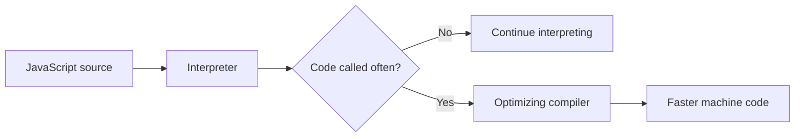

## 2. Inline Caching

Inline caching is an engine optimization. When the engine repeatedly reads a property from objects with the same structure, it can remember where that property is located and access it faster next time.

Example idea:

```js
function findUser(user) {
  return `Found ${user.firstName} ${user.lastName}`;
}
```

The original example uses `user` and `UserActivation` without defining them inside the function. The intended property is `user.lastName`, and passing the user as an argument makes the example self-contained.

## 3. Hidden Classes

JavaScript engines can give objects with the same property layout an internal shape, sometimes called a hidden class. Objects created from the same constructor can then be accessed efficiently.

```js
function Animal(x, y) {
  this.x = x;
  this.y = y;
}

const obj1 = new Animal(1, 2);
const obj2 = new Animal(3, 4);
```

Keep objects created from the same constructor consistent when possible. Adding properties later in different orders can create different internal shapes and reduce optimization opportunities:

```js
obj1.a = 30;
obj2.a = 30;
```

The important idea is consistent object structure, not that every property must be declared in the constructor.

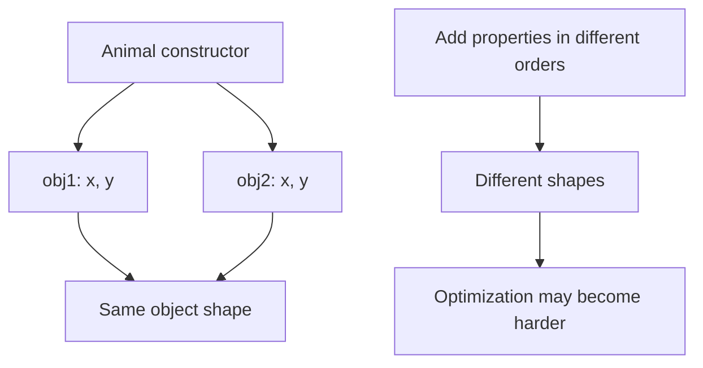

## 4. The `delete` Keyword

`delete` removes an object property:

```js
delete obj1.x;
```

It is not used as an assignment such as `delete obj1.x = 40`. Deleting properties can change an object's internal shape, so it may make repeated property access less predictable for the engine.

## 5. Memory Heap and Call Stack

JavaScript uses two important runtime areas:

- **Memory heap:** stores values such as objects, arrays, and function data.
- **Call stack:** tracks the functions currently being executed.

In the example:

```js
function subtractTwo(num) {
  return num - 2;
}

function calculate() {
  const sumTotal = 4 + 5;
  return subtractTwo(sumTotal);
}

calculate();
```

The call stack briefly looks like this:

1. `calculate()` is added to the stack.
2. `subtractTwo()` is added while `calculate()` is running.
3. `subtractTwo()` returns and is removed.
4. `calculate()` returns and is removed.

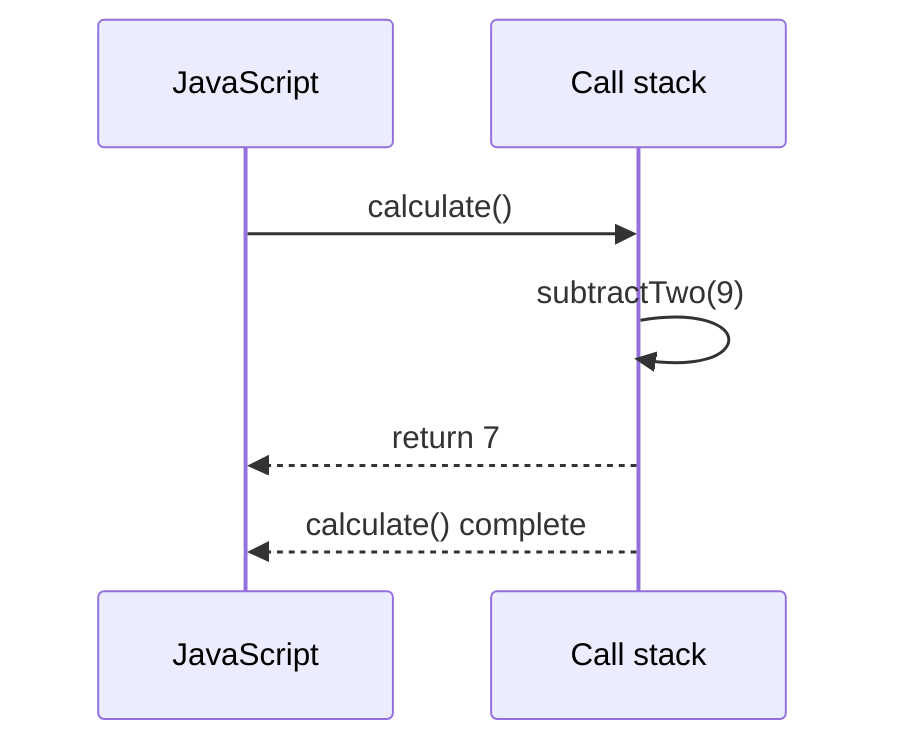

Example output order:

```js
function subtractTwo(number) {
  return number - 2;
}

function calculate() {
  const total = 4 + 5;
  return subtractTwo(total);
}

console.log(calculate()); // 7
```

## 6. Memory Leaks

A memory leak happens when memory is still reachable even though the application no longer needs it. Common examples in the file are:

### Unintended global variables

```js
var a = 1;
var b = 1;
var c = 1;
```

Long-lived global values stay reachable for the lifetime of the page. Prefer block-scoped variables with `const` or `let`, and keep values in the smallest useful scope.

### Event listeners that are never removed

```js
const element = document.getElementById("button");
element.addEventListener("click", onClick);
```

When a listener is no longer needed, remove it:

```js
element.removeEventListener("click", onClick);
```

The same function reference must be used when adding and removing the listener.

In the current `index.js`, the listener registration is commented out, so that line is only a warning example.

### Intervals that are never cleared

```js
const intervalId = setInterval(() => {}, 0);
clearInterval(intervalId);
```

Use `clearInterval` when the repeating work should stop.

The current file creates an interval without clearing it. In a real application, keep the interval ID and clear it when the work is finished.

## 7. JavaScript Is Single-Threaded

JavaScript code runs on one main call stack. It executes synchronous statements one at a time. The browser can still handle asynchronous work through the runtime APIs, allowing JavaScript to remain responsive while waiting for timers, network requests, or user actions.

## 8. JavaScript Runtime

The browser JavaScript runtime can be understood as these cooperating parts:

- **Call stack:** executes JavaScript functions.
- **Memory heap:** stores allocated values.
- **Web APIs:** browser features such as the DOM, `fetch`, and `setTimeout`.
- **Callback queue:** holds callbacks ready to run.
- **Event loop:** moves callbacks to the call stack when the stack is empty.

A typical asynchronous flow is:

1. JavaScript starts an asynchronous Web API operation.
2. The call stack becomes available for other synchronous code.
3. The Web API finishes and places the callback in the callback queue.
4. The event loop waits for an empty call stack.
5. The callback is moved to the call stack and executed.

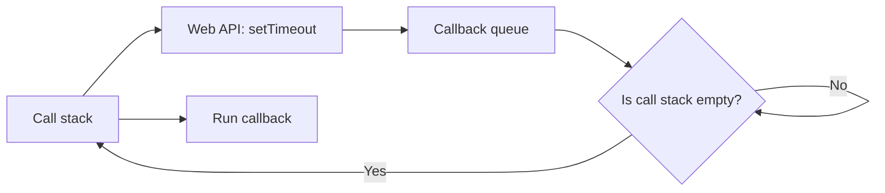

The event loop does not make JavaScript run two pieces of JavaScript at the same time. It decides when waiting callbacks can enter the one call stack:

```js
console.log("Start");

setTimeout(() => {
  console.log("Timer callback");
}, 0);

console.log("End");

// Output:
// Start
// End
// Timer callback
```

The timer callback waits until the current synchronous code has finished, even with a delay of `0` milliseconds.

The same rule applies to the example in `index.js`:

```js
console.log("1");

setTimeout(() => {
  console.log("2");
}, 1000);

console.log("3");
```

## 9. OOP Fundamentals

Object-oriented programming is a way of organizing code around objects. Each object can hold data and behavior together. The main idea is to model real-world entities such as a `Character`, `Elf`, or `Queen` with a shared blueprint and specialized behavior.

The four core OOP rules are:

1. **Encapsulation:** keep data and behavior together.
2. **Abstraction:** expose only what matters and hide implementation details.
3. **Inheritance:** reuse behavior from a parent class.
4. **Polymorphism:** override or reuse the same method name in different child classes.

```js
class Character {
  constructor(name, weapon) {
    this.name = name;
    this.weapon = weapon;
  }

  attack() {
    return `Attack with ${this.weapon}`;
  }
}

class Elf extends Character {
  constructor(name, weapon, type) {
    super(name, weapon);
    this.type = type;
  }

  attack() {
    return `Elf ${this.name} attacks with ${this.weapon}`;
  }
}

class Ogre extends Character {
  constructor(name, weapon, color) {
    super(name, weapon);
    this.color = color;
  }

  makeFort() {
    return `${this.name} builds a strong fort`;
  }
}

class Queen extends Character {
  constructor(name, weapon, kind) {
    super(name, weapon);
    this.kind = kind;
  }

  attack() {
    console.log(super.attack());
    return `I am the ${this.name} of ${this.kind}, now bow down to me!`;
  }
}

const bob = new Elf("Bob", "sword", "forest");
const shrek = new Ogre("Shrek", "club", "green");
const victoria = new Queen("Victoria", "army", "hearts");

console.log(bob.attack());
console.log(shrek.makeFort());
console.log(victoria.attack());
```

This is the typical inheritance chain:

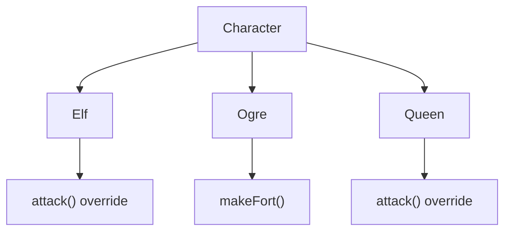

The important rule is that a child class can reuse the parent logic and then specialize it. In JavaScript, `extends` creates that relationship. The `super()` call initializes the parent constructor, and override methods let the child change behavior without changing the parent definition.

When to use inheritance vs. composition:

- Use inheritance when there is a true parent-child relationship and shared behavior.
- Use composition when the object should contain reusable behavior instead of being a strict subclass.

### OOP vs FP and composition vs inheritance

The exercise file also describes the trade-off in a very practical way:

- OOP: few operations on common data, stateful behavior, side effects, imperative style, and data + behavior kept together.
- FP: many operations on fixed data, stateless behavior, pure functions, declarative style, and data kept separate from behavior.

```js
// Composition example: build behavior from reusable pieces
function getAttack(character) {
  return {
    ...character,
    attack() {
      return `${this.name} attacks with ${this.weapon}`;
    },
  };
}

function Elf(name, weapon, type) {
  const elf = { name, weapon, type };
  return getAttack(elf);
}

function Ogre(name, weapon, color) {
  const ogre = { name, weapon, color };
  return {
    ...getAttack(ogre),
    makeFort() {
      return `${this.name} builds a strong fort`;
    },
  };
}
```

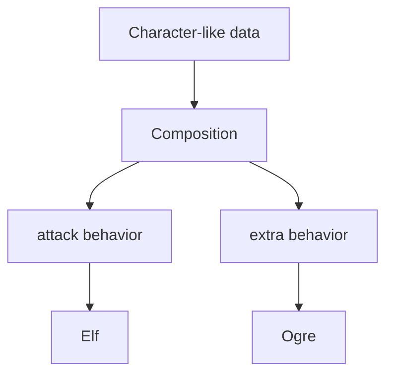

This is the key idea behind the note in the source file:

- Inheritance is useful for a strict hierarchy such as `Character -> Elf -> Queen`.
- Composition is better when you want to mix and match behavior like attack, sleep, shield, or fort-building without creating a rigid class chain.
- In practice, modern JavaScript systems often blend both: classes for domain models, functions for reusable logic and pure transformations.

## 10. Currying and Closures

Currying transforms a function that takes multiple arguments into a sequence of functions, each taking one argument. This works because of JavaScript's closure mechanism.

```js
// Without closure optimization
function addTwo(a) {
  return (b) => {
    return (c) => {
      return (d) => {
        return (e) => {
          return () => {
            return a + b + c + d + e;
          };
        };
      };
    };
  };
}

// With recursion and early return
function improved(a) {
  return function (b) {
    if (b === undefined) {
      return a;
    }
    return improved(a + b);
  };
}
```

The `improved` version allows flexible arity—you can call it with as many or as few arguments as needed before calling with no arguments to finalize.

## 11. Function Composition and Pipe

Composition chains multiple functions together. The `pipe` pattern applies functions left-to-right, transforming the output of one function into the input of the next.

```js
const pipe =
  (f, g) =>
  (...args) =>
    g(f(...args));

purchaseItems(
  addItemToCart,
  applyTaxToItems,
  buyItems,
  emptyCart,
)(user, { name: "laptop", price: 2000 });
```

This creates a data transformation pipeline where state flows through each function immutably.

## 12. Pure Functions and Side Effects

A pure function has no side effects and always returns the same output for the same input:

```js
// Pure: Creates new array, doesn't modify original
function removeLastItem(arr) {
  const newArray = [].concat(arr);
  newArray.pop();
  return newArray;
}

// Impure: Modifies the original array
function mutateArray(arr) {
  arr.pop();
}
```

Impure functions modify external state or depend on it, making code harder to test and reason about. Pure functions are predictable and composable.

## 13. Referential Transparency

Code exhibits referential transparency when you can replace a function call with its return value without changing the program's behavior. This only works for pure functions:

```js
function j(num1, num2) {
  return num1 * num2;
}

j(3, 4); // Always returns 12
f(j(3, 4)); // Same as f(12)
```

## 14. Immutable State Management

The Amazon cart example demonstrates immutability using `Object.assign` to create new state objects rather than mutating existing ones:

```js
return Object.assign({}, user, { cart: updatedCart });
```

This pattern:

- Maintains a history of all state transitions
- Prevents accidental mutations
- Makes debugging easier by keeping transaction records
- Enables undo/redo and audit trails

See [excercise/interview.js](interview.js) for the full shopping cart implementation with history tracking.

## 9. How JavaScript Works Under the Hood

A JavaScript program is not magic; it is a combination of memory allocation, parsing, and execution.

- **Memory heap:** stores allocated values such as objects, arrays, strings, and numbers.
- **Call stack:** tracks the active function calls in the order they are running.
- **Parser/executor:** reads the source and runs the operations in the current execution context.

```js
const a = 1;
const b = 2;
const c = 3;

const one = () => {
  const two = () => {
    console.log(4);
  };
  two();
};

one();
```

The order in the call stack is:

1. `one()` enters the stack.
2. `two()` enters while `one()` is still running.
3. `two()` finishes and is removed.
4. `one()` finishes and is removed.
5. The global execution context resumes.

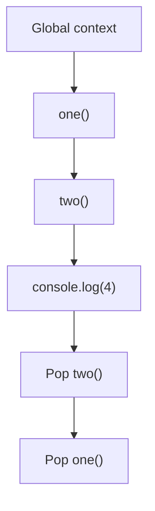

### Stack overflow and recursion

A recursion bug keeps adding frames on the stack until the memory limit is reached.

```js
function fooooo() {
  fooooo();
}

fooooo();
```

This is a classic stack overflow because each call waits for the next call to finish before it can return. The engine keeps allocating more stack frames until it crashes or throws a maximum call stack error.

### Timer order and the event loop

JavaScript is single-threaded, but it can schedule work with browser APIs such as `setTimeout` and `Promise` callbacks.

```js
console.log("1");
setTimeout(() => console.log("2"), 0);
Promise.resolve().then(() => console.log("3"));
console.log("4");
Promise.resolve().then(() => {
  console.log("5");
  setTimeout(() => console.log("6"), 0);
});
console.log("7");
```

Output order:

```js
// 1
// 4
// 7
// 3
// 5
// 2
// 6
```

Why this happens:

1. `console.log("1")` and `console.log("4")` and `console.log("7")` run synchronously on the call stack.
2. Promise callbacks are placed in the microtask queue.
3. The microtask queue is drained before the timer task queue is processed.
4. `setTimeout` callbacks wait in the task queue until the stack is empty.

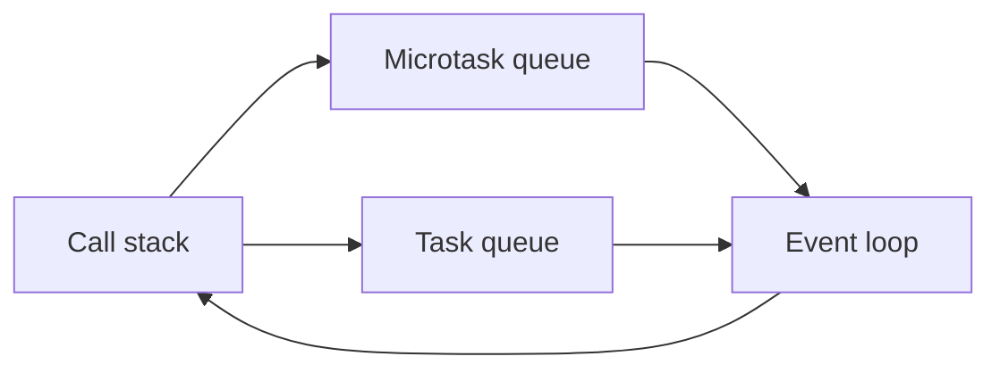

This explains the single-thread model:

- JavaScript runs one piece of code at a time on the main thread.
- Browser APIs do not block the JavaScript thread.
- The event loop decides when queued callbacks are allowed to run.

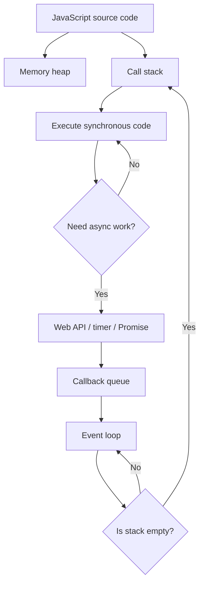

The key interview answer is: JavaScript is single-threaded, but it is not blocking because asynchronous work is delegated to the environment and then resumed when the call stack is available.

## 10. Preventing Stack Overflow

Calling a recursive function too many times can overflow the call stack because every call must remain on the stack until the next call finishes. The file avoids this by removing one item at a time and scheduling the next removal with `setTimeout`:

```js
const list = new Array(60000).join("1.1").split(".");

function removeItemsFromList() {
  const item = list.pop();

  if (item) {
    setTimeout(removeItemsFromList, 0);
  } else {
    console.log("END = " + list.length);
  }
}

removeItemsFromList();
```

`setTimeout` lets the current function return before the next call starts, so the calls do not build up in one large stack:

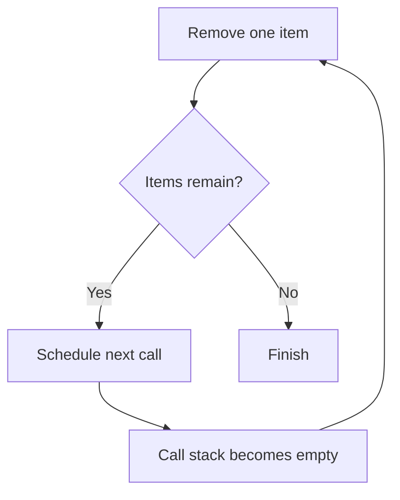

## 10. Execution Context

An execution context is the environment in which JavaScript code runs. It contains information needed to execute that code, including variables, function declarations, and the value of `this`.

JavaScript creates a global execution context first. Each function call creates a new function execution context:

```js
function printName() {
  return "Deepak Kumar";
}

function findName() {
  return printName();
}

function sayMyName() {
  return findName();
}

sayMyName();
```

The function contexts are added to and removed from the call stack in this order:

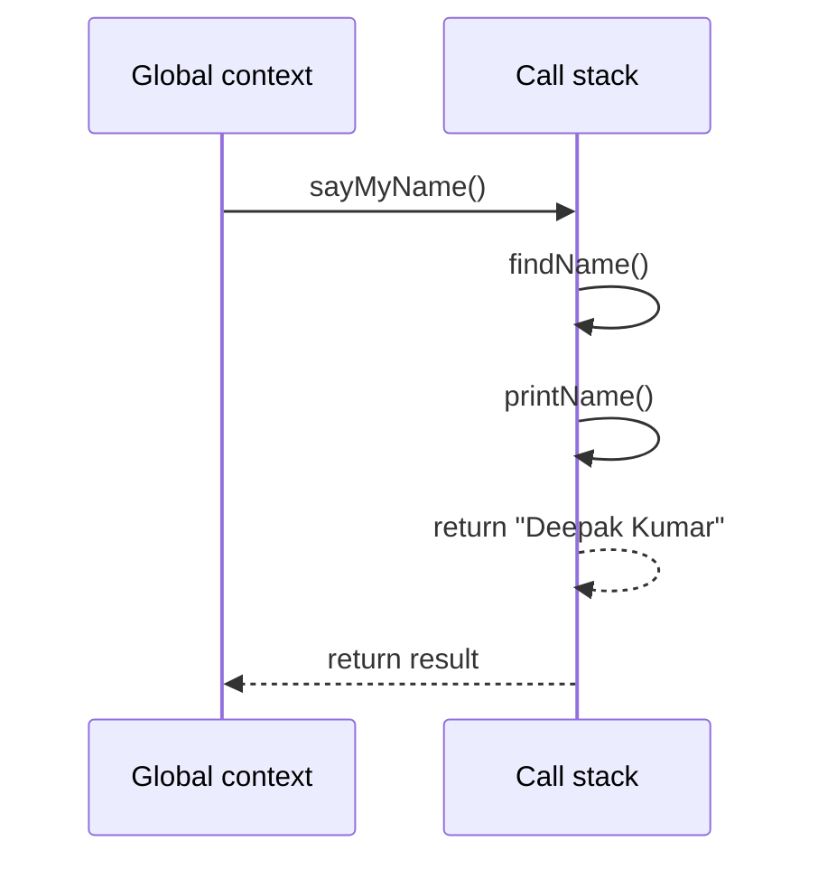

## 11. Lexical Environment

A lexical environment is created based on where code is written. It stores identifiers such as variables and functions and provides the connection to its outer environment.

For example, function `a` is written inside `test`, so its lexical environment is nested inside the lexical environment of `test`:

```js
function test() {
  function a() {}
}
```

The lexical environment is determined by the source-code location, not by the place from which a function is called. This is the foundation of lexical scope and closures.

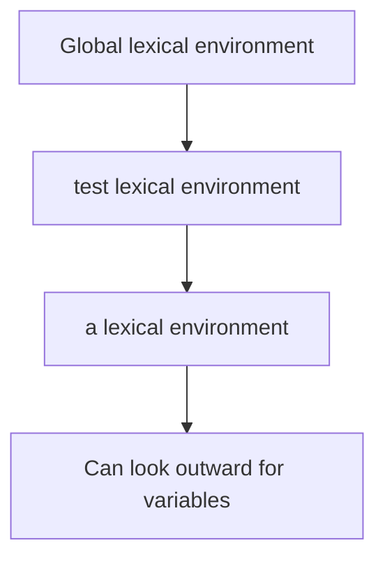

## 12. Hoisting

Hoisting describes how JavaScript handles declarations during the creation phase of an execution context. Declarations are processed before the code runs, but different declaration types behave differently:

- **Function declarations** are available before their line appears in the source code.
- **`var` declarations** are hoisted and initialized with `undefined`.
- **Function expressions assigned to `var`** are hoisted only as `undefined`; the function value is assigned later.
- **`let` and `const`** are hoisted internally but remain in the temporal dead zone until their declaration is reached, so reading them early throws an error.

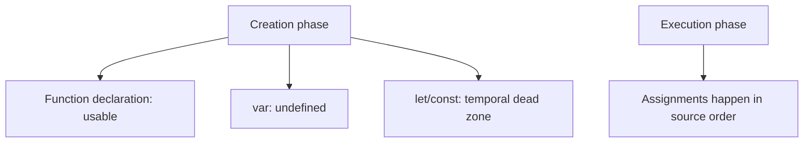

### Function declaration versus function expression

```js
console.log(sing()); // "ohhh la la la"

function sing() {
  return "ohhh la la la";
}
```

The function declaration can be called before its declaration. This function expression cannot be called before assignment:

```js
console.log(sing2); // undefined
// sing2();          // TypeError: sing2 is not a function

var sing2 = function () {
  return "uhhhh la la la";
};
```

### `var` redeclaration and function replacement

The file also shows that `var` can be declared more than once, and a later function declaration replaces an earlier one:

```js
var one = 1;
var one = 2;
console.log(one); // 2

a(); // "Bye"

function a() {
  console.log("Hi");
}

function a() {
  console.log("Bye");
}
```

Prefer `let` and `const` for new code because they prevent accidental redeclaration in the same scope and make access-before-declaration errors visible.

### Local scope during a function call

Each function call gets its own local environment. The local `favouritedFood` below starts as `undefined`, so it shadows the outer variable:

```js
var favouritedFood = "grapes";

var foodThoughts = function () {
  var favouritedFood;
  console.log(favouritedFood); // undefined
  favouritedFood = "Sushi";
  console.log(favouritedFood); // "Sushi"
};

foodThoughts();
```

### Duplicate function declarations

Function declarations with the same name are stored in the same environment. When the code is created, the later declaration replaces the earlier one:

```js
function bigBrother() {
  function littleBrother() {
    return "it is me!";
  }

  function littleBrother() {
    return "no me!";
  }

  return littleBrother();
}

console.log(bigBrother()); // "no me!"
```

The second `littleBrother` declaration is the one that `bigBrother` calls:

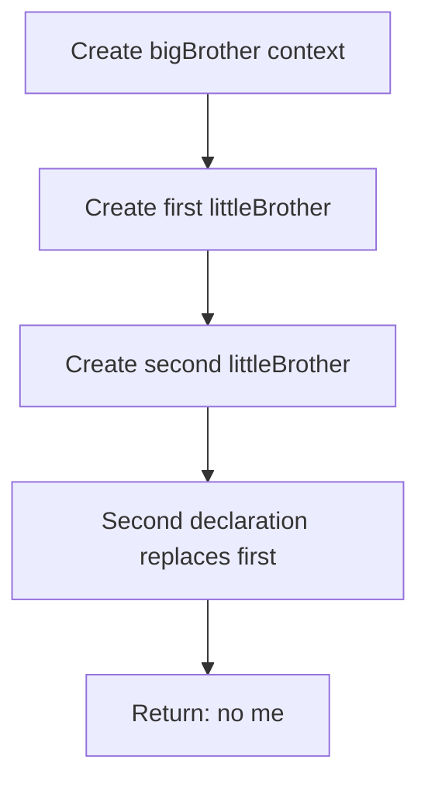

In the current `index.js`, the second declaration is commented out, so the active `littleBrother` returns `"it is me!"`. The replacement behavior remains a useful hoisting exercise. Avoid duplicate function names in the same scope because the result can be confusing and easy to overlook.

## 13. Function Expressions and Invocation

A function can be created with a function expression, an arrow function, or a function declaration:

```js
// Function expression using an arrow function
var canada = () => {
  console.log("Cold");
};

// Function declaration
function india() {
  console.log("Warm");
}

// Invocation, call, and execution all mean running a function
canada();
india();
```

An arrow function assigned to a variable is a value stored in that variable. A function declaration is registered during the creation phase and can be called before its declaration.

## 14. Parameters and the `arguments` Object

Function parameters receive values passed at the call site. Inside a regular function, the special `arguments` object contains the values that were passed:

```js
function marry(person1, person2) {
  console.log(arguments); // array-like object of passed values
  console.log(Array.from(arguments)); // real array
  return `${person1} is now married to ${person2}`;
}

console.log(marry("Tim", "Tina"));
// Tim is now married to Tina
```

`arguments` is array-like, not a real array. `Array.from(arguments)` converts it into an array so array methods can be used. Arrow functions do not have their own `arguments` object.

## 15. Variable Environment

Every function execution context has its own variable environment. A local variable can have the same name as a global variable without changing the global value:

```js
function two() {
  var isValid; // undefined in two's environment
}

function one() {
  var isValid = true; // one has its own value
  two();
}

var isValid = false; // global value
one();
```

The three `isValid` variables belong to three different environments:

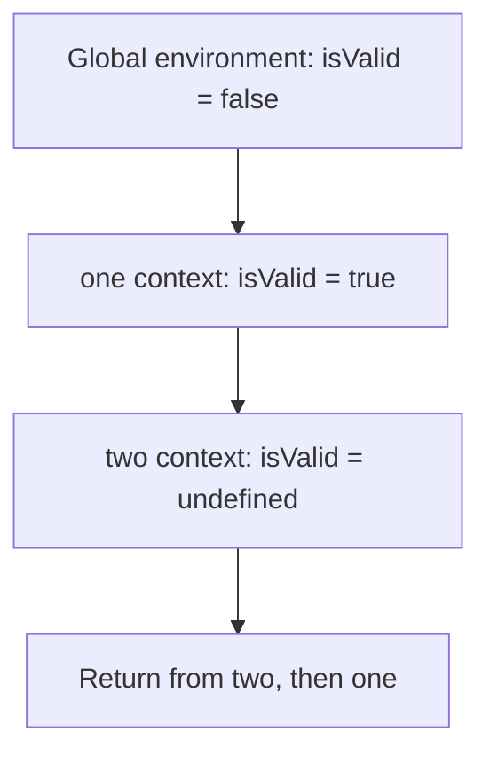

When a function finishes, its execution context is removed from the call stack. Its local variables are no longer available unless another reference, such as a closure, keeps them reachable.

## 16. Scope Chain and Static Scope

The scope chain is the path JavaScript follows when it looks for a variable. JavaScript first checks the current function, then moves outward through the lexical environments until it finds the name or reaches the global environment.

```js
var x = "x";

function findName() {
  console.log(x); // found in the global environment
  var b = "b";
  return printName();
}

function printName() {
  var c = "c";
  console.log(x); // also found in the global environment
  return "Rohan shekhar";
}

function sayMyName() {
  var a = "a";
  return findName();
}

sayMyName();
```

`findName` cannot access the local variable `a` from `sayMyName`, because the functions are not nested in the source code. This is called static scope or lexical scope: a function's available outer variables are determined where the function is written, not where it is called.

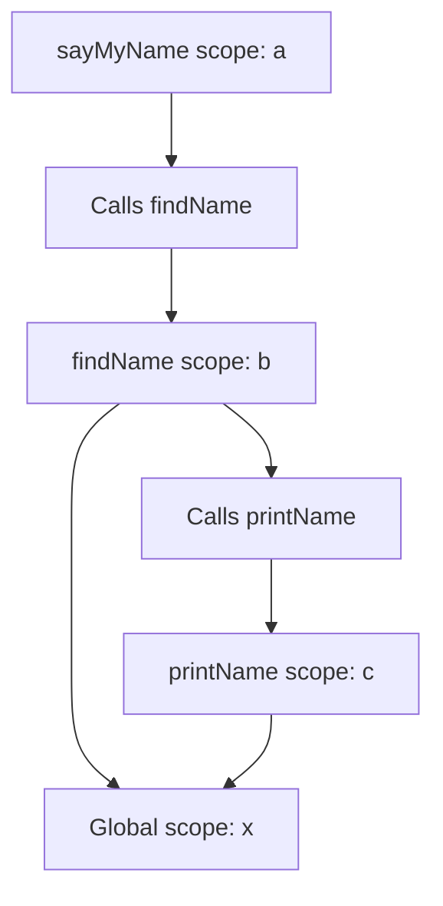

### Nested functions and closures

When a function is written inside another function, the inner function gets a link to the outer lexical environment. This link allows it to access variables from the place where it was created:

```js
function sayMyName1() {
  var name = "Rohan";

  return function findName() {
    return function printName() {
      return name;
    };
  };
}

const findName = sayMyName1();
const printName = findName();
console.log(printName()); // "Rohan"
```

The returned functions keep access to `name` even after `sayMyName1` has finished. This behavior is called a closure.

### How a closure remembers data

A closure is created when an inner function uses a variable from an outer function. The inner function keeps a reference to that lexical environment, so the variable remains available after the outer function returns:

```js
function createCounter() {
  let count = 0;

  return function increment() {
    count += 1;
    return count;
  };
}

const firstCounter = createCounter();
console.log(firstCounter()); // 1
console.log(firstCounter()); // 2
```

`count` is private. Code outside `createCounter` cannot change it directly; it can only use the returned function. Each call to `createCounter` creates a separate environment:

```js
const secondCounter = createCounter();

console.log(secondCounter()); // 1
console.log(firstCounter()); // 3
```

The two counters do not share `count` because each closure points to a different invocation environment.

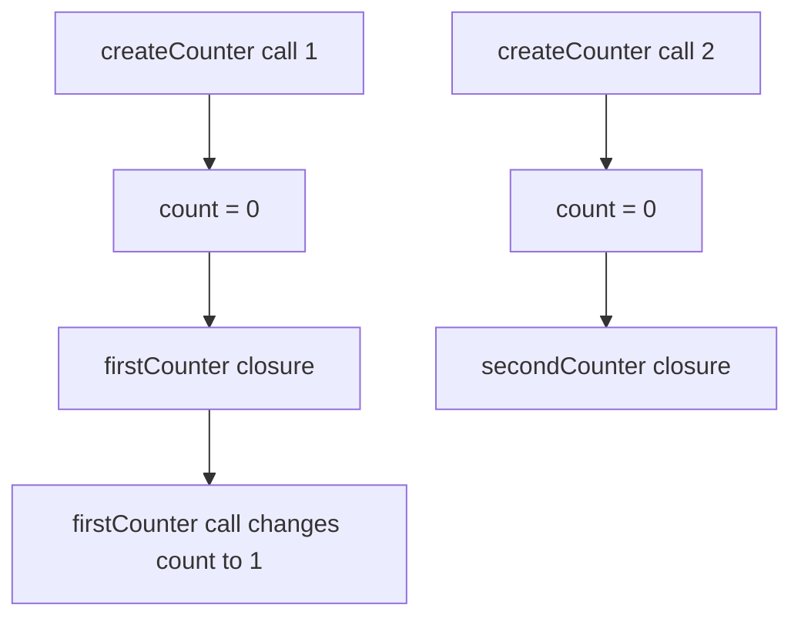

### Closures in loops

Use `let` when creating callbacks in a loop if each callback should remember its own iteration value. `let` creates a new binding for each iteration:

```js
const callbacks = [];

for (let index = 0; index < 3; index += 1) {
  callbacks.push(() => index);
}

console.log(callbacks[0]()); // 0
console.log(callbacks[1]()); // 1
console.log(callbacks[2]()); // 2
```

With `var`, all callbacks would share one function-scoped variable, whose final value after the loop is `3`:

```js
const callbacks = [];

for (var index = 0; index < 3; index += 1) {
  callbacks.push(() => index);
}

console.log(callbacks[0]()); // 3
console.log(callbacks[1]()); // 3
console.log(callbacks[2]()); // 3
```

Closures are useful for private state, factories, event handlers, timers, and currying. They can also retain large objects, so remove long-lived listeners and callbacks when they are no longer needed.

## 17. `undefined`

`undefined` means a variable exists but currently has no assigned value. It commonly appears when a variable is declared without an initializer or when a function does not return a value:

```js
var value;
console.log(value); // undefined

function doNothing() {}
console.log(doNothing()); // undefined
```

`undefined` is different from an undeclared variable. Reading an undeclared variable throws a `ReferenceError`:

```js
console.log(existingVariable); // undefined
var existingVariable;

// console.log(missingVariable); // ReferenceError
```

## 18. Accidental Global Variables

In non-strict JavaScript, assigning to a name that was never declared can create a property on the global object:

```js
function weird() {
  height = 50; // accidental global in non-strict mode
  return height;
}

console.log(weird()); // 50
```

This is called global-variable leakage. The assignment does not create a local variable inside `weird`; instead, it creates a global value. Global values can cause name collisions and remain in memory longer than needed.

Use strict mode to catch this mistake:

```js
"use strict";

function safeFunction() {
  height = 50; // ReferenceError: height was not declared
}
```

The safer fix is to declare the variable explicitly:

```js
function safeFunction() {
  const height = 50;
  return height;
}
```

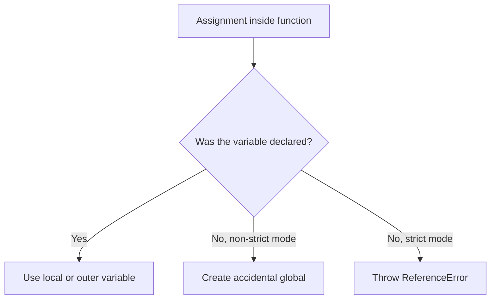

## 19. Named Function Expressions

A named function expression stores a function in a variable while giving the function its own internal name:

```js
var heyhey = function doodle() {
  return "Heyhey";
};

console.log(heyhey()); // "Heyhey"
```

The name `doodle` is available inside the function body, which is useful for recursion or self-reference. It is not available in the surrounding scope:

```js
var heyhey = function doodle() {
  return "Heyhey";
};

heyhey(); // works
// doodle(); // ReferenceError: doodle is not defined
```

The outside scope knows the variable `heyhey`; the function's internal scope knows the name `doodle`:

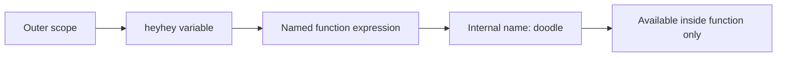

For a function expression, call the outer variable. The internal function name cannot be called directly from outside.

## 20. Function Scope and Block Scope

Scope describes where a variable can be accessed. `var` is function-scoped, while `let` and `const` are block-scoped.

### `var` is not limited to an `if` block

An `if` statement creates a block, but it does not create a separate function scope. A `var` declared inside the block can therefore be accessed after the block finishes:

```js
if (5 > 4) {
  var secret = "12345";
}

console.log(secret); // "12345"
```

The function `d` has its own function scope. Its local `secret` is a different variable and cannot be accessed from outside `d`:

```js
function d() {
  var secret = "123459899";
}

// console.log(secret); // does not access d's local variable
```

### `let` is block-scoped

`let` is available only between the braces where it is declared:

```js
if (6 > 5) {
  let secret = "123456";
  console.log(secret); // "123456"
}

// console.log(secret); // ReferenceError: secret is not defined
```

In the current exercise, the final `console.log(secret, "2")` still reads the earlier `var secret`, so it prints `12345 2`. The later `let secret` belongs only to its own `if` block.

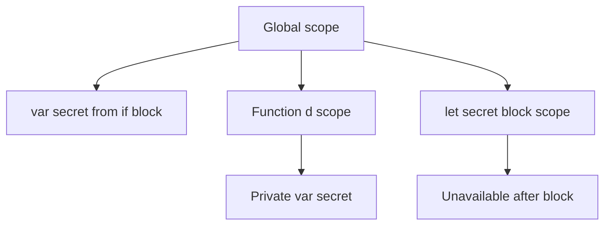

Prefer `let` or `const` for block-specific values. This prevents accidental access outside the block and makes the variable's lifetime easier to understand.

### `var` inside a `for` loop

A `for` loop also creates a block, but `var` ignores block boundaries and belongs to the surrounding function scope:

```js
function loop() {
  for (var i = 0; i < 5; i++) {
    console.log(i); // 0, 1, 2, 3, 4
  }

  console.log("Final", i); // Final 5
}

loop();
```

The loop stops when `i` becomes `5`, so that value is available after the loop. With `let`, `i` would exist only inside the `for` block:

```js
function saferLoop() {
  for (let i = 0; i < 5; i++) {
    console.log(i);
  }

  // console.log(i); // ReferenceError: i is not defined
}
```

```mermaid
flowchart TD
    A[for block] --> B[var i belongs to function scope]
    B --> C[i is available after loop]
    D[for block] --> E[let i belongs to block scope]
    E --> F[i unavailable after loop]
```

## 21. Global Namespace and Variable Collisions

The global namespace is the shared space where top-level variables and functions are stored. Adding many names to it can cause collisions, where one variable or function accidentally overwrites another with the same name.

```js
var userName = "Raushan";

// Later code reuses the same global name.
var userName = "Andre";

console.log(userName); // "Andre"
```

The global namespace is like a shared table: every global name must be unique enough not to conflict with names from other scripts. Prefer modules, functions, or block-scoped `let` and `const` to keep implementation details private.

```mermaid
flowchart TD
  A[Script 1: userName] --> C[Global namespace]
  B[Script 2: userName] --> C
  C --> D[Collision or overwritten value]
  E[Module or function scope] --> F[Private names]
```

## 22. IIFE

An IIFE, or Immediately Invoked Function Expression, is a function expression that is created and called immediately. It creates a private function scope without adding its internal variables to the global namespace:

```js
(function () {
  const privateValue = "hidden";
  console.log(privateValue); // "hidden"
})();

// console.log(privateValue); // ReferenceError
```

The extra parentheses turn the function declaration into an expression, and the final `()` invokes it immediately:

```mermaid
flowchart LR
  A[Create function expression] --> B[Create private scope]
  B --> C[Invoke immediately]
  C --> D[Private variables are discarded or released]
```

IIFEs were commonly used before JavaScript modules became widespread. Modern code generally prefers ES modules, but understanding IIFEs helps explain older JavaScript patterns and private scope.

## 23. The `this` Keyword

`this` usually refers to the object used to call a regular function. The call site determines its value; the place where the function is written does not.

### `this` inside an object method

When a method is called through an object, `this` refers to that object:

```js
const obj = {
  name: "Zilly",
  sing() {
    return "lalala " + this.name;
  },
  singAgain() {
    return this.sing() + "!";
  },
};

console.log(obj.sing()); // "lalala Zilly"
console.log(obj.singAgain()); // "lalala Zilly!"
```

This lets one method use the data belonging to its object. The same function can also be shared by multiple objects:

```js
function importantPerson() {
  console.log(this.name + "!");
}

const cassy = { name: "Cassy", importantPerson };
const jacob = { name: "Jacob", importantPerson };

cassy.importantPerson(); // "Cassy!"
jacob.importantPerson(); // "Jacob!"
```

Calling `importantPerson()` by itself is a different call site. In strict mode, `this` is `undefined`; in a browser's non-strict script, it may refer to the global object.

### Regular nested functions

A regular nested function gets its own `this` value. It does not automatically inherit the `this` value from the outer method:

```js
const obj = {
  name: "Billy",
  sing() {
    console.log(this.name); // "Billy"

    function anotherFunction() {
      console.log(this); // separate this value
    }

    anotherFunction();
  },
};

obj.sing();
```

### Arrow functions

Arrow functions do not create their own `this`. They capture `this` from the surrounding function:

```js
const obj = {
  name: "Billy",
  sing() {
    const anotherFunction = () => {
      console.log(this.name); // "Billy"
    };

    anotherFunction();
  },
};

obj.sing();
```

The `obj6` example in `index.js` uses an arrow function but refers to `self`, which is not declared there. It should use `this.name`, or declare `const self = this` first.

### `bind`

`bind` creates a new function with a permanently selected `this` value:

```js
const obj = {
  name: "Billy",
  sing() {
    const anotherFunction = function () {
      console.log(this.name); // "Billy"
    };

    return anotherFunction.bind(this);
  },
};

const boundFunction = obj.sing();
boundFunction();
```

In the `obj7` example, `sing()` returns the bound function, so the returned function must be stored or immediately invoked. `bind` does not execute the function by itself.

### Saving `this` in a variable

Before arrow functions were commonly used, developers often saved the outer `this` in a variable such as `self`:

```js
const obj = {
  name: "Billy",
  sing() {
    const self = this;

    const anotherFunction = function () {
      console.log(self.name); // "Billy"
    };

    anotherFunction();
  },
};

obj.sing();
```

This is the pattern used correctly by `obj8`.

```mermaid
flowchart TD
    A[Object method call] --> B[this is the object]
    C[Regular nested function] --> D[Gets its own this]
    E[Arrow function] --> F[Captures outer this]
    G[bind] --> H[Creates function with fixed this]
    I[self variable] --> J[Stores outer this manually]
```

## 24. `call`, `apply`, and `bind`

These methods let you choose the `this` value for a regular function:

- **`call`** invokes the function immediately and receives arguments separately.
- **`apply`** invokes the function immediately and receives arguments as an array.
- **`bind`** returns a new function that can be called later.

```js
const wizard = {
  name: "Merlin",
  health: 50,
  heal(amountOne, amountTwo) {
    return (this.health += amountOne + amountTwo);
  },
};

const archer = {
  name: "Robin Hood",
  health: 30,
};

wizard.heal.call(archer, 50, 30);
console.log(archer.health); // 110

wizard.heal.apply(archer, [50, 40]);
console.log(archer.health); // 200

const healArcher = wizard.heal.bind(archer, 100, 40);
healArcher();
console.log(archer.health); // 340
```

The method originally belongs to `wizard`, but these methods allow it to work with `archer` too.

```mermaid
flowchart LR
    A[Function] --> B[call: invoke now]
    A --> C[apply: invoke now]
    A --> D[bind: return new function]
    D --> E[Invoke later]
```

## 25. Currying with `bind`

Currying creates a new function by fixing one or more arguments of an existing function. `bind` can do this while also fixing `this`:

```js
function multiply(firstNumber, secondNumber) {
  return firstNumber * secondNumber;
}

const multiplyByTwo = multiply.bind(null, 2);
const multiplyByTen = multiply.bind(null, 10);

console.log(multiplyByTwo(4)); // 8
console.log(multiplyByTen(4)); // 40
```

The first argument to `bind` is the future `this` value. `multiply` does not use `this`, so `null` communicates that no object context is needed. The next argument becomes the first parameter of the new function.

## 26. `this` in Returned Functions

A returned regular function gets `this` from the way it is later called. A returned arrow function captures `this` from the surrounding method:

```js
const regularObject = {
  name: "Jay",
  say() {
    return function () {
      console.log(this);
    };
  },
};

const arrowObject = {
  name: "Jay",
  say() {
    return () => console.log(this);
  },
};

const regularFunction = regularObject.say();
const arrowFunction = arrowObject.say();

regularFunction(); // its call site determines this
arrowFunction(); // keeps arrowObject as this
```

```mermaid
flowchart TD
    A[say method called as object.say] --> B[this is the object]
    B --> C[Return regular function]
    B --> D[Return arrow function]
    C --> E[Later call decides this]
    D --> F[Arrow keeps outer this]
```

## 27. JavaScript Types

JavaScript values can be grouped into primitive and non-primitive values.

### Primitive values

Primitive values are immutable and are copied independently when assigned:

- `number`
- `string`
- `boolean`
- `undefined`
- `null`
- `symbol`
- `bigint`

### Non-primitive values

Objects, arrays, and functions are objects. Variables holding them contain a reference to an object, but that reference is still passed by value.

```mermaid
flowchart TD
    A[JavaScript values] --> B[Primitive values]
    A --> C[Objects]
    B --> D[number, string, boolean]
    B --> E[undefined, null, symbol, bigint]
    C --> F[object, array, function]
```

`typeof` can help inspect a value, but it has historical quirks: `typeof null` is `"object"`, and arrays also report `"object"`. Use `Array.isArray(value)` when you need to identify an array.

## 28. Pass-by-Value and Object References

JavaScript is pass-by-value. With a primitive, assignment creates an independent value:

```js
let firstNumber = 5;
let secondNumber = firstNumber;

secondNumber++;

console.log(firstNumber); // 5
console.log(secondNumber); // 6
```

With an object, the copied value is a reference to the same object. Mutating through either variable changes that shared object:

```js
const firstObject = { name: "Raushan" };
const secondObject = firstObject;

secondObject.name = "Updated";

console.log(firstObject.name); // "Updated"
console.log(secondObject.name); // "Updated"
```

Reassigning one variable does not reassign the other variable:

```js
let original = { count: 1 };
let copy = original;

copy = { count: 2 };

console.log(original.count); // 1
console.log(copy.count); // 2
```

The variables originally pointed to the same object, but `copy` now points to a different object.

## 29. Shallow and Deep Cloning

A shallow clone creates a new outer object while keeping the same references for nested objects:

```js
const source = {
  a: "a",
  b: "b",
  nested: { value: 1 },
};

const assignClone = Object.assign({}, source);
const spreadClone = { ...source };

source.nested.value = 2;

console.log(assignClone.nested.value); // 2
console.log(spreadClone.nested.value); // 2
```

Both `Object.assign` and object spread copy only the first level. Their `nested` property still points to the same nested object as `source`.

The exercise creates a separate nested structure with JSON serialization:

```js
const source = {
  a: "a",
  b: "b",
  nested: { value: 1 },
};

const deepClone = JSON.parse(JSON.stringify(source));

source.nested.value = 2;
console.log(deepClone.nested.value); // 1
```

For supported data, `structuredClone(source)` is usually a safer modern deep-copy option:

```js
const deepClone = structuredClone(source);
```

JSON cloning is limited. It cannot correctly preserve values such as `undefined`, functions, symbols, `Date`, `Map`, `Set`, circular references, or object identity. Choose the cloning method based on the data being copied rather than deep-cloning everything automatically.

```mermaid
flowchart LR
    A[Source object] --> B[Object.assign or spread]
    B --> C[New outer object]
    B --> D[Same nested references]
    A --> E[structuredClone or JSON serialization]
    E --> F[Independent nested data]
```

The current exercise contains this sequence:

```js
obj10.c = 5;
obj10.c.deep = "hahaha hahah";
```

After the first line, `obj10.c` is a number. The second line therefore throws a `TypeError`; it cannot assign a property named `deep` to the number `5`. To update the nested property instead, use:

```js
obj10.c.deep = "hahaha hahah";
```

To replace the nested object with a number, remove the second assignment:

```js
obj10.c = 5;
```

## 30. Type Coercion and Equality

Type coercion is JavaScript converting one value into another type during an operation. The loose equality operator `==` allows coercion, while strict equality `===` compares values without converting their types.

```js
1 == "1"; // true: the string is converted for comparison
1 === "1"; // false: number and string are different types
```

Prefer `===` in normal application code because its behavior is easier to predict. Use `Object.is` when you need its special handling of `NaN` and signed zero:

```js
-0 === +0; // true
Object.is(-0, +0); // false

NaN === NaN; // false
Object.is(NaN, NaN); // true
```

### Common loose-equality conversions

Some comparisons from the exercise are useful for seeing how coercion works:

| Expression    | Result  | Reason                                                           |
| ------------- | ------- | ---------------------------------------------------------------- |
| `false == ""` | `true`  | Both are converted to a falsy numeric value.                     |
| `false == []` | `true`  | The array becomes an empty string, then a falsy numeric value.   |
| `false == {}` | `false` | A plain object becomes `"[object Object]"`, not an empty string. |
| `"" == 0`     | `true`  | The empty string becomes `0`.                                    |
| `"" == []`    | `true`  | The empty array becomes an empty string.                         |
| `"" == {}`    | `false` | A plain object does not become an empty string.                  |
| `0 == []`     | `true`  | The empty array becomes `0`.                                     |
| `0 == {}`     | `false` | A plain object does not become `0`.                              |
| `0 == null`   | `false` | `null` loosely equals only `null` or `undefined`.                |

Objects and arrays can be converted to primitive values through their `valueOf` and `toString` behavior. This is why loose equality involving objects can be surprising. When checking for `null` or `undefined` intentionally, `value == null` is one of the few common uses of `==`; otherwise prefer strict equality.

```mermaid
flowchart TD
  A[Equality comparison] --> B{Which operator?}
  B -- === --> C[No type coercion]
  B -- == --> D[Possible type coercion]
  B -- Object.is --> E[Special NaN and signed-zero rules]
```

## 31. Dynamic and Static Typing

Typing describes when and how a language checks the types of values.

- **Dynamic typing:** types are checked while the program runs. A variable can hold values of different types at different times.
- **Static typing:** types are checked before the program runs, usually during compilation or a type-checking step.

JavaScript is dynamically typed:

```js
let value = 10;
value = "ten"; // allowed at runtime
value = true; // also allowed
```

The value has a type; the variable name does not have one permanent type. This flexibility is convenient, but type mistakes may appear only when a particular line executes.

```mermaid
flowchart LR
    A[Dynamic typing] --> B[Check types at runtime]
    B --> C[Variable can hold different types]
    D[Static typing] --> E[Check types before running]
    E --> F[Errors can be found earlier]
```

TypeScript adds static analysis to JavaScript development:

```ts
let age: number = 30;
// age = "thirty"; // Type error before runtime
```

TypeScript types are removed when code is compiled to JavaScript. The JavaScript runtime still performs the actual runtime behavior, so external input should still be validated.

## 32. Weak and Strong Typing

Weak and strong typing describe how freely a language converts values between types. These terms are informal and do not have one universally accepted definition.

- A **weakly typed** language commonly allows more implicit conversions.
- A **strongly typed** language generally requires more explicit conversions and rejects incompatible operations earlier.

JavaScript is often called weakly typed because operators may coerce values:

```js
console.log("5" + 1); // "51"
console.log("5" - 1); // 4
console.log(false == 0); // true
```

The same string participates in string concatenation with `+` and numeric subtraction with `-`. This is why implicit coercion can make code difficult to predict.

Use explicit conversion and strict equality when clarity matters:

```js
const input = "5";
const number = Number(input);

console.log(number + 1); // 6
console.log(input === 5); // false
```

```mermaid
flowchart TD
    A[Operation] --> B{Do types match?}
    B -- Yes --> C[Perform operation]
    B -- No --> D[JavaScript may coerce values]
    D --> E[Result can be surprising]
    F[Explicit conversion] --> G[Intent is clear]
```

Strong versus weak typing is separate from static versus dynamic typing. A language can be dynamically typed and still reject many incompatible operations, or statically typed while allowing some conversions.

## 33. Practical Type Safety in JavaScript

JavaScript does not enforce types automatically at boundaries such as form fields, API responses, or local storage. Validate and normalize untrusted values before using them:

```js
function parseAge(input) {
  const age = Number(input);

  if (!Number.isInteger(age) || age < 0) {
    throw new TypeError("Age must be a non-negative integer");
  }

  return age;
}

console.log(parseAge("30")); // 30
```

Static tools such as TypeScript, JSDoc checking, and ESLint can catch many mistakes before runtime. Runtime validation is still necessary for data coming from outside the program.

## 34. Functions Are Objects

Functions are callable objects in JavaScript. They can be stored in variables, passed to other functions, returned from functions, and created with the `Function` constructor.

```js
const objectWithMethod = {
  two() {
    return 2;
  },
};

console.log(objectWithMethod.two()); // 2

const four = new Function("number", "return number");
console.log(four(4)); // 4
```

The `Function` constructor is rarely recommended because it creates code from strings and makes static analysis harder. Prefer function declarations, expressions, or arrow functions.

## 35. First-Class Functions

JavaScript treats functions as first-class values. A function can be:

1. Assigned to a variable.
2. Passed as an argument.
3. Returned from another function.

```js
// 1. Store a function in a variable.
const doSomething = function () {};

// 2. Pass a function to another function.
function runFunction(callback) {
  callback();
}

runFunction(() => console.log("Hello"));

// 3. Return a function from another function.
function createFunction() {
  return function () {
    console.log("Goodbye");
  };
}

const returnedFunction = createFunction();
returnedFunction();
```

This ability is the foundation for callbacks, event handlers, closures, function composition, and higher-order functions.

## 36. Higher-Order Functions and Currying

A higher-order function accepts a function, returns a function, or does both. Currying is a pattern that fixes arguments one at a time and returns a more specialized function:

```js
const multiplyBy = (firstNumber) => {
  return (secondNumber) => firstNumber * secondNumber;
};

const multiplyByTwo = multiplyBy(2);
const multiplyBySix = multiplyBy(6);

console.log(multiplyByTwo(4)); // 8
console.log(multiplyBySix(6)); // 36
```

The shorter equivalent is:

```js
const multiplyBy = (firstNumber) => (secondNumber) =>
  firstNumber * secondNumber;
```

The first call stores `firstNumber` in a closure. The returned function later receives `secondNumber`:

```mermaid
flowchart LR
    A[multiplyBy 2] --> B[Remember firstNumber = 2]
    B --> C[Return function]
    C --> D[Call with 4]
    D --> E[Return 8]
```

Currying is useful for reusable configuration, validation, logging, and composing small functions.

## 37. Default Parameters and Reference Errors

A default parameter supplies a value when the caller passes `undefined` or omits the argument:

```js
function showValue(value = 6) {
  return value;
}

console.log(showValue()); // 6
console.log(showValue(6)); // 6
console.log(showValue(undefined)); // 6
```

Passing `null` does not use the default because `null` is an intentional value:

```js
console.log(showValue(null)); // null
```

Reading a name that was never declared causes a `ReferenceError`:

```js
function brokenFunction() {
  return missingParameter;
}

// brokenFunction(); // ReferenceError
```

The `z()` example in `index.js` intentionally demonstrates this error. Because it is called directly, execution stops at that point in a normal script, so later examples should be run separately or the failing call should remain commented out.

## 38. Nested Closures

Closures can be nested several levels deep. Each inner function can access variables from all of its outer lexical environments:

```js
function family() {
  const grandparent = "grandpa";

  return function () {
    const parent = "father";

    return function () {
      const child = "son";
      return `${grandparent} > ${parent} > ${child}`;
    };
  };
}

console.log(family()()()); // "grandpa > father > son"
```

The innermost function can read `grandparent` and `parent` even though they were declared in functions that have already returned. This is the same closure mechanism used by the `j` example in `index.js`.

## 39. Closures and Timers

A callback passed to `setTimeout` can keep access to variables from the function that created it:

```js
function callMeLater() {
  const message = "Hi! I am now here";

  setTimeout(() => {
    console.log(message);
  }, 4000);
}

callMeLater();
```

The callback closes over `message`. In the `callMeMaybe1` example, `cm` is declared after `setTimeout`, but this is still safe because the callback does not run until the current function has finished and `cm` has been initialized. The callback captures the binding, not an early snapshot of its value.

```mermaid
sequenceDiagram
    participant Function as callMeLater()
    participant Timer as setTimeout
    participant Callback as Callback closure
    Function->>Timer: Register callback
    Function->>Function: Finish and return
    Timer-->>Callback: Run after delay
    Callback->>Callback: Read message from outer scope
```

## 40. Memory-Efficient Closures

Creating a large array every time a function runs repeats allocation work:

```js
function heavyDuty(index) {
  const values = new Array(7000).fill("2");
  return values[index];
}
```

A closure can create the array once and reuse it for later calls:

```js
function createHeavyDutyReader() {
  const values = new Array(7000).fill("2");

  return function readValue(index) {
    return values[index];
  };
}

const readHeavyValue = createHeavyDutyReader();
readHeavyValue(688);
readHeavyValue(700);
readHeavyValue(800);
```

This can reduce repeated allocation, but the closure keeps `values` alive as long as `readHeavyValue` remains reachable. Do not retain large closures longer than their useful lifetime.

## 41. Encapsulation with Closures

Closures can hide state and expose only the operations that other code should use:

```js
function createTimer() {
  let elapsedSeconds = 0;

  const intervalId = setInterval(() => {
    elapsedSeconds += 1;
  }, 1000);

  return {
    getElapsedSeconds() {
      return elapsedSeconds;
    },
    stop() {
      clearInterval(intervalId);
    },
  };
}

const timer = createTimer();
timer.getElapsedSeconds();
timer.stop();
```

The caller cannot directly change `elapsedSeconds`; it can use the returned methods. The current `makeNuclearButton` example follows this pattern, but its interval is never cleared and its launch function is intentionally not exposed. A production version should provide cleanup, such as a `stop` method, to avoid keeping the closure and interval alive indefinitely.

## 42. Curried Closures

The `boo` example combines currying and closures by remembering one argument at each level:

```js
function sayThree(first) {
  return (second) => {
    return (third) => `${first} > ${second} > ${third}`;
  };
}

console.log(sayThree("hi")("Tim")("becca"));
// "hi > Tim > becca"
```

The one-line version in `index.js` names its last parameter `n1` but refers to `n2`. It should use the same name consistently:

```js
const sayThree = (first) => (second) => (third) =>
  `${first} > ${second} > ${third}`;
```

## 43. Run-Once Initialization with a Closure

Calling a normal initialization function several times repeats its work:

```js
let view;

function initialize() {
  view = "View";
  console.log("view has been set!");
}

initialize();
initialize();
// "view has been set!" is printed twice
```

A closure can keep a private flag that remembers whether initialization has already happened:

```js
function createInitializer() {
  let hasInitialized = false;

  return function initializeOnce() {
    if (hasInitialized) return;

    hasInitialized = true;
    console.log("view has been set!");
  };
}

const startOnce = createInitializer();
startOnce(); // sets the view
startOnce(); // does nothing
startOnce(); // does nothing
```

`hasInitialized` is private to the closure. The caller cannot reset it directly, so the returned function controls the one-time behavior.

```mermaid
flowchart TD
    A[createInitializer] --> B[hasInitialized = false]
    B --> C[Return initializeOnce]
    C --> D{Called before?}
    D -- No --> E[Initialize and set flag true]
    D -- Yes --> F[Return without repeating work]
```

This pattern is useful for one-time setup, lazy initialization, and guarding an operation against duplicate execution.

## 44. Closures in Delayed Loop Callbacks

When callbacks run later, they need to remember which loop value belongs to them. With `let`, each loop iteration receives its own binding:

```js
const numbers = [1, 2, 3, 4];

for (let index = 0; index < numbers.length; index += 1) {
  setTimeout(() => {
    console.log("Value:", numbers[index]);
  }, 3000);
}
```

After three seconds, the callbacks print `1`, `2`, `3`, and `4`. The callbacks close over their individual `index` bindings.

Before block-scoped `let` was available, an IIFE could create a separate parameter for each iteration:

```js
const numbers = [1, 2, 3, 4];

for (var index = 0; index < numbers.length; index += 1) {
  (function (closureIndex) {
    setTimeout(() => {
      console.log("Value:", numbers[closureIndex]);
    }, 3000);
  })(index);
}
```

The IIFE receives the current `index` as `closureIndex`. Each invocation gets a separate function scope, so every timer remembers a different value.

```mermaid
flowchart LR
    A[Loop index] --> B[let: new binding per iteration]
    A --> C[var: one shared binding]
    C --> D[IIFE receives current value]
    B --> E[Callback remembers index]
    D --> E
    E --> F[Timer prints correct array item]
```

The `let` version is shorter and is preferred in modern JavaScript. The IIFE version is still important because it demonstrates how a closure can capture a value through a function parameter.

## 45. Prototypal Inheritance

JavaScript objects can inherit properties and methods from another object through a prototype chain. When a property is not found on the object itself, JavaScript searches its prototype, then continues upward through the chain.

```js
const dragon = {
  name: "Tanya",
  fire: true,
  fight() {
    return 5;
  },
  sing() {
    return `I am ${this.name}, the breather of fire`;
  },
};

const lizard = {
  name: "Kiki",
  fight() {
    return 1;
  },
};

Object.setPrototypeOf(lizard, dragon);

console.log(lizard.sing()); // "I am Kiki, the breather of fire"
console.log(lizard.fire); // true, inherited from dragon
console.log(lizard.fight()); // 1, lizard's own method wins
```

The `this` value is still the object used for the call. Therefore, inherited `sing()` uses `lizard.name`, not `dragon.name`. The local `fight()` method shadows the inherited `dragon.fight()` method.

```mermaid
flowchart TD
    A[lizard own properties] --> B[name = Kiki]
    A --> C[fight returns 1]
    A --> D[Prototype: dragon]
    D --> E[fire = true]
    D --> F[sing method]
    D --> G[fight returns 5]
    C --> H[Own property wins lookup]
```

### Prototype lookup

```js
console.log(lizard.hasOwnProperty("name")); // true
console.log(lizard.hasOwnProperty("fire")); // false
console.log(dragon.isPrototypeOf(lizard)); // true
```

`hasOwnProperty` checks only the object's own properties; it does not count inherited properties. In the loop from `index.js`, this means only `name` and `fight` are printed for `lizard`, not inherited `fire` or `sing`.

`__proto__` can demonstrate inheritance, but it is legacy accessor syntax and should not be used for routine mutation. Prefer `Object.create(prototype)` when creating an object with a prototype, or `Object.setPrototypeOf` only when a change is genuinely necessary:

```js
const lizardWithPrototype = Object.create(dragon);
lizardWithPrototype.name = "Kiki";
lizardWithPrototype.fight = () => 1;
```

For many objects, use a constructor or class so the prototype is established during creation rather than changed afterward.

## 46. Constructor Functions and the `.prototype` Property

Only functions have a `.prototype` property. This special property is used when a function is called with the `new` keyword to set up the prototype chain for the new instance.

```js
function Animal(name) {
  this.name = name;
}

Animal.prototype.speak = function () {
  return `${this.name} makes a sound`;
};

const dog = new Animal("Dog");
console.log(dog.name); // "Dog"
console.log(dog.speak()); // "Dog makes a sound"
console.log(Animal.isPrototypeOf(dog)); // false
console.log(Animal.prototype.isPrototypeOf(dog)); // true
```

When `new Animal()` runs, JavaScript:

1. Creates a new empty object.
2. Sets the object's `[[Prototype]]` (accessible as `__proto__`) to `Animal.prototype`.
3. Calls `Animal` with `this` bound to the new object.
4. Returns the new object.

```mermaid
flowchart TD
    A[new Animal name] --> B[Create empty object]
    B --> C[Set proto to Animal.prototype]
    C --> D[Call Animal with this bound]
    D --> E[Return new object]
    E --> F[Instance has inherited methods]
```

The difference between instances and prototypes:

- `dog.__proto__ === Animal.prototype` (true)
- `dog === Animal.prototype` (false)
- `Animal.isPrototypeOf(dog)` (false)
- `Animal.prototype.isPrototypeOf(dog)` (true)

Constructor functions are an older pattern. Modern JavaScript prefers classes, which provide clearer syntax for the same mechanism:

```js
class Animal {
  constructor(name) {
    this.name = name;
  }

  speak() {
    return `${this.name} makes a sound`;
  }
}

const dog = new Animal("Dog");
```

Classes are syntactic sugar over constructor functions and the prototype chain. Under the hood, they work the same way.

## Quick Review

- Repeated code can be optimized by the JavaScript engine.
- Consistent object shapes help engine optimizations.
- The call stack manages execution order; the heap stores data.
- Unremoved references, listeners, and intervals can keep memory alive.
- The event loop coordinates asynchronous callbacks with the single call stack.
- `setTimeout` can defer work and help avoid building a deeply recursive call stack.
- Execution contexts describe the current global or function execution environment.
- Lexical environments come from where code is written and form nested scopes.
- Hoisting processes declarations before execution, with different behavior for `var`, functions, `let`, and `const`.
- When function declarations have the same name, the later declaration replaces the earlier one.
- Function expressions, arrow functions, and function declarations are different ways to create functions.
- `arguments` contains values passed to a regular function and can be converted into an array.
- Each function execution context has its own variable environment.
- The scope chain searches from the current function outward through lexical environments.
- Static scope is determined by where a function is written, not where it is called.
- A closure allows a nested function to keep using variables from its outer environment.
- `undefined` means a declared value has not been assigned; an undeclared name causes an error.
- Assigning to an undeclared name can leak a global variable in non-strict mode.
- Strict mode catches accidental global assignments with a `ReferenceError`.
- A named function expression's internal name is available only inside that function.
- `var` is function-scoped and can escape an `if` or other block.
- `let` and `const` are block-scoped and cannot be accessed outside their block.
- The global namespace is shared, so duplicate names can overwrite one another.
- An IIFE runs immediately and keeps its local variables private.
- A `var` declared in a `for` loop remains available in the surrounding function scope.
- For regular functions, `this` is determined by how the function is called.
- Arrow functions capture `this` from their surrounding scope.
- `bind` creates a new function with a fixed `this` value but does not call it.
- `call` invokes immediately with separate arguments; `apply` invokes immediately with an argument array.
- `bind` can fix `this` and preset arguments for a later call.
- Currying creates specialized functions by fixing some arguments in advance.
- A returned regular function gets `this` from its later call site, while a returned arrow keeps the outer `this`.
- JavaScript has seven primitive types; objects, arrays, and functions are non-primitive objects.
- JavaScript passes values by value, including copied references to objects.
- `Object.assign` and spread create shallow copies, so nested objects remain shared.
- `structuredClone` can create deep copies for supported data; JSON cloning has important limitations.
- `===` avoids implicit type coercion; `==` can convert values before comparing them.
- `Object.is` treats `NaN` as equal to itself and distinguishes `-0` from `+0`.
- Arrays and objects can convert to primitives during loose equality comparisons.
- JavaScript is dynamically typed; TypeScript can add static type checking during development.
- JavaScript is often described as weakly typed because it performs implicit coercion.
- Static versus dynamic typing is different from strong versus weak typing.
- Validate external data at runtime even when using static type tools.
- Functions are callable objects and can be stored, passed, or returned.
- First-class functions enable callbacks, closures, and higher-order functions.
- Currying fixes arguments gradually and returns specialized functions.
- Default parameters apply for omitted arguments or `undefined`, but not `null`.
- Reading an undeclared name throws a `ReferenceError`.
- Prototypes provide inherited properties; an object's own property takes precedence during lookup.
- `hasOwnProperty` distinguishes own properties from inherited properties.
- Prefer `Object.create`, constructors, or classes over changing `__proto__` directly.
- Nested closures can access variables from multiple outer environments.
- Timer callbacks can keep outer variables alive after the creating function returns.
- Closures can reuse expensive data, but they also retain captured memory.
- Closures can encapsulate private state and expose controlled operations.
- Curried functions remember earlier arguments through closures.
- Only functions have a `.prototype` property.
- The `new` keyword creates an instance and sets its `[[Prototype]]` to the constructor's `.prototype`.
- Constructor functions establish the prototype chain when a new instance is created.
- Classes provide cleaner syntax but work the same way as constructor functions under the hood.

## 18. Promises and Async Patterns

Promises are a way to handle asynchronous operations in JavaScript. A Promise represents a value that may not be available immediately but will eventually become available (resolved) or fail (rejected).

### The Callback Problem: Pyramid of Doom

Before Promises, asynchronous code used nested callbacks, which became difficult to read and manage:

```js
grabTweets("twitter/rausha", (error, raushanTweets) => {
  if (error) {
    throw Error;
  }
  displayTweets(raushanTweets);
  grabTweets("twitter/elmusk", (error, elonTweets) => {
    if (error) {
      throw Error;
    }
    displayTweets(elonTweets);
    grabTweets("twitter/rohan", (error, rohanTweets) => {
      if (error) {
        throw Error;
      }
      displayTweets(rohanTweets);
    });
  });
});
```

This pattern is called "Pyramid of Doom" or "Callback Hell" because each nested callback creates another level of indentation, making the code hard to follow.

### Promise Basics

A Promise wraps an asynchronous operation and has three states:

- **Pending:** The operation has not completed yet.
- **Resolved (Fulfilled):** The operation succeeded and `resolve()` was called.
- **Rejected:** The operation failed and `reject()` was called.

```js
const promise = new Promise((resolve, reject) => {
  if (true) {
    resolve("Stuff worked");
  } else {
    reject("Error, it broke");
  }
});
```

The executor function receives two parameters: `resolve` and `reject`. Call `resolve()` to fulfill the promise with a value, or call `reject()` to reject it with an error.

### Promise Chaining with .then() and .catch()

Once a Promise settles (resolves or rejects), you can attach handlers with `.then()` for success and `.catch()` for errors:

```js
promise
  .then((res) => {
    throw Error;
    return res + "!";
  })
  .then((an) => console.log("===>> ", an))
  .catch((e) => console.log("error", e));
```

Key behaviors:

- `.then()` receives the resolved value.
- `.catch()` handles errors from the promise or any `.then()` in the chain.
- Each `.then()` returns a new Promise, allowing chaining.
- If a `.then()` throws, the next `.catch()` will handle it.

```mermaid
flowchart TD
    A["New Promise"] --> B["Pending"]
    B --> C{Settled?}
    C -- resolve --> D["Fulfilled"]
    C -- reject --> E["Rejected"]
    D --> F[".then() handler runs"]
    E --> G[".catch() handler runs"]
    F --> H["Return new Promise"]
    G --> H
```

### Promise.all() for Multiple Promises

When you need to wait for multiple asynchronous operations to complete before proceeding, use `Promise.all()`. It takes an array of promises and returns a single promise that resolves with an array of all the results:

```js
const promise2 = new Promise((resolve, reject) => {
  setTimeout(resolve, 100, "Hi");
});

const promise3 = new Promise((resolve, reject) => {
  setTimeout(resolve, 1000, "POOKIE");
});

const promise4 = new Promise((resolve, reject) => {
  setTimeout(resolve, 3000, "Is it me you are looking for ?");
});

Promise.all([promise2, promise3, promise4]).then((v) => {
  console.log(v);
  // Output: ["Hi", "POOKIE", "Is it me you are looking for ?"]
});
```

`Promise.all()` waits for all promises to resolve. If any promise rejects, `Promise.all()` rejects immediately.

### Real-World Example: Fetching Multiple API Endpoints

A practical use of `Promise.all()` is fetching data from multiple API endpoints and processing all results together:

```js
const urls = [
  "https://jsonplaceholder.typicode.com/users",
  "https://jsonplaceholder.typicode.com/posts",
  "https://jsonplaceholder.typicode.com/albums",
];

Promise.all(
  urls.map((url) => {
    return fetch(url).then((resp) => resp.json());
  }),
)
  .then((results) => {
    console.log(results[0]); // Array of users
    console.log(results[1]); // Array of posts
    console.log(results[2]); // Array of albums
  })
  .catch(() => {
    console.log("Error fetching data");
  });
```

This pattern:

1. Map each URL to a fetch request.
2. Convert each response to JSON with `.then()`.
3. Wait for all requests to complete with `Promise.all()`.
4. Process all results in a single `.then()`.
5. Handle any errors in `.catch()`.

```mermaid
flowchart TD
    A["URLs array"] --> B["Map to fetch requests"]
    B --> C["Promise.all waits"]
    C --> D["All resolve?"]
    D -- Yes --> E["results array"]
    D -- No --> F["Error caught"]
    E --> G[".then() processes all"]
    F --> H[".catch() handles error"]
```

**Key Concept:** Promises solve callback hell by allowing sequential chaining with `.then()` instead of nested callbacks. `Promise.all()` makes it easy to combine multiple async operations.

## Important Runtime Note

`document`, `setInterval`, and event listeners require a browser environment. Running `index.js` directly with Node.js will not provide `document` unless it is mocked or otherwise supplied.
