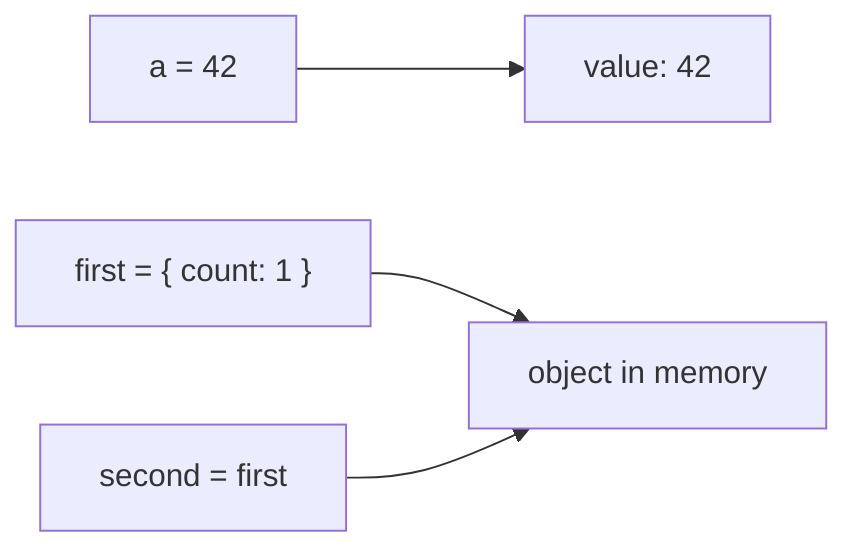
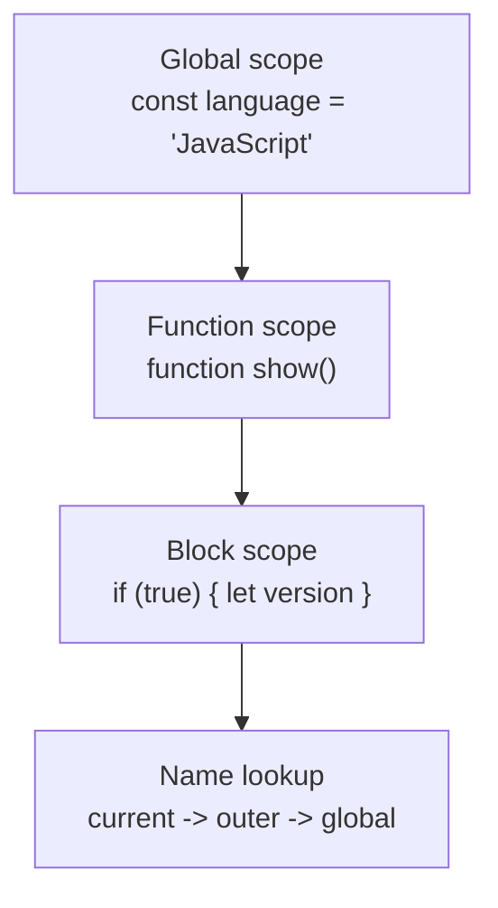

# JavaScript Basics

This note accompanies [`index.js`](./index.js). The examples are written for a modern JavaScript runtime such as a browser console or Node.js.

## 1. What Is JavaScript?

JavaScript is a high-level, dynamically typed programming language. It is used in browsers and on servers with Node.js. JavaScript supports:

- interactive web pages and browser APIs
- server-side applications
- mobile and desktop applications
- games and automation
- synchronous and asynchronous programming

Important language features include first-class functions, objects, prototype-based inheritance, event-driven programming, and Promises with `async`/`await`.

## 2. Values and Data Types

Every JavaScript expression produces a value. JavaScript has seven primitive types and one non-primitive category:

| Category      | Types       | Example                     |
| ------------- | ----------- | --------------------------- |
| Primitive     | `string`    | `"hello"`                   |
| Primitive     | `number`    | `42`, `3.14`, `NaN`         |
| Primitive     | `bigint`    | `9007199254740993n`         |
| Primitive     | `boolean`   | `true`                      |
| Primitive     | `undefined` | `let result;`               |
| Primitive     | `null`      | `null`                      |
| Primitive     | `symbol`    | `Symbol("id")`              |
| Non-primitive | `object`    | `{ name: "Ada" }`, `[1, 2]` |

### Primitive Values

Primitives are immutable and are compared by their value. An operation creates a new value instead of changing the existing primitive.

```js
const firstName = "Ada";
const updatedName = firstName.toUpperCase();

console.log(firstName); // "Ada"
console.log(updatedName); // "ADA"
console.log(typeof firstName); // "string"
```

Primitive strings have methods because JavaScript temporarily wraps them in an object when a method is called. The string itself is still a primitive and cannot be changed in place.

```js
let message = "hello";
message[0] = "H";
console.log(message); // "hello"
```

### Objects, Arrays, and Functions

Objects are mutable collections. Arrays and functions are also objects, although arrays are ordered collections and functions are callable objects.

```js
const user = { name: "Ada" };
user.name = "Grace"; // The object is mutated.

const numbers = [1, 2, 3];
numbers.push(4);

function greet() {
  return "Hello";
}

console.log(typeof user); // "object"
console.log(typeof numbers); // "object"
console.log(typeof greet); // "function"
```

## 3. Value Identity and References

Variables hold primitive values directly or a reference to an object. Assigning an object to another variable copies the reference, not the object.



```js
const first = { count: 1 };
const second = first;
const third = { count: 1 };

second.count = 2;

console.log(first.count); // 2: first and second refer to the same object.
console.log(first === second); // true
console.log(first === third); // false: third is a different object.
```

For shallow objects, spread syntax creates a new outer object. Nested objects still share references.

```js
const original = { settings: { theme: "light" } };
const copy = { ...original };

copy.settings.theme = "dark";
console.log(original.settings.theme); // "dark"
```

## 4. Equality

Prefer strict equality because it does not perform implicit type conversion:

```js
console.log(5 === "5"); // false
console.log(5 == "5"); // true: coercion happens with ==
console.log(null === undefined); // false
console.log(null == undefined); // true: a special loose-equality rule
```

`Object.is` is useful for two edge cases: it treats `NaN` as equal to itself and distinguishes `0` from `-0`.

```js
console.log(NaN === NaN); // false
console.log(Object.is(NaN, NaN)); // true
console.log(Object.is(0, -0)); // false
```

## 5. Variables: `var`, `let`, and `const`

| Keyword | Scope          | Reassign? | Redeclare in same scope? |
| ------- | -------------- | --------- | ------------------------ |
| `var`   | Function scope | Yes       | Yes                      |
| `let`   | Block scope    | Yes       | No                       |
| `const` | Block scope    | No        | No                       |

`const` prevents reassignment of the variable binding. It does not freeze an object stored in that binding.

```js
var oldStyle = "can be redeclared";
var oldStyle = "still valid";

let score = 10;
score = 11;

const profile = { name: "Ada" };
profile.name = "Grace"; // Valid: the object can still be mutated.
// profile = {}; // TypeError: the const binding cannot be reassigned.
```

## 6. Scope and the Scope Chain

Scope determines where a variable can be accessed. JavaScript looks for a name in the current scope and then moves outward through the scope chain.



```js
const language = "JavaScript";

function showLanguage() {
  const version = "ES2024";

  if (true) {
    const message = `${language} ${version}`;
    console.log(message); // Both outer variables are accessible here.
  }

  // console.log(message); // ReferenceError: message is block-scoped.
}

showLanguage();
```

`var` ignores block scope, but it remains local to a function when declared inside one:

```js
if (true) {
  var functionScoped = "visible after the block";
  let blockScoped = "visible only inside the block";
}

console.log(functionScoped); // Works because var is not block-scoped.
// console.log(blockScoped); // ReferenceError
```

## 7. Hoisting and the Temporal Dead Zone

Declarations are processed before code runs, but initialization rules differ:

- `var` is hoisted and initialized with `undefined`.
- `let` and `const` are hoisted but remain inaccessible in the temporal dead zone until execution reaches their declaration.
- Function declarations can be called before their declaration in the same scope.

```js
console.log(varValue); // undefined
var varValue = 10;

// console.log(letValue); // ReferenceError: temporal dead zone
let letValue = 20;

sayHello(); // Works
function sayHello() {
  console.log("Hello");
}
```

## 8. Functions Are First-Class Values

Functions can be stored in variables, passed as arguments, and returned from other functions.

```js
const add = (left, right) => left + right;

function calculate(operation, left, right) {
  return operation(left, right);
}

console.log(calculate(add, 2, 3)); // 5
```

## 9. Quick Reference

```js
console.log(typeof 42); // "number"
console.log(typeof "text"); // "string"
console.log(typeof true); // "boolean"
console.log(typeof undefined); // "undefined"
console.log(typeof null); // "object" (historic JavaScript behavior)
console.log(typeof Symbol("id")); // "symbol"
console.log(Array.isArray([])); // true
```

### Rules to Remember

1. Use `const` by default and `let` when reassignment is needed.
2. Use `===` for predictable equality.
3. Primitive values compare by value; objects compare by reference.
4. `const` protects a binding, not the contents of an object.
5. Keep `var` for legacy code unless function-scoped behavior is intentional.
