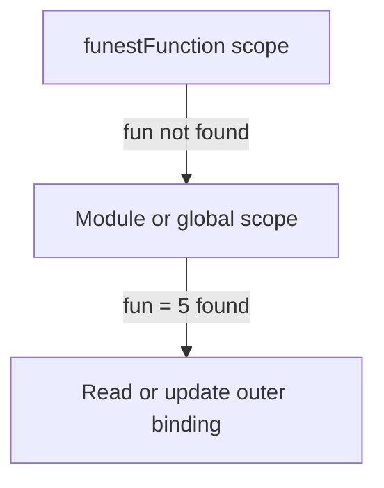

# JavaScript Scope

## 1. What is scope?

Scope is the region of a program where a variable can be accessed. JavaScript decides which variables are available by creating lexical environments while it parses and runs the code.

Every execution context has access to its own variables and, when a name is not found, JavaScript searches outward through the scope chain.

```text
Current function scope
				|
				v
Outer function scope
				|
				v
Global scope
```

The lookup direction is always from inner scope to outer scope. An outer scope cannot directly access a variable declared inside a nested function.

## 2. Global scope and the root object

Code at the top level belongs to the global scope in a browser script. The global object is usually `window` in a browser and `globalThis` is the portable name for the global object.

Node.js CommonJS files have a module wrapper, so top-level `var`, `let`, `const`, and function declarations are module-scoped rather than properties of `globalThis`.

```js
var browserScriptValue = 10;

// In a classic browser script, this is normally true:
console.log(window.browserScriptValue === browserScriptValue);

// Prefer this portable spelling when referring to the global object:
console.log(globalThis);
```

Avoid putting application variables on the global object. Global names can collide and become difficult to track.

## 3. Function scope

A function creates a new function scope. Variables declared with `var` inside the function are available throughout that function, but not outside it.

```js
var message = "outer";

function showMessage() {
  var localMessage = "inner";
  console.log(message); // outer: found in the outer scope
  console.log(localMessage); // inner: found in this function
}

showMessage();
console.log(message); // outer
// console.log(localMessage); // ReferenceError: localMessage is not defined
```

The `ReferenceError` occurs because `localMessage` exists only while `showMessage` runs and is not visible to the surrounding scope.

## 4. Scope chain and name lookup



Example:

```js
var count = 5;

function printCount() {
  console.log(count); // 5; no local count, so search outward
}

printCount();
```

JavaScript does not search sibling scopes. A function can access its parent scopes, but it cannot access variables declared inside another function.

## 5. Shadowing

Shadowing happens when an inner scope declares a variable with the same name as a variable in an outer scope. The inner binding temporarily hides the outer binding.

```js
var value = "global";

function firstFunction() {
  var value = "first";
  console.log(value); // first
}

function secondFunction() {
  var value = "second";
  console.log(value); // second
}

firstFunction();
secondFunction();
console.log(value); // global
```

The two function-local `value` variables do not conflict with each other. They are different bindings in different function scopes.

## 6. Reading versus updating an outer variable

If a function does not declare a local variable with a name, an assignment can update the nearest existing outer binding.

```js
var score = 5;

function updateScore() {
  score = 10; // updates the outer score
}

updateScore();
console.log(score); // 10
```

This is valid, but usually less maintainable than returning a value or passing data explicitly:

```js
function getUpdatedScore(score) {
  return score + 5;
}

var score = getUpdatedScore(5);
console.log(score); // 10
```

If an assignment names a variable that does not exist anywhere, non-strict code may create an accidental global. In strict mode it throws a `ReferenceError`.

```js
"use strict";

function createAccidentalGlobal() {
  // accidentalName = 10; // ReferenceError
}
```

Always declare variables with `const`, `let`, or `var`.

## 7. Applying the ideas to `app.js`

In the original file:

```js
var b = "Can I access this";

function bb() {
  b = "Hello Now I can access this";
  var c = "hello";
}

console.log(c); // ReferenceError
```

`c` is declared inside `bb`, so it cannot be read outside `bb`. Because the error is uncaught, execution stops at that line. The later `b` and `fun` examples do not run.

To make the example runnable, log `c` inside the function or return it:

```js
var b = "Can I access this";

function bb() {
  b = "Hello Now I can access this";
  var c = "hello";
  console.log(c); // hello
  return c;
}

console.log("before function run -->", b);
var returnedValue = bb();
console.log("after function runs -->", b);
console.log("returned value -->", returnedValue);
```

The `fun` part demonstrates both shadowing and mutation:

```js
var fun = 5;

function funFunction() {
  var fun = "hellooo"; // local variable shadows the outer fun
  console.log("1", fun); // 1 hellooo
}

function funerFunction() {
  var fun = "Bye"; // a different local variable
  console.log("2", fun); // 2 Bye
}

function funestFunction() {
  fun = "AHHHHHHH"; // no local declaration: updates outer fun
  console.log("3", fun); // 3 AHHHHHH
}

console.log("outside", fun); // 5
funFunction();
funerFunction();
funestFunction();
console.log("outside after update", fun); // AHHHHHH
```

## 8. Ternary operator and `switch` statement

These are conditional patterns used often in JavaScript interview questions.

### 1) Ternary operator

The ternary operator is a compact form of an `if/else` statement.

```js
function isUserValid(bool) {
  return bool;
}

var answer = isUserValid(true) ? "You may enter" : "Access Denied";
console.log(answer); // You may enter
```

Equivalent `if/else` version:

```js
function condition() {
  if (isUserValid(true)) {
    return "You may enter";
  } else {
    return "Access Denied";
  }
}

console.log(condition()); // You may enter
```

Use ternary when the logic is simple and short. Use `if/else` when the logic is longer or needs more conditions.

### 2) `switch` statement

A `switch` is useful when you have many fixed values to compare against one variable.

```js
function moveCommand(direction) {
  var whatHappen;

  switch (direction) {
    case "forward":
      whatHappen = "you encounter a monster";
      break;

    case "back":
      whatHappen = "you arrived home";
      break;

    case "right":
      whatHappen = "you found a river";
      break;

    case "left":
      whatHappen = "you run into a troll";
      break;

    default:
      whatHappen = "please enter a valid direction";
  }

  return whatHappen;
}

console.log(moveCommand("left")); // you run into a troll
```

Important interview note: in the original code, this line was written incorrectly:

```js
moveCommand(left);
```

`left` is treated as a variable name, not a string. The correct version is:

```js
moveCommand("left");
```

That is the difference between a string literal and an identifier.

## 9. `var`, `let`, and `const`

`var` is function-scoped. `let` and `const` are block-scoped, so they are limited to the nearest pair of braces.

```js
function example() {
  if (true) {
    var functionScoped = "available in the function";
    let blockScoped = "available only in the if block";
    const fixedValue = 42;
  }

  console.log(functionScoped); // available in the function
  // console.log(blockScoped); // ReferenceError
  // console.log(fixedValue);  // ReferenceError
}
```

Prefer `const` by default, use `let` when reassignment is required, and avoid `var` in new code unless demonstrating legacy behavior.

### `const` and object mutation

JavaScript `const` means the variable binding cannot be reassigned. It does not mean the value itself is deeply immutable.

```js
const player = "bobby";
// player = "Sally"; // TypeError: Assignment to constant variable.

const obj = {
  player: "Rohan",
  experience: 120,
  wizardLevel: false,
};

// obj = 10; // TypeError: Assignment to constant variable.
obj.wizardLevel = true; // valid: we are mutating the object property
console.log(obj.wizardLevel); // true
```

Interview answer:

- `const player = "bobby"` prevents reassigning `player`
- `const obj = {...}` prevents reassigning the `obj` variable itself
- but the object properties can still change if they are not frozen

This is a common interview question: `const` protects the binding, not the object contents.

### `let` and block scope

`let` is also block-scoped, which means variables declared inside `{}` are not accessible outside that block.

```js
let experience = 100;
let wizardLevel = false;

if (experience > 90) {
  let wizardlevel = true;
  console.log(wizardlevel); // true
}

// console.log(wizardlevel); // ReferenceError
```

This is different from `var`, which is function-scoped. `let` creates a new scope in the block, which helps avoid accidental variable leakage.

## 10. Advanced arrays and functions

The files in the advanced examples highlight a few important patterns that are used often in real JavaScript code.

### 1) `forEach`, `map`, `filter`, and `reduce`

These array methods all help us work with collections, but they are not the same.

```js
const array = [1, 2, 10, 16];

const doubled = [];
array.forEach((num) => {
  doubled.push(num * 2);
});

console.log(doubled); // [2, 4, 20, 32]
```

`forEach()` loops through elements and runs a callback for each one. It does not return a new array. It is useful when we want to perform an action, but not when we want a transformed result.

```js
const myArray = array.map((num) => num * 2);
console.log(myArray); // [2, 4, 20, 32]
```

`map()` creates a new array from an existing array. The output length is the same as the input length unless filtering is also used.

```js
const filterArray = array.filter((num) => num > 5);
console.log(filterArray); // [10, 16]
```

`filter()` creates a new array containing only the values that satisfy a condition.

```js
const reduceArray = array.reduce((accumulator, num) => {
  return accumulator + num;
}, 10);

console.log(reduceArray); // 39
```

`reduce()` combines all values into one result. The accumulator holds the running total. The second argument to `reduce()` is the initial value for the accumulator. Here it starts at `10`, so the total becomes:

```text
10 + 1 + 2 + 10 + 16 = 39
```

### 2) Closures

A closure is created when an inner function keeps access to variables from its outer function even after the outer function has finished execution.

```js
const first = () => {
  const greet = "Hi";

  const second = () => {
    alert(greet);
  };

  return second;
};

const newFunc = first();
newFunc();
```

The `second` function still remembers the `greet` variable even though `first()` has already returned. This is the core idea behind closures in JavaScript.

### 3) Currying

Currying means converting a function that takes multiple arguments into a chain of functions, each taking one argument at a time.

```js
const multiply = (a, b) => a * b;
const curriedMultiply = (a) => (b) => a * b;

const multiplyBy5 = curriedMultiply(5);
console.log(multiplyBy5(11)); // 55
```

This makes some logic easier to reuse and compose. A curried function can be partially applied and reused later.

### 4) Side effects and functional purity

A side effect happens when a function changes something outside its own local scope.

```js
var a = 1;

function b() {
  a = 2; // side effect: modifies outer state
}
```

This changes the value of `a` outside the function. That can make code harder to debug because the function depends on and changes external state.

A pure function avoids side effects and always returns the same output for the same inputs.

```js
const add = (x, y) => x + y;
console.log(add(2, 3)); // 5
console.log(add(2, 3)); // 5
```

Pure functions are easier to test because they are deterministic and do not mutate shared state.

## 11. Destructuring, object shorthand, template strings, symbols, and arrow functions

These are common JavaScript patterns that appear in modern code and interview questions.

### Destructuring

Destructuring lets you extract values from objects or arrays in a clean, readable way.

```js
const userDetails = {
  name: "Sally",
  age: 30,
  isMarried: false,
};

const { name, age, isMarried } = userDetails;
console.log(name); // Sally
console.log(age); // 30
console.log(isMarried); // false
```

Instead of writing `userDetails.name`, we directly unpack the values we need.

### Computed property names

JavaScript allows object keys to be created dynamically.

```js
const name1 = "John show";

const obj1 = {
  [name1]: "hello",
  ["ray" + "smith"]: "hihi",
  [1 + 2]: "tskjs",
};

console.log(obj1["John show"]); // hello
console.log(obj1["raysmith"]); // hihi
console.log(obj1["3"]); // tskjs
```

This is useful when property names are generated at runtime.

### Object shorthand syntax

When the variable name and property name are the same, you can shorten the object literal.

```js
const d = "Simon";
const e = true;
const f = {};

const obj2 = {
  d: d,
  e: e,
  f: f,
};

const obj3 = {
  d,
  e,
  f,
};

console.log(obj2.d); // Simon
console.log(obj3.e); // true
```

### Template strings

Template strings make string interpolation easy and readable.

```js
const greeting = "Hello " + name + " you seem to be doing";
const greetingBest = `Hello ${name1} you seem to be doing`;

console.log(greetingBest);
```

This is cleaner than concatenation when mixing strings and variables.

### Default parameters

Default parameters let us assign fallback values when arguments are missing.

```js
function greet(name = "", age = 30, pet = "pet") {
  return `Hello ${name} you seem to be ${age - 10}. what a lovely ${pet} you have`;
}

console.log(greet("john", 40, "dog"));
console.log(greet());
```

When a user does not pass an argument, the default is used instead.

### Symbols

A symbol is a unique primitive value. It is often used as an identifier that should not collide with other properties.

```js
let sm1 = Symbol();
let sm2 = Symbol("foo");
let sm3 = Symbol("foo");

console.log(sm2 === sm3); // false
```

Even if the description is the same, each `Symbol()` call creates a new unique value.

### Arrow functions

Arrow functions are a shorter syntax for writing functions.

```js
function add(a, b) {
  return a + b;
}

const add1 = (a, b) => a + b;
console.log(add(2, 3)); // 5
console.log(add1(2, 3)); // 5
```

When the function body is a single expression, the `return` keyword is implicit. This makes the syntax shorter and cleaner.

## 12. Interview-ready answers

**What is the scope chain?**

It is the ordered chain of lexical environments JavaScript searches when resolving a variable name. Lookup begins in the current scope and continues outward until the name is found or the global scope is reached.

**Can a parent function access a child function's variable?**

No. Scope lookup goes inward to outward, not outward to inward. The parent can provide variables to the child, but cannot directly read the child's local variables.

**What is shadowing?**

Shadowing is declaring a same-named variable in an inner scope. References in that inner scope use the inner binding, while the outer binding remains unchanged.

**Why did `console.log(c)` fail in `app.js`?**

`c` was declared with `var` inside `bb`, so it is function-scoped. It does not exist in the surrounding scope, and the uncaught `ReferenceError` stops the script.

**How can a function change an outer variable?**

If no local binding with that name exists, assignment resolves the nearest outer binding and updates it. A clearer design is usually to return a new value or pass the value as an argument.

**What is the difference between `const` and `let`?**

`const` prevents reassignment of the variable binding, while `let` allows reassignment. However, `const` does not freeze an object, so object properties can still be mutated.

**What is destructuring used for?**

It is used to unpack values from arrays and objects into variables, which makes code cleaner and easier to read.

**What is the difference between `forEach` and `map`?**

`forEach` runs a callback for each item but returns `undefined`. `map` returns a new array of transformed values.

**What does `reduce` do?**

`reduce` folds an array into one value by repeatedly combining the accumulator with each element.

**What is a closure?**

A closure allows an inner function to keep access to variables from an outer function even after the outer function has finished executing.

**What is currying?**

Currying transforms a function that accepts multiple arguments into a chain of functions that each take one argument at a time.

**What is functional purity?**

A pure function does not mutate external state and returns the same output for the same inputs.

## Quick summary

```text
Scope       = where a variable is accessible
Scope chain = where JavaScript searches for a name
Shadowing   = inner same-name binding hides an outer binding
var         = function-scoped
let         = block-scoped and reassignable
const       = block-scoped and non-reassignable
Destructuring = extract object/array values into variables
Template strings = cleaner string interpolation
Arrow functions = shorthand for simple functions
Symbols = unique, non-colliding identifiers
```

It is the ordered chain of lexical environments JavaScript searches when resolving a variable name. Lookup begins in the current scope and continues outward until the name is found or the global scope is reached.

**Can a parent function access a child function's variable?**

No. Scope lookup goes inward to outward, not outward to inward. The parent can provide variables to the child, but cannot directly read the child's local variables.

**What is shadowing?**

Shadowing is declaring a same-named variable in an inner scope. References in that inner scope use the inner binding, while the outer binding remains unchanged.

**Why did `console.log(c)` fail in `app.js`?**

`c` was declared with `var` inside `bb`, so it is function-scoped. It does not exist in the surrounding scope, and the uncaught `ReferenceError` stops the script.

**How can a function change an outer variable?**

If no local binding with that name exists, assignment resolves the nearest outer binding and updates it. A clearer design is usually to return a new value or pass the value as an argument.

## Quick summary

```text
Scope       = where a variable is accessible
Scope chain = where JavaScript searches for a name
Shadowing   = inner same-name binding hides an outer binding
var         = function-scoped
let/const   = block-scoped
ReferenceError = name was not found in the available scopes
```
