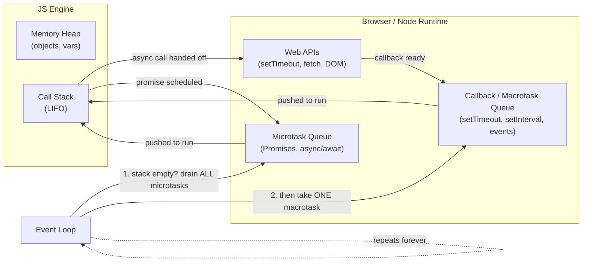
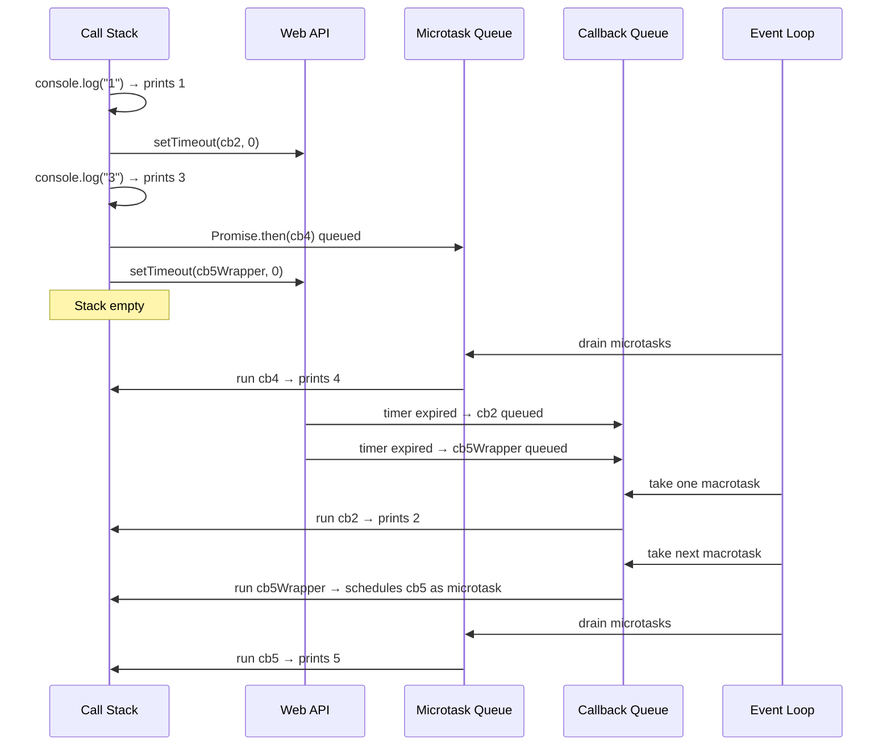

# JavaScript Engine, Call Stack & Event Loop

Notes based on [index.js](./index.js).

## 1. Engine building blocks

- **Memory Heap** — unstructured memory pool where variables, objects and functions are allocated.
- **Call Stack** — LIFO structure that tracks which function is currently executing (single threaded → one stack).
- **Web APIs** — provided by the browser/Node (not the JS engine itself): `setTimeout`, DOM events, `fetch`, etc.
- **Callback Queue (Macrotask Queue)** — holds callbacks from Web APIs like `setTimeout`, DOM events, `setInterval`.
- **Microtask Queue** — holds `Promise.then/catch/finally`, `queueMicrotask`, `async/await` continuations. **Higher priority** than the callback queue.
- **Event Loop** — continuously checks: _"Is the call stack empty?"_ → if yes, drain **all** microtasks first, then take **one** task from the callback queue.



## 2. Execution order rule

For every loop tick:

1. Run everything currently on the **call stack** (synchronous code) to completion.
2. Once the stack is **empty**, drain the **entire microtask queue** (including any new microtasks created while draining it).
3. Take **one** callback from the **macrotask/callback queue** and push it to the stack.
4. Repeat from step 2.

## 3. Step-by-step trace ("animation" in text form)

Example code:

```js
console.log("1");

setTimeout(() => {
  console.log("2");
}, 0);

console.log("3");

Promise.resolve().then(() => {
  console.log("4");
});

setTimeout(() => {
  Promise.resolve().then(() => {
    console.log("5");
  });
}, 0);
```

| Step | Call Stack                                                                            | Web API             | Microtask Queue | Callback Queue       | Console Output |
| ---- | ------------------------------------------------------------------------------------- | ------------------- | --------------- | -------------------- | -------------- |
| 1    | `console.log("1")` runs                                                               | —                   | —               | —                    | `1`            |
| 2    | `setTimeout(...,0)` called → handed to Web API timer                                  | timer(0ms) started  | —               | —                    | —              |
| 3    | `console.log("3")` runs                                                               | timer(0ms) running  | —               | —                    | `3`            |
| 4    | `Promise.resolve().then(cb4)` called → `cb4` queued as microtask                      | timer(0ms) running  | `[cb4]`         | —                    | —              |
| 5    | second `setTimeout(...,0)` called → handed to Web API timer                           | timer2(0ms) started | `[cb4]`         | —                    | —              |
| 6    | stack empty → event loop drains microtasks → run `cb4`                                | —                   | `[]`            | —                    | `4`            |
| 7    | timers expire → callbacks pushed to callback queue                                    | —                   | `[]`            | `[cb2, cb5-wrapper]` | —              |
| 8    | event loop takes **one** macrotask `cb2` → runs it                                    | —                   | `[]`            | `[cb5-wrapper]`      | `2`            |
| 9    | event loop takes next macrotask `cb5-wrapper` → runs it, schedules `cb5` as microtask | —                   | `[cb5]`         | `[]`                 | —              |
| 10   | stack empty → drain microtasks → run `cb5`                                            | —                   | `[]`            | `[]`                 | `5`            |

**Final output:** `1, 3, 4, 2, 5`



## 4. Quick reference

| Source                                                         | Queue type                 | Priority                                      |
| -------------------------------------------------------------- | -------------------------- | --------------------------------------------- |
| `Promise.then/catch/finally`, `queueMicrotask`, `async/await`  | Microtask                  | Highest — fully drained before next macrotask |
| `setTimeout`, `setInterval`, `setImmediate` (Node), DOM events | Macrotask (callback queue) | Lower — one processed per event loop tick     |

## 5. Stack overflow

Unbounded recursion (`function foo(){ foo(); } foo();`) keeps pushing frames onto the call stack until it exceeds its size limit → `RangeError: Maximum call stack size exceeded`.

See runnable examples in [index.js](./index.js).
