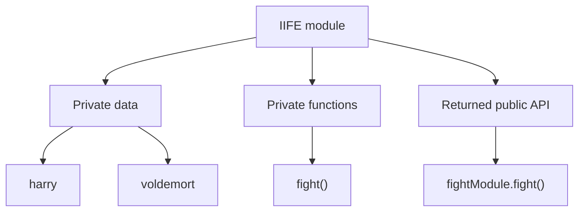
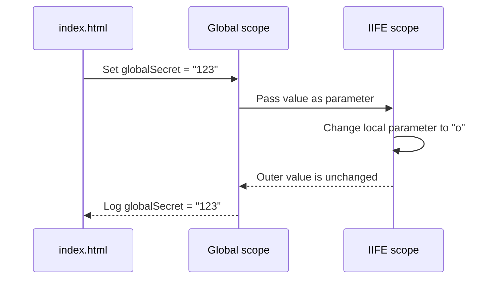

# JavaScript Modules Interview Notes

These notes are based only on the code in this folder:

- [app.js](app.js)
- [index.html](index.html)

The examples demonstrate why modules are useful, how JavaScript scopes work, and how older module patterns such as IIFE, CommonJS, AMD, and UMD were designed.

---

## 1. What Is a Module?

A module is a self-contained unit of code that groups related variables and functions together.

A good module should:

- keep related logic together
- hide private implementation details
- expose only the functions or values other code needs
- reduce global namespace pollution
- make code easier to reuse and maintain

Without modules, many variables and functions can be placed in the global scope. This can cause:

- naming conflicts
- accidental changes from unrelated scripts
- difficult dependency management
- unnecessary memory usage from long-lived global values

### Interview answer

A JavaScript module is an isolated piece of code with its own scope. It exposes a public API and hides private implementation details.

---

## 2. JavaScript Scopes

The code in `app.js` refers to four important scopes.

### Global scope

A value declared in the global scope can be accessed by different scripts on the same page.

```html
<script>
  var globalSecret = "123";
</script>

<script>
  console.log(globalSecret); // 123
</script>
```

Global variables should be limited because every script can potentially access or overwrite them.

### Module scope

An ES module has its own scope. Values are private unless they are explicitly exported.

```js
// math.js
const privateValue = 10;

export function add(left, right) {
  return left + right;
}
```

`privateValue` cannot be imported directly because it was not exported.

### Function scope

Variables declared with `var` inside a function belong to that function.

```js
function createMessage() {
  var message = "Hello";
  return message;
}

console.log(createMessage());
// console.log(message); // ReferenceError
```

### Block scope

Variables declared with `let` and `const` belong to the nearest block.

```js
if (true) {
  const secret = "hidden";
  let count = 1;
}

// secret and count are not available here
```

---

## 3. IIFE and the Module Pattern

An IIFE means **Immediately Invoked Function Expression**. It is a function that is created and called immediately.

```js
(function () {
  const privateValue = "hidden";
  console.log(privateValue);
})();
```

The IIFE creates a private function scope. Code outside the function cannot directly access `privateValue`.

The older module pattern uses an IIFE to create private data and returns only the public methods.

---

## 4. The Revealing Module Pattern in `app.js`

The `fightModule` example uses an IIFE and returns the method that should be public.

```js
var fightModule = (function () {
  var harry = "potter";
  var voldemort = "He who must not be named";

  function fight(char1, char2) {
    var attack1 = Math.floor(Math.random() * char1.length);
    var attack2 = Math.floor(Math.random() * char2.length);
    return attack1 > attack2 ? `${char1} Wins ` : `${char2} wins`;
  }

  console.log(fight(harry, voldemort));

  return {
    fight: fight,
  };
})();
```

### What is private?

`harry`, `voldemort`, `attack1`, and `attack2` are private to the IIFE.

### What is public?

The returned object exposes the `fight` method:

```js
fightModule.fight("Harry", "Voldemort");
```

The returned object is the module's public API.

### Why is this called revealing?

The private function is defined inside the module and then revealed through the returned object.

### Important limitation

The variable `fightModule` itself is still global because it is declared with `var` in a normal browser script. ES modules solve this more cleanly by giving the file module scope.

---

## 5. Module Diagram



The outside code can use `fightModule.fight()`, but it cannot directly access the private variables.

---

## 6. CommonJS Modules

CommonJS was designed mainly for Node.js and loads dependencies synchronously.

The example in `app.js` is:

```js
var module1 = require("module1");
var module2 = require("module2");

function fight1() {}

module.exports = {
  fight1: fight1,
};
```

### Importing

```js
const fightModule = require("./fight");
fightModule.fight1();
```

### Exporting

```js
module.exports = {
  fight1,
};
```

### Important note

This CommonJS example is illustrative. A normal browser page does not provide `require` or `module.exports` unless a bundler or compatible runtime is used.

### Interview answer

CommonJS uses `require()` to import dependencies and `module.exports` to expose values. It is commonly associated with Node.js and synchronous module loading.

---

## 7. AMD Modules

AMD means **Asynchronous Module Definition**. It was designed for browsers where scripts could be loaded asynchronously.

```js
define(["module1", "module2"], function (module1Import, module2Import) {
  var module1 = module1Import;
  var module2 = module2Import;

  function dance() {}

  return {
    dance: dance,
  };
});
```

The dependency names are loaded first, then passed into the factory function.

### Important note

The browser does not define `define()` by itself. An AMD loader is required. The snippet in `app.js` is a historical example, not a script that can run directly in the current `index.html`.

### Interview answer

AMD loads dependencies asynchronously and passes them into a factory function. It was useful for browser applications before native ES modules became widely supported.

---

## 8. UMD Modules

UMD means **Universal Module Definition**. It combines multiple module styles so the same library can work in different environments.

A simplified UMD structure looks like this:

```js
(function (root, factory) {
  if (typeof module === "object" && module.exports) {
    module.exports = factory();
  } else if (typeof define === "function" && define.amd) {
    define([], factory);
  } else {
    root.myModule = factory();
  }
})(this, function () {
  function greet() {
    return "Hello";
  }

  return { greet };
});
```

UMD checks the environment and chooses CommonJS, AMD, or a browser global.

### Interview answer

UMD is a compatibility pattern that allows one library to support multiple module systems.

---

## 9. Script Order in `index.html`

The HTML file loads `app.js` first and then runs two inline scripts.

```html
<script src="app.js"></script>

<script>
  var globalSecret = "123";
</script>

<script>
  var script2 = (function (globalSecret) {
    globalSecret = "o";
    console.log(globalSecret);
  })(globalSecret);

  console.log("===>>", globalSecret);
</script>
```

### What is the output behavior?

1. The first inline script creates the global variable `globalSecret` with value `"123"`.
2. The IIFE receives `globalSecret` as a parameter.
3. The parameter is local to the IIFE and changes to `"o"`.
4. The outer global variable remains `"123"`.

The important idea is that the parameter shadows the outer variable inside the IIFE.



### Interview point

Script order matters for normal browser scripts. A later script can use values created by an earlier script, but an IIFE parameter can create a local variable that shadows the global value.

---

## 10. Native ES Modules: Modern Approach

Modern JavaScript uses `export` and `import`.

```js
// fight.js
export function fight(char1, char2) {
  return `${char1} versus ${char2}`;
}
```

```js
// app.js
import { fight } from "./fight.js";

console.log(fight("Harry", "Voldemort"));
```

The HTML file must load the entry file as a module:

```html
<script type="module" src="app.js"></script>
```

### Benefits of native modules

- file-level module scope
- explicit imports and exports
- no need to expose every value globally
- dependency relationships are easy to see
- supports asynchronous module loading in browsers

---

## 11. Module System Comparison

| System           | Import style      | Export style              | Typical environment         |
| ---------------- | ----------------- | ------------------------- | --------------------------- |
| IIFE             | Function wrapper  | Returned object           | Older browser scripts       |
| Revealing module | Function wrapper  | Returned selected methods | Older browser scripts       |
| CommonJS         | `require()`       | `module.exports`          | Node.js                     |
| AMD              | `define()`        | Returned factory value    | Older browser apps          |
| UMD              | Environment check | Varies by environment     | Cross-environment libraries |
| ES modules       | `import`          | `export`                  | Modern browsers and Node.js |

---

## 12. Interview Revision

### Why do we use modules?

To organize code, hide private details, control dependencies, prevent global naming conflicts, and improve reuse.

### What is the revealing module pattern?

An IIFE keeps implementation details private and returns an object containing only the methods that should be public.

### What is the difference between CommonJS and AMD?

CommonJS generally loads dependencies synchronously and is associated with Node.js. AMD was designed for asynchronous loading in browsers.

### What is UMD?

UMD is a compatibility wrapper that supports more than one module system.

### What is the modern module system?

Native ES modules use `import` and `export`, provide file-level scope, and are the preferred modern approach.

### One-minute interview answer

JavaScript modules let us split an application into self-contained files. Each module keeps private implementation details hidden and exposes only a public API. Older code used IIFEs, revealing modules, CommonJS, AMD, or UMD. Modern JavaScript uses native ES modules with `import` and `export`, which make dependencies explicit and avoid unnecessary global variables.

---

## Final Diagram


The most important rule is: keep implementation details private and export only what other parts of the application need.

---

## 13. Native ES Module Example from `app.js`

The code at lines 65–75 uses the modern ES module system.

```js
const harry = "potter";
const voldemort = "He who must not be named";

export function jump() {}

export function fight(char1, char2) {
  const attack1 = Math.floor(Math.random() * char1.length);
  const attack2 = Math.floor(Math.random() * char2.length);
  return attack1 > attack2 ? `${char1} Wins ` : `${char2} wins`;
}
```

### What is private?

`harry` and `voldemort` are not exported, so another module cannot import them directly. They are private to this file.

### What is public?

`jump()` and `fight()` are exported named functions. Another module can import them by name:

```js
import { jump, fight } from "./app.js";

console.log(fight("Harry", "Voldemort"));
jump();
```

### How does `fight()` work?

1. It receives two character names.
2. It creates a random attack value for each character.
3. It compares the two values.
4. It returns the winner's name.

The result is not guaranteed to be the same every time because `Math.random()` is used.

### Browser requirement

Because `app.js` contains `export`, the browser must load it as a module:

```html
<script type="module" src="app.js"></script>
```

A normal script tag such as `<script src="app.js"></script>` cannot directly execute `export` syntax.

### Interview answer

ES modules use `export` to expose selected values and `import` to consume them. Values that are not exported remain private to the module file. This gives JavaScript file-level scope and prevents unnecessary global variables.
