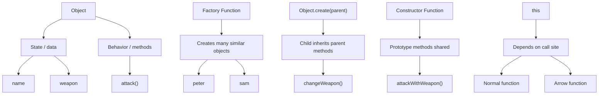

# JavaScript OOP Interview Notes

This is the interview-friendly version of the OOP concepts we wrote in [oops/app.js](oops/app.js).

The key idea is simple: in JavaScript, objects can hold data and behavior together. We can create many objects, share methods, and use prototypes to build inheritance.

---

## 1) What is OOP?

Object-Oriented Programming is a way of modeling real-world entities using objects.

For example, an `elf` can have:

- properties: `name`, `weapon`
- behavior: `attack()`

```js
const elf = {
  name: "Ajay",
  weapon: "bow",

  attack() {
    return "Attack with  " + elf.weapon;
  },
};
```

### Interview answer

OOP is about grouping data and related functions together in one object so the object can manage its own state and behavior.

---

## 2) Encapsulation

Encapsulation means putting both data and methods inside the same object.

```js
const elf2 = {
  name: "Ajay",
  weapon: "bow",

  attack() {
    return "Attack with  " + elf.weapon;
  },
};
```

### Interview answer

Encapsulation keeps the state and logic together. The object owns its own data, and the method works on that data.

---

## 3) Object Literal Pattern

This is the simplest form of object creation.

```js
const elf3 = {
  name: "Ajay",
  weapon: "bow",
};
```

This works when we only need one object. But if we need many similar objects, we use a factory function or constructor function.

---

## 4) Factory Function

Factory function creates multiple objects with the same structure.

```js
function createElf(name, weapon) {
  return {
    name,
    weapon,
    attack() {
      return "Attack with  " + weapon;
    },
  };
}

const peter = createElf("Peter", "stones");
const sam = createElf("Sam", "fire");
```

### Interview answer

A factory function is a function that returns a new object. It is useful when we want multiple similar objects without repeating code.

---

## 5) Method Borrowing and `this`

This is an important OOP and JavaScript interview concept.

```js
const elfFn = {
  attack() {
    return "Attack with  " + this.weapon;
  },
};

let a = createElf("PS", "Fire");
a.attack = elfFn.attack;
console.log(a.attack());
```

### What is happening?

The method `elfFn.attack` is assigned to `a.attack`.
Now when we call `a.attack()`, JavaScript sets `this` to `a`.

So `this.weapon` refers to `a.weapon`.

### Interview answer

In JavaScript, the value of `this` depends on how the function is called. If a method is called as `obj.method()`, then `this` refers to `obj`.

---

## 6) Inheritance in JavaScript

JavaScript uses prototype-based inheritance.

```js
const elfStore = {
  changeWeapon() {
    return "Changed Weapons : --> " + this.weapon;
  },
};

function createNewElf(name, weapon) {
  let newElf = Object.create(elfStore);
  newElf.name = name;
  newElf.weapon = weapon;
  return newElf;
}
```

### Interview answer

`Object.create()` creates a new object whose prototype is the given object. So the new object can access methods defined on the parent object.

This is inheritance in JavaScript without using `class` syntax.

---

## 7) Constructor Function and `new`

A constructor function creates objects using the `new` keyword.

```js
function ElfConstructor(name, weapon) {
  this.name = name;
  this.weapon = weapon;
}

const peters = new ElfConstructor("Peter", "gun");
```

### Why `new` matters

When `new` is used:

- a new empty object is created
- `this` points to that object
- the object is returned automatically

### Interview answer

A constructor function is a template for creating multiple objects with the same shape.

---

## 8) Prototype

Prototype is used to share methods across instances.

```js
ElfConstructor.prototype.attackWithWeapon = function () {
  return "Attack With : " + this.weapon;
};
```

Now every object created from `ElfConstructor` can use the same method without copying it each time.

### Interview answer

The prototype is a shared object where methods are stored. This saves memory and lets all instances use the same behavior.

---

## 9) `this` inside nested functions

This is a common interview question.

```js
ElfConstructor.prototype.build = function () {
  let self = this;

  function building() {
    return self.name + " builds a house";
  }

  return building();
};
```

### Why this pattern is used

Inside `building()`, `this` does not point to the outer object. It depends on how the nested function is called.

So the code stores `self = this` to keep access to the outer object.

### Interview answer

The inner function gets a different `this`, so we save the outer object reference in a variable and use it inside the inner function.

---

## 10) Arrow function vs normal function

```js
ElfConstructor.prototype.buildOwnHouse = () => {
  return "Build Own house " + this.name;
};

ElfConstructor.prototype.buildOwnHouse = function () {
  return "Build Own house " + this.name;
};
```

### Important point

Arrow functions do not have their own `this`.
They capture `this` from the surrounding lexical scope.

Normal functions get `this` based on how they are called.

### Interview answer

If we want `this` to refer to the object instance, we should use a normal function inside an object method or prototype method. Arrow functions are not the right choice for dynamic `this` binding.

---

## 11) `peters.prototype` is undefined

```js
console.log(peters.prototype); // undefined
```

### Why?

`peters` is an object instance, not the constructor function.
The `prototype` property belongs to the constructor function, not to the instance.

Correct version:

```js
console.log(ElfConstructor.prototype);
```

### Interview answer

The prototype chain is attached to the constructor function, not to each created object instance.

---

## 12) OOP summary for interviews

If the interviewer asks, “What is OOP in JavaScript?”, the best answer is:

JavaScript supports OOP through objects, prototypes, constructor functions, and inheritance. We can create objects with state and behavior, share common methods through prototypes, and use `this` to refer to the current object. OOP helps us model real-world entities in a reusable and maintainable way.

---

## 13) Simple diagram



---

## 14) Final interview-ready answer

JavaScript OOP is based on objects, functions, and prototypes. We create objects with properties and methods, reuse behavior through factory functions and constructor functions, and inherit shared methods through the prototype chain. The tricky part is `this`, because its value changes based on how a function is called. That is why understanding `this`, prototype, and constructor functions is important in JavaScript interviews.
