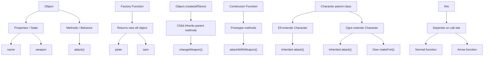

# OOP Notes from app.js

This file is a practical JavaScript OOP example. It covers the most important object-oriented ideas in JavaScript using real code: objects, encapsulation, factory functions, inheritance, constructor functions, prototype, `this`, classes, and binding.

The main idea is simple:

- an object can hold both data and behavior
- similar objects can be created repeatedly
- methods can be shared through prototype
- `this` depends on how a function is called

---

## 1) Encapsulation

Encapsulation means grouping data and behavior inside the same object.

```js
const elf = {
  name: "Ajay",
  weapon: "bow",

  attack() {
    return "Attack with  " + elf.weapon;
  },
};
```

### What this teaches

- `name` and `weapon` are the state of the object
- `attack()` is the behavior
- both live together in one object

### Interview explanation

Encapsulation is about keeping related data and logic together so the object can manage its own behavior.

---

## 2) Object literal pattern

This is the simplest way to create an object.

```js
const elf2 = {
  name: "Ajay",
  weapon: "bow",

  attack() {
    return "Attack with  " + elf.weapon;
  },
};
```

### Why it matters

This is the most basic OOP style in JavaScript. It is simple, but if we need many similar objects, we should avoid repeating the same object structure again and again.

---

## 3) Factory function pattern

Factory functions are used when we want to create many similar objects without rewriting the same code.

```js
function createElf(name, weapon) {
  return {
    name: name,
    weapon: weapon,
    attack() {
      return "Attack with  " + weapon;
    },
  };
}

const peter = createElf("Peter", "stones");
const sam = createElf("Sam", "fire");
```

### What this shows

- same structure
- different values
- multiple instances created easily

### Interview explanation

A factory function returns a new object. It is useful when we want many objects with the same behavior but different data.

---

## 4) Reusing a method with `this`

This example shows method borrowing.

```js
function createElfs(weapon, name) {
  return {
    name,
    weapon,
  };
}

const elfFn = {
  attack() {
    return "Attack with  " + this.weapon;
  },
};

let a = createElf("PS", "Fire");
a.attack = elfFn.attack;
console.log(a.attack());
```

### What is happening?

We created a method `attack()` on another object, and then attached it to `a`.

When `a.attack()` is called:

- JavaScript sets `this` to `a`
- therefore `this.weapon` means `a.weapon`

### Key understanding

The same method can be reused across different objects by calling it in different contexts.

---

## 5) Inheritance with `Object.create()`

This is inheritance in JavaScript without classes.

```js
const elfStore = {
  changeWeapon() {
    return "Changed Weapons : --> " + this.weapon;
  },
};

function createNewElf(name, weapon) {
  let newElf = Object.create(elfStore);
  newElf.name = name;
  newElf.weapon = weapon;
  return newElf;
}

let newCreateObject = createNewElf("Rohit", "Wood");
```

### What this means

- `newElf` gets access to methods from `elfStore`
- `elfStore` acts like a parent object
- `newElf` can call `changeWeapon()` even though it is defined on the parent

### Interview explanation

`Object.create(parent)` creates a new object whose prototype is the parent. This is prototype-based inheritance in JavaScript.

---

## 6) Constructor function and `new`

Constructor functions are used to create objects with shared structure.

```js
function ElfConstructor(name, weapon) {
  console.log("This ===>>", this);
  this.name = name;
  this.weapon = weapon;
  console.log("This --->>", this);
}

const peters = new ElfConstructor("Peter", "gun");
```

### What `new` does

When a function is called with `new`:

- a new empty object is created
- `this` points to that object
- the function initializes it
- the object is returned automatically

### Why this is important

This is a classic OOP pattern in JavaScript before `class` syntax became common.

---

## 7) Prototype and shared methods

Methods can be shared across instances using prototype.

```js
ElfConstructor.prototype.attackWithWeapon = function () {
  return "Attack With : " + this.weapon;
};
```

Now every object created by `new ElfConstructor()` can access `attackWithWeapon()`, without copying the method each time.

### Why prototype is useful

- memory efficient
- method sharing
- cleaner design

### Interview answer

The prototype is a shared object where common methods are placed. Objects inherit those methods through the prototype chain.

---

## 8) Why arrow function can break `this`

This part is very important.

```js
ElfConstructor.prototype.buildOwnHouse = () => {
  return "Build Own house " + this.name;
};

ElfConstructor.prototype.buildOwnHouse = function () {
  return "Build Own house " + this.name;
};
```

### Why first version is wrong

Arrow functions do not create their own `this`.
They capture `this` from the outer lexical scope instead of the object instance.

### Why second version works

A normal function gets `this` based on how it is called.
When called as `peters2.buildOwnHouse()`, `this` refers to `peters2`.

### Interview insight

- arrow function: lexical `this`
- normal function: dynamic `this`

---

## 9) Nested function loses `this`

This example explains the common bug with `this` inside inner functions.

```js
ElfConstructor.prototype.build = function () {
  let self = this;

  function building() {
    return self.name + " builds a house";
  }

  return building();
};
```

### What is happening?

Inside `building()`, `this` would not refer to the `ElfConstructor` instance.
So the code saves the outer `this` in `self` and uses `self.name` inside inner function.

### Interview explanation

The inner function gets its own execution context, and therefore a different `this`. Saving the original object in a variable is a common workaround.

---

## 10) Why `peters.prototype` is undefined

```js
console.log(peters.prototype); // undefined
```

### Why?

`peters` is an instance, not the constructor function.
The `prototype` property is on the constructor function, not on the instance.

Correct version:

```js
console.log(ElfConstructor.prototype);
```

### Interview explanation

Only functions have a `.prototype` property. Objects created from them do not.

---

## 11) Dynamic constructor using `new Function()`

JavaScript also allows dynamic function creation.

```js
let Andrew = new Function(
  "name",
  "weapon",
  ` this.name = name;
  this.weapon = weapon;`,
);

let andrew1 = new Andrew("Andrew", "Stone");
```

### What it shows

Functions in JavaScript are objects, and they can be used as constructors too.

This is advanced, but it helps understand how JavaScript works internally.

---

## 12) ES6 class syntax

The file ends with a modern class example.

```js
class Elfg {
  constructor(name, weapon) {
    this.name = name;
    this.weapon = weapon;
  }

  attack() {
    return "Attack with New Es6 " + this.weapon;
  }
}

const shally = new Elfg("Shally", "stones");
console.log(shally instanceof Elfg); // true
```

### What is class?

A class is a cleaner syntax for creating constructor functions and prototypal inheritance.

### Interview explanation

A class wraps the same idea in a more readable syntax. The class constructor creates instance properties, and instance methods are added to the prototype.

---

## 13) `this` binding types

The file also shows different types of `this` binding.

### 1. New binding

```js
function Person(name, age) {
  this.name = name;
  this.age = age;
}

const person1 = new Person("Xavier", 40);
```

When using `new`, `this` refers to the newly created object.

### 2. Implicit binding

```js
const person = {
  name: "Karen",
  age: 40,
  hi() {
    console.log("Hi " + this.name);
  },
};
```

When a method is called as `person.hi()`, `this` refers to `person`.

### 3. Explicit binding

```js
const person2 = {
  name: "Karen",
  age: 40,
  hi: function () {
    console.log("Hi " + this.setTimeout);
  }.bind(window),
};
```

`bind()` explicitly sets the value of `this`.

### 4. Lexical binding with arrow function

```js
const person3 = {
  name: "Karen",
  age: 40,
  hi: function () {
    var inner = () => {
      console.log("Hi " + this.name);
    };

    return inner();
  },
};
```

The arrow function inherits `this` from the outer function, so it keeps the object reference.

### 5. Fixing lost `this` with self

```js
const person5 = {
  name: "Karen",
  age: 40,
  hi: function () {
    let self = this;
    var inner = function () {
      console.log("Hi  ==>>" + self.name);
    };

    return inner();
  },
};
```

This is a common workaround when `this` is lost inside a nested function.

---

## 14) Class Inheritance with `extends`

The latest part of `app.js` shows how one class can inherit from another class.

```js
class Character {
  constructor(name, weapon) {
    this.name = name;
    this.weapon = weapon;
  }

  attack() {
    return "Attack with " + this.weapon;
  }
}

class Elf extends Character {
  constructor(name, weapon, type) {
    super(name, weapon);
    this.type = type;
  }
}

class Ogre extends Character {
  constructor(name, weapon, color) {
    super(name, weapon);
    this.color = color;
  }

  makeFort() {
    return "strongest fort in the world made";
  }
}
```

### What is happening?

- `Character` is the parent class.
- `Elf` and `Ogre` are child classes.
- `extends` creates the inheritance relationship.
- `super(name, weapon)` calls the parent constructor.
- `Elf` gets the inherited `attack()` method.
- `Ogre` gets `attack()` and also defines its own `makeFort()` method.

```js
const dolby = new Elf("Dolby", "cloth", "house");
const shrek = new Ogre("Shrek", "club", "green");

shrek.attack();
shrek.makeFort();
```

`shrek` can call both methods because `attack()` comes from `Character` and `makeFort()` comes from `Ogre`.

### Important interview point

JavaScript does not copy all parent methods into the child object. The child is connected to the parent through the prototype chain. This saves memory because shared methods are looked up through that chain.

---

## 15) Checking the Prototype Chain

The code uses `isPrototypeOf()` and `instanceof` to check inheritance relationships.

```js
console.log(Ogre.prototype.isPrototypeOf(shrek));
console.log(Character.prototype.isPrototypeOf(Ogre));

console.log(dolby instanceof Elf);
console.log(dolby instanceof Character);
```

### `instanceof`

`instanceof` checks whether an object was created from a class or from one of its parent classes.

```js
dolby instanceof Elf; // true
dolby instanceof Character; // true
```

`dolby` is an `Elf`, and because `Elf` extends `Character`, it is also considered a `Character`.

### `isPrototypeOf()`

`isPrototypeOf()` checks whether one prototype exists in another object's prototype chain.

```js
Ogre.prototype.isPrototypeOf(shrek); // true
```

The `Character` check in the file is different:

```js
Character.prototype.isPrototypeOf(Ogre); // false
```

Here `Ogre` is the class function itself, not an instance created with `new`. To check the instance relationship, use `Character.prototype.isPrototypeOf(shrek)` or `shrek instanceof Character`.

### Interview answer

An instance is an object created with `new`. Inheritance does not copy the parent class; JavaScript links objects and prototypes together through the prototype chain.

---

## 16) Big idea from this file

This file teaches the real foundation of JavaScript OOP:

- objects hold state and behavior
- object literals are the simplest form
- factory functions create repeated object patterns
- `Object.create()` supports inheritance
- constructor functions + prototype build reusable object systems
- classes are a cleaner syntax on top of the same idea
- `this` is the most important concept to master

---

## 17) Simple diagram



---

## 18) Final understanding

The main thing to remember is this:

JavaScript OOP is not just about classes. It is about objects, prototypes, shared methods, inheritance, and `this` binding. We can model real-world things using object literals, factory functions, constructor functions, and classes. The real challenge is understanding how `this` behaves in different situations.

This is exactly what this file has taught us.
