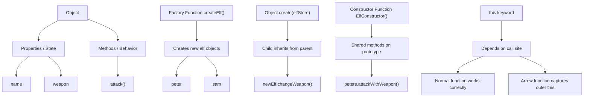

# Object-Oriented Programming in JavaScript

This note is based on the code written in [oops/app.js](oops/app.js). The file shows the core OOP concepts in JavaScript: encapsulation, object literals, factory functions, inheritance, constructor functions, and prototype chaining.

---

## 1) Encapsulation

Encapsulation means grouping data and behavior together inside a single object.

```js
const elf = {
  name: "Ajay",
  weapon: "bow",

  attack() {
    return "Attack with  " + elf.weapon;
  },
};
```

Here:

- `name` and `weapon` are the object data
- `attack()` is the behavior

This keeps related logic together. A real-world object is represented as one unit.

### Why this matters

- easy to read
- easier to maintain
- data and method work together

---

## 2) Object Literal Pattern

This is the simplest way to create an object.

```js
const elf2 = {
  name: "Ajay",
  weapon: "bow",

  attack() {
    return "Attack with  " + elf.weapon;
  },
};
```

This is useful for creating a single object, but if we need many similar objects, object literals become repetitive.

---

## 3) Factory Function Pattern

A factory function creates many objects with the same structure but different values.

```js
function createElf(name, weapon) {
  return {
    name: name,
    weapon: weapon,
    attack() {
      return "Attack with  " + weapon;
    },
  };
}

const peter = createElf("Peter", "stones");
const sam = createElf("Sam", "fire");
```

### Why use factory functions?

- reusable object creation logic
- avoids repeated code
- helps create multiple similar objects easily

This is a good beginner-level OOP pattern in JavaScript.

---

## 4) Method Borrowing and `this`

This example shows that a method can be reused and assigned to another object.

```js
function createElfs(weapon, name) {
  return {
    name,
    weapon,
  };
}

const elfFn = {
  attack() {
    return "Attack with  " + this.weapon;
  },
};

let a = createElf("PS", "Fire");
a.attack = elfFn.attack;
console.log(a.attack());
```

### Important concept

When we call `a.attack()`, the object before the dot is `a`, so `this` refers to `a`.

That means:

- `this.weapon` becomes `a.weapon`
- the same method can be used by multiple objects

This is a key JavaScript OOP concept because methods are not permanently attached to one object.

---

## 5) Inheritance with `Object.create()`

JavaScript supports inheritance in a prototype-based way.

```js
const elfStore = {
  changeWeapon() {
    return "Changed Weapons : --> " + this.weapon;
  },
};

function createNewElf(name, weapon) {
  let newElf = Object.create(elfStore);
  newElf.name = name;
  newElf.weapon = weapon;
  return newElf;
}

let newCreateObject = createNewElf("Rohit", "Wood");
```

### What is happening here?

- `newElf` inherits from `elfStore`
- `elfStore` has a method `changeWeapon()`
- `newElf` can access that method through the prototype chain

This is inheritance in JavaScript without using `class` syntax.

---

## 6) Constructor Function and Prototype

Constructor functions are used with the `new` keyword.

```js
function ElfConstructor(name, weapon) {
  this.name = name;
  this.weapon = weapon;
}

ElfConstructor.prototype.attackWithWeapon = function () {
  return "Attack With : " + this.weapon;
};
```

Now each new object created with `new ElfConstructor()` gets:

- its own `name` and `weapon`
- access to shared methods from the prototype

This is a more OOP-style pattern than factory functions.

### Why prototype matters

Methods are shared instead of copied for every object, which saves memory.

---

## 7) `this` and Arrow Functions

This is a very important note from the code:

```js
ElfConstructor.prototype.buildOwnHouse = () => {
  return "Build Own house " + this.name;
};

ElfConstructor.prototype.buildOwnHouse = function () {
  return "Build Own house " + this.name;
};
```

### Why the first version is wrong

An arrow function does not create its own `this`.
It captures `this` from the surrounding lexical scope.

So in many cases, inside a prototype method, `this` will not refer to the instance object as expected.

That is why the second version, using a normal function, is correct.

### Key lesson

- normal function: `this` depends on how it is called
- arrow function: `this` is lexically inherited

---

## 8) `new Function()` as a dynamic constructor

JavaScript also allows creating functions dynamically.

```js
let Andrew = new Function(
  "name",
  "weapon",
  ` this.name = name;
  this.weapon = weapon;`,
);

let andrew1 = new Andrew("Andrew", "Stone");
```

This creates a function constructor dynamically and then instantiates an object with `new`.

This is advanced and usually not used in normal application code, but it shows how JavaScript functions can be treated as constructor-like objects.

---

## 9) Full OOP idea from this file

The file teaches these main ideas:

- Encapsulation: grouping state and behavior together
- Object literal: direct object creation
- Factory function: generate similar objects
- Method borrowing: reuse one method on another object
- Inheritance with `Object.create()`: child object inherits the parent prototype
- Constructor + prototype: shared behavior through prototype chain
- `this` behavior: important for correct method binding

---

## 10) Diagram



---

## 11) Summary

This file is a practical demonstration of OOP in JavaScript. It shows that JavaScript is not limited to classes only; it can model objects through:

- object literals
- factory functions
- prototype inheritance
- constructor functions

This is why JavaScript is so flexible and powerful in OOP design.
