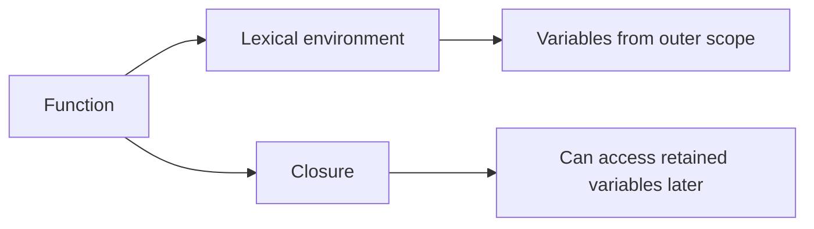
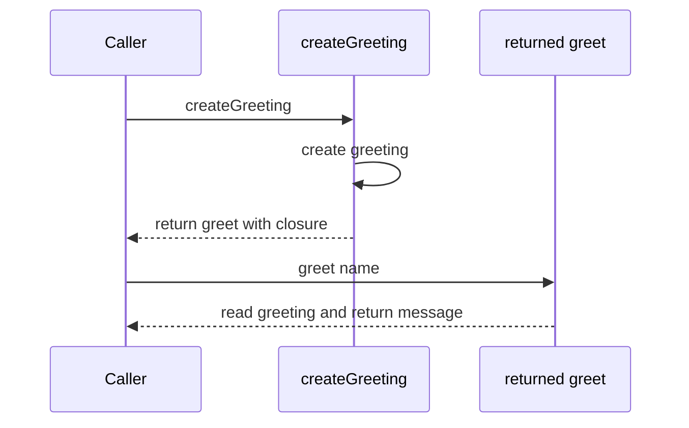
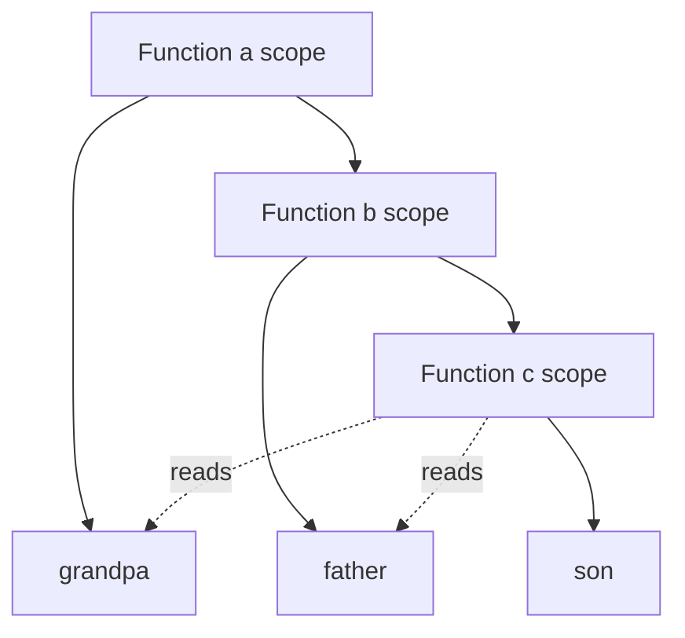
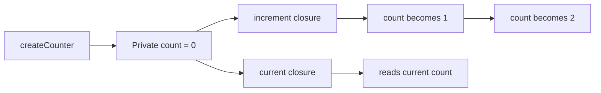
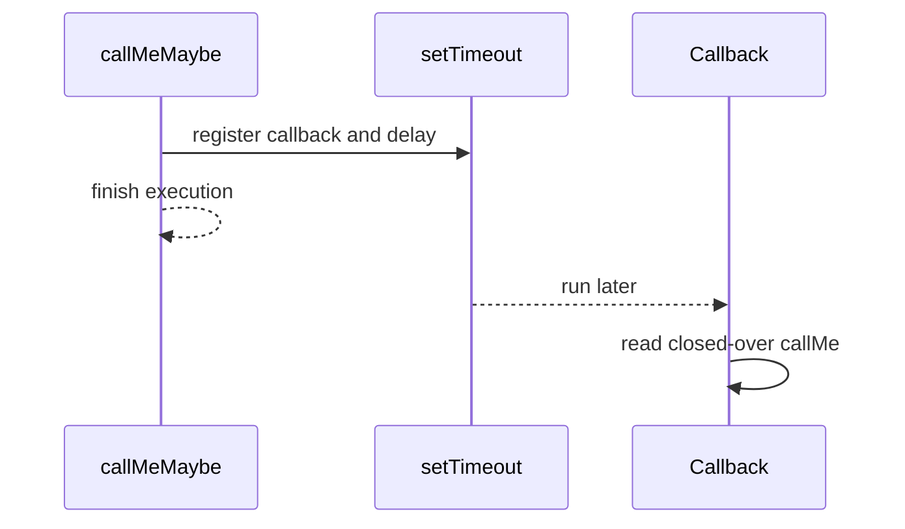
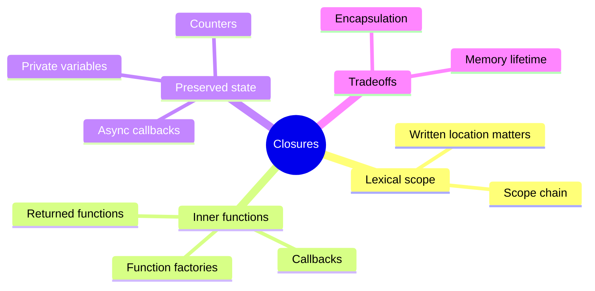

# Closures in JavaScript

A **closure** is a function together with the lexical environment in which that function was created. The function can continue to access variables from its surrounding scope even after the outer function has finished running.

Closures depend on two ideas:

- **Lexical scope**: variable access is determined by where code is written, not where a function is called.
- **Function values**: an inner function can be returned, stored, or passed to another function.



## 1. Lexical scope

Lexical scope means JavaScript decides which variables are available based on the nesting of the source code.

```js
const outside = "outside";

function showScope() {
  const inside = "inside";
  return `${outside} and ${inside}`;
}

showScope(); // "outside and inside"
```

`showScope` can read `outside` because it was declared in an outer scope. Code outside the function cannot directly read `inside`:

```js
function createMessage() {
  const message = "Hello";
  return message;
}

createMessage(); // "Hello"
// message is not available here
```

The important rule is that scope follows the written structure of the program.

## 2. A closure is created by returning an inner function

The outer function creates a local variable and returns an inner function that uses it. That returned function closes over the variable.

```js
function createGreeting() {
  const greeting = "Hello";

  return function greet(name) {
    return `${greeting}, ${name}`;
  };
}

const greet = createGreeting();

greet("Maya"); // "Hello, Maya"
```

Even though `createGreeting` has finished, `greet` can still access `greeting`. The closure keeps the needed lexical environment reachable.



## 3. Nested closures and the scope chain

The example in `app.js` creates three nested functions:

```js
function a() {
  const grandpa = "I am grandpa";

  return function b() {
    const father = "I am father";

    return function c() {
      const son = "I am son";
      return `${grandpa} -> ${father} -> ${son}`;
    };
  };
}

a()()(); // "I am grandpa -> I am father -> I am son"
```

Function `c` can read:

1. Its own variable, `son`.
2. The variable from its parent scope, `father`.
3. The variable from the outer scope, `grandpa`.



The lookup order is local scope first, then parent scope, then the next outer scope. JavaScript continues outward until it finds the variable or reaches the global scope.

## 4. Higher-order functions and closures

A higher-order function accepts a function, returns a function, or both. In the nested example:

- `a` is higher-order because it returns `b`.
- `b` is higher-order because it returns `c`.
- `c` is not higher-order just because it is nested; it returns a string, not a function.

```js
function makeMultiplier(multiplier) {
  return function multiply(number) {
    return multiplier * number;
  };
}

const double = makeMultiplier(2);
const triple = makeMultiplier(3);

double(5); // 10
triple(5); // 15
```

Each returned function has its own closure. `double` remembers `2`, while `triple` remembers `3`.

## 5. Closures preserve state

Closures can create private state. The `count` variable cannot be changed directly from outside, but the returned functions can read and update it.

```js
function createCounter() {
  let count = 0;

  return {
    increment() {
      count += 1;
      return count;
    },
    current() {
      return count;
    },
  };
}

const counter = createCounter();

counter.increment(); // 1
counter.increment(); // 2
counter.current(); // 2
```

The returned object exposes behavior, not the `count` variable itself. This is a common way to model encapsulation in JavaScript.



## 6. Closures with asynchronous callbacks

The callback passed to `setTimeout` is created inside `callMeMaybe`. It closes over `callMe`, so it can read the variable later when the timer runs.

```js
function callMeMaybe() {
  const callMe = "Hi! I am now here!";

  setTimeout(() => {
    console.log(callMe);
  }, 1000);
}

callMeMaybe(); // logs the message after about one second
```

The outer function finishes before the timer callback runs, but the callback still has access to `callMe`.



### Declaration order and timers

This version also works:

```js
function callMeMaybeLater() {
  setTimeout(() => {
    console.log(callMe);
  }, 1000);

  const callMe = "Hi! I am now here!";
}

callMeMaybeLater();
```

The callback is not executed while `setTimeout` is being called. By the time the callback runs, the function has reached the `const callMe` declaration and initialized it.

This does **not** mean `const` variables are usable before initialization in synchronous code:

```js
function invalidOrder() {
  // console.log(value); // ReferenceError: value is in the temporal dead zone
  const value = 10;
  return value;
}
```

The difference is the delay between creating the callback and executing it.

## 7. Closures and loops

`let` creates a separate binding for each loop iteration, so each callback remembers the expected value.

```js
const callbacks = [];

for (let index = 0; index < 3; index += 1) {
  callbacks.push(() => index);
}

callbacks.map((callback) => callback()); // [0, 1, 2]
```

With `var`, the callbacks share one function-scoped variable. After the loop, that variable contains `3`:

```js
const callbacksWithVar = [];

for (var index = 0; index < 3; index += 1) {
  callbacksWithVar.push(() => index);
}

callbacksWithVar.map((callback) => callback()); // [3, 3, 3]
```

Prefer `let` or `const` for block-scoped loop variables.

## 8. Memory and lifetime

A closure does not keep every variable in an entire program alive. It keeps the variables that are still reachable through the function. The environment can be collected when no live reference can access it anymore.

```js
function createTemporaryMessage() {
  const message = "temporary";

  return () => message;
}

let readMessage = createTemporaryMessage();
readMessage(); // "temporary"

readMessage = null;
```

After `readMessage` no longer references the returned function, the closure is no longer reachable through that variable and can eventually be reclaimed by garbage collection.

Closures are useful, but keeping long-lived closures that capture large objects can increase memory usage.

## 9. Common uses

### Data privacy

```js
function createUser(initialName) {
  let name = initialName;

  return {
    getName: () => name,
    rename: (nextName) => {
      name = nextName;
    },
  };
}
```

### Function factories

```js
function createLogger(prefix) {
  return (message) => `${prefix}: ${message}`;
}

const errorLog = createLogger("ERROR");
errorLog("Request failed"); // "ERROR: Request failed"
```

### Event handlers and callbacks

Event handlers, timers, promise callbacks, and array methods often use closures to remember surrounding data.

```js
function createClickMessage(buttonName) {
  return () => `Clicked ${buttonName}`;
}

const handleSaveClick = createClickMessage("Save");
handleSaveClick(); // "Clicked Save"
```

## 10. Closure checklist

- Where was the function written?
- Which outer variables does it use?
- Is the function returned or passed somewhere else?
- Can the outer function finish while the inner function still runs later?
- Is the closure intentionally preserving private state?
- Could the closure keep a large object alive longer than necessary?

## Quick summary


