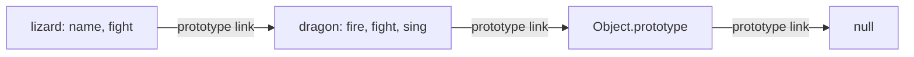

# Prototype Inheritance in JavaScript

JavaScript objects can inherit behavior from other objects. Each object has an internal prototype link (often written as `[[Prototype]]`). When a property is not found directly on an object, JavaScript looks for it on that object's prototype, then continues up the chain until it finds the property or reaches `null`.



## Inherited properties and shadowing

In `app.js`, `Object.create(dragon)` makes `dragon` the prototype of `lizard`. The lizard inherits `fire` and `sing`, while its own `name` and `fight` properties belong directly to `lizard`.

```js
const dragon = {
  fire: true,
  fight() {
    return 5;
  },
  sing() {
    return `I am ${this.name} the breather of fire!`;
  },
};

const lizard = Object.create(dragon);
lizard.name = "Kiki";
lizard.fight = function () {
  return 1;
};

lizard.fire; // true, inherited from dragon
lizard.sing(); // "I am Kiki the breather of fire!"
lizard.fight(); // 1, lizard's own method shadows dragon.fight
Object.getPrototypeOf(lizard) === dragon; // true
Object.hasOwn(lizard, "sing"); // false
Object.hasOwn(lizard, "fight"); // true
```

The inherited `sing` method uses the receiver as `this`, so `lizard.sing()` reads `lizard.name`. An own property with the same name as an inherited property takes precedence; this is called **shadowing**.

## Constructor functions and `.prototype`

The `.prototype` property on a constructor function is the object that instances created with `new` will inherit from. It is different from the constructor function's own prototype link:

```js
function Creature(name) {
  this.name = name;
}

Creature.prototype.describe = function () {
  return `I am ${this.name}.`;
};

const creature = new Creature("Mira");

Object.getPrototypeOf(Creature) === Function.prototype; // true
Object.getPrototypeOf(creature) === Creature.prototype; // true
creature.describe(); // "I am Mira."
```

`Creature` itself inherits function behavior from `Function.prototype`. The `creature` instance inherits `describe` from `Creature.prototype`.

```mermaid
flowchart TD
    C[Creature function] -->|prototype link| F[Function.prototype]
    I[creature instance] -->|prototype link| CP[Creature.prototype: describe]
    CP -->|prototype link| OP[Object.prototype]
    OP -->|prototype link| N[null]
    C -. .prototype property .-> CP
```

## Built-in prototype chains

Built-in objects use the same lookup mechanism. An array inherits array methods from `Array.prototype`, and `Array.prototype` inherits object methods from `Object.prototype`:

```js
const values = [];

Object.getPrototypeOf(values) === Array.prototype; // true
Object.getPrototypeOf(Array.prototype) === Object.prototype; // true
values.toString(); // inherited through the prototype chain
```

Use `Object.getPrototypeOf(value)` to inspect an object's prototype. `__proto__` is a legacy accessor; prefer `Object.getPrototypeOf` for reading and `Object.create` for setting up delegation.
