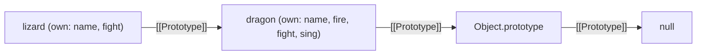
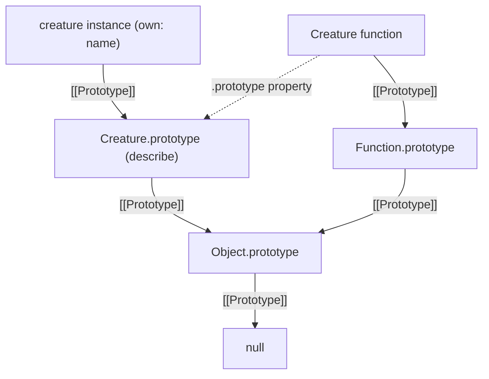

# JavaScript Prototype Inheritance

## The core idea

JavaScript uses **prototype-based inheritance**. An object can delegate property lookups to another object through its internal `[[Prototype]]` link. If a property is not found on the object itself, JavaScript checks its prototype, then that prototype's prototype, and so on until it finds the property or reaches `null`.

The prototype is not a copy of the object. Objects in the chain share access to properties and methods through delegation.

## Example: `lizard` inherits from `dragon`

This example follows the objects in `app.js` and `prototype_chain.js`. `Object.create(dragon)` is the preferred way to create an object whose prototype is `dragon`:

```js
const dragon = {
  name: "Tanya",
  fire: true,
  fight() {
    return 5;
  },
  sing() {
    if (this.fire) {
      return `I am ${this.name} the breather of fire!`;
    }
  },
};

const lizard = Object.create(dragon);
lizard.name = "Kiki";
lizard.fight = function () {
  return 1;
};

console.log(lizard.sing()); // "I am Kiki the breather of fire!"
console.log(lizard.fight()); // 1
console.log(lizard.fire); // true (inherited from dragon)

console.log(Object.getPrototypeOf(lizard) === dragon); // true
console.log(Object.hasOwn(lizard, "sing")); // false
console.log(Object.hasOwn(lizard, "fight")); // true
```



### What happens during lookup?

- `lizard.fire`: JavaScript does not find `fire` on `lizard`, so it finds `dragon.fire`.
- `lizard.fight()`: both objects have `fight`; the own property on `lizard` is found first and shadows `dragon.fight`.
- `lizard.sing()`: JavaScript finds `sing` on `dragon`, but the call receiver is still `lizard`. Therefore, inside `sing`, `this.name` is `"Kiki"` and `this.fire` is found on `dragon`.
- A missing property lookup continues to `Object.prototype` and then stops at `null`. If the property is not found anywhere, the result is `undefined`.

To inspect own versus inherited enumerable properties, as in `prototype_chain.js`:

```js
for (const property in lizard) {
  if (Object.hasOwn(lizard, property)) {
    console.log(`Own property: ${property}`);
  } else {
    console.log(`Inherited property: ${property}`);
  }
}
```

`for...in` visits enumerable properties from the object and its prototype chain. Use `Object.hasOwn(object, property)` when you specifically need to tell whether a property belongs directly to that object.

## Creating and inspecting prototype links

Prefer `Object.create()` when creating an object with a chosen prototype, and `Object.getPrototypeOf()` when inspecting the link:

```js
const child = Object.create(parent);
Object.getPrototypeOf(child) === parent; // true
```

The existing example also uses `lizard.__proto__ = dragon`. `__proto__` is a legacy accessor; prefer `Object.create()` for setup. The internal link is called `[[Prototype]]`; it is distinct from the `.prototype` property found on constructor functions.

## Constructor functions and `.prototype`

When a constructor is called with `new`, the new instance's `[[Prototype]]` is set to the constructor's `.prototype` object:

```js
function Creature(name) {
  this.name = name;
}

Creature.prototype.describe = function () {
  return `I am ${this.name}.`;
};

const creature = new Creature("Mira");

console.log(creature.describe()); // "I am Mira."
console.log(Object.getPrototypeOf(creature) === Creature.prototype); // true
```



Keep these two relationships separate:

- `creature`'s `[[Prototype]]` is `Creature.prototype`.
- `Creature` is itself a function object, so its `[[Prototype]]` is `Function.prototype`.
- `Creature.prototype` is an ordinary object that instances can inherit from.

## Built-in prototype chain

Arrays and functions also delegate to built-in prototype objects:

```js
const values = [];
function example() {}

Object.getPrototypeOf(values) === Array.prototype; // true
Object.getPrototypeOf(Array.prototype) === Object.prototype; // true
Object.hasOwn(Array.prototype, "toString"); // true
Object.getPrototypeOf(example) === Function.prototype; // true
Object.getPrototypeOf(Object.prototype) === null; // true
```

Array methods such as `map` and `toString` are found on `Array.prototype`. Methods such as `hasOwnProperty` are farther up the chain on `Object.prototype`.

## Interview recap

**What is the prototype chain?**  
It is the linked sequence of objects JavaScript searches when resolving a property. Lookup starts on the object and follows `[[Prototype]]` links until the property is found or the chain ends at `null`.

**What is shadowing?**  
An object's own property takes precedence over an inherited property with the same key. The inherited property is still on the prototype; it has not been overwritten.

**What is the difference between `[[Prototype]]` and `.prototype`?**  
`[[Prototype]]` is an object's internal link to its prototype. A constructor function's `.prototype` is the object that instances created with `new` will link to.

**Does inheritance copy methods onto the child?**  
No. The child can access inherited properties through delegation; they remain on the prototype unless the child defines its own property.

**How do you inspect a prototype safely?**  
Use `Object.getPrototypeOf(object)`. Use `Object.hasOwn(object, key)` to check whether a property is directly on the object.
