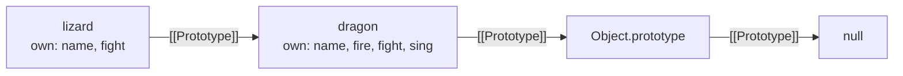
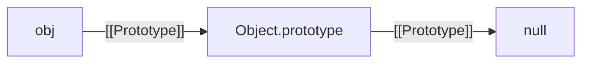
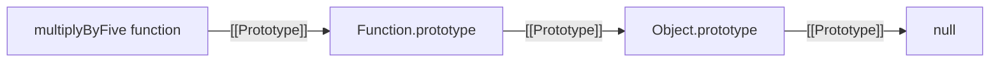
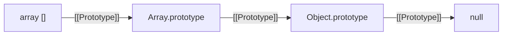

# JavaScript Prototype Inheritance

## 1) Core idea

JavaScript is built on prototype-based inheritance.

An object does not store all its methods and properties directly on itself. Instead, each object has an internal link called `[[Prototype]]`. When you read a property like `lizard.fire`, JavaScript first checks `lizard` itself. If it is not there, it moves to `lizard.__proto__`, then to that object's prototype, and continues upward until it reaches `null`.

This means inheritance works by delegation, not by copying:

- the child object gets access to parent properties
- the parent remains the source of truth
- the child can override behavior locally if needed

## 2) Simple example: `dragon` and `lizard`

This is the pattern from `prototype_chain.js`:

```js
let dragon = {
  name: "Tanya",
  fire: true,
  fight() {
    return 5;
  },
  sing() {
    if (this.fire) {
      return `I am ${this.name} the breather of fire!`;
    }
  },
};

let lizard = {
  name: "Kiki",
  fight() {
    return 1;
  },
};

lizard.__proto__ = dragon;

console.log(lizard.name); // "Kiki" (own property wins)
console.log(lizard.fire); // true (inherited from dragon)
console.log(lizard.fight()); // 1 (own method shadows parent)
console.log(lizard.sing()); // "I am Kiki the breather of fire!"
```

### What is happening?

- `lizard` has its own `name` and `fight`.
- It does not have `fire` or `sing`, so JavaScript searches the prototype chain.
- `dragon` has those properties, so they are accessible through inheritance.
- When `sing()` runs, `this` is still `lizard`, so `this.name` becomes `"Kiki"` even though the function was found on `dragon`.

This is called delegation.

## 3) Prototype chain diagram



In this chain:

- `lizard` looks for `fire` and finds it on `dragon`
- `lizard` looks for `sing` and finds it on `dragon`
- `lizard` looks for `toString` and eventually finds it on `Object.prototype`
- if nothing is found, the lookup ends at `null`

## 4) How JavaScript checks properties

JavaScript performs a lookup in this order:

1. check the object itself
2. check its prototype
3. keep moving upward through the prototype chain
4. stop at `null`

Example:

```js
console.log(lizard.__proto__); // dragon
console.log(lizard.__proto__.__proto__); // Object.prototype
console.log(lizard.__proto__.__proto__.__proto__); // null
```

## 5) Own property vs inherited property

The `for...in` loop iterates enumerable properties from the object and its prototype chain.

```js
for (let prop in lizard) {
  if (lizard.hasOwnProperty(prop)) {
    console.log(`Own property: ${prop}`);
  } else {
    console.log(`Inherited property: ${prop}`);
  }
}
```

This prints properties that are directly on `lizard` versus ones inherited from `dragon`.

Better modern version:

```js
for (const prop in lizard) {
  if (Object.hasOwn(lizard, prop)) {
    console.log(`Own property: ${prop}`);
  } else {
    console.log(`Inherited property: ${prop}`);
  }
}
```

### Key point

- `hasOwnProperty` checks only own properties
- inherited properties are not counted as direct properties

## 6) `__proto__` is a legacy way to set prototype

In the example, this line is used:

```js
lizard.__proto__ = dragon;
```

This works, but it is not the preferred modern way. A clearer and safer version is:

```js
const lizard = Object.create(dragon);
```

This creates an object whose prototype is `dragon` directly.

```js
const lizard = Object.create(dragon);
console.log(Object.getPrototypeOf(lizard) === dragon); // true
```

### Why `Object.create()` is better

- more explicit
- easier to read
- safer for learning and production code
- avoids direct mutation of the hidden prototype link

## 7) `Object.prototype` is the final stop

Everything in JavaScript eventually inherits from `Object.prototype` unless it is `null`.

```js
const obj = { name: "Sally" };

console.log(obj.hasOwnProperty("name")); // true
console.log(obj.hasOwnProperty("hasOwnProperty")); // false
```

Why does `obj.hasOwnProperty` work even though it is not an own property? Because it is inherited from `Object.prototype`.

Example chain:



## 8) Functions also have prototype chains

Functions are objects too, and they also sit in the prototype chain.

```js
function multiplyByFive(num) {
  return num * 5;
}

console.log(multiplyByFive(2)); // 10
console.log(multiplyByFive.__proto__); // Function.prototype
console.log(multiplyByFive.__proto__.__proto__); // Object.prototype
```

This chain looks like:



So functions inherit from `Function.prototype`, and `Function.prototype` inherits from `Object.prototype`.

## 9) Arrays also have prototype chains

```js
const array = [];

console.log(array.__proto__); // Array.prototype
console.log(array.__proto__.__proto__); // Object.prototype
```



That is why arrays can use methods like `map`, `filter`, `push`, and `length` even though those are not directly on the array object.

## 10) Object.create() example with parent object

```js
let human = {
  mortal: true,
};

let socrates = Object.create(human);
socrates.age = 45;

console.log(socrates.age); // 45
console.log(socrates.mortal); // true
console.log(human.isPrototypeOf(socrates)); // true
```

Here:

- `socrates` is a new object
- it inherits from `human`
- `human` is the prototype of `socrates`
- `human.isPrototypeOf(socrates)` returns `true`

## 11) Big picture summary

Prototype inheritance means:

- objects delegate property lookup to another object
- the parent object is in the prototype chain
- lookup continues upward until the property is found or `null` is reached
- own properties win over inherited ones
- methods and data can be shared without copying them onto every object

## 12) Quick interview answers

### What is a prototype chain?
It is the chain of linked objects that JavaScript checks when a property is not found on the current object.

### Why is prototype inheritance useful?
It avoids duplication and lets objects share behavior efficiently.

### What happens if a property is not found?
JavaScript keeps searching until it reaches `Object.prototype`, then `null`. If still not found, it returns `undefined`.

### What is shadowing?
When a child object defines a property with the same name as an inherited property, the child's own property takes priority.

### What is the difference between `[[Prototype]]` and `prototype`?
- `[[Prototype]]` is the internal prototype link of an object
- `.prototype` is a property on constructor functions used to define what instances inherit from

## 13) Final mental model

Think of prototype inheritance like this:

- every object has a parent link
- if you ask for a property and the object does not have it, JavaScript asks its parent
- if the parent does not have it, JavaScript asks the grandparent
- this continues until the chain ends

That is the heart of JavaScript inheritance.
