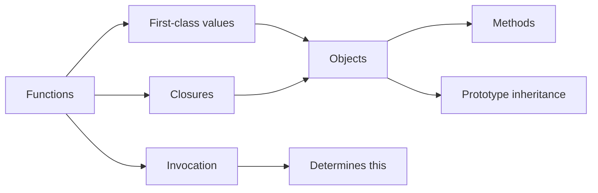
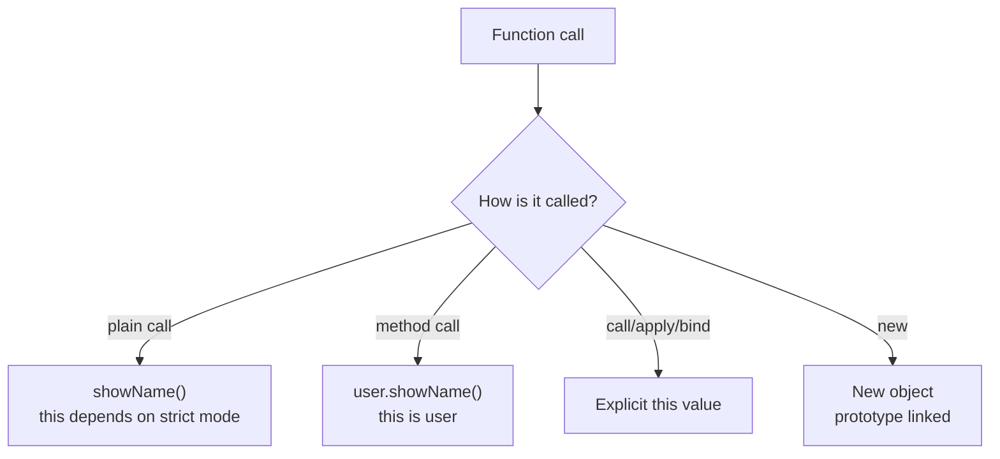
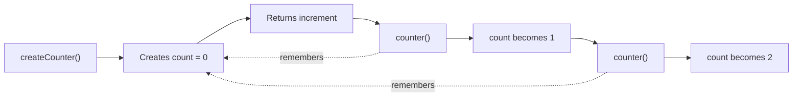
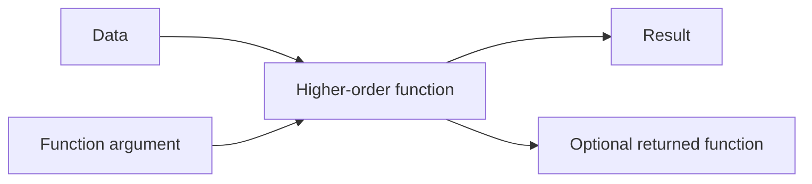
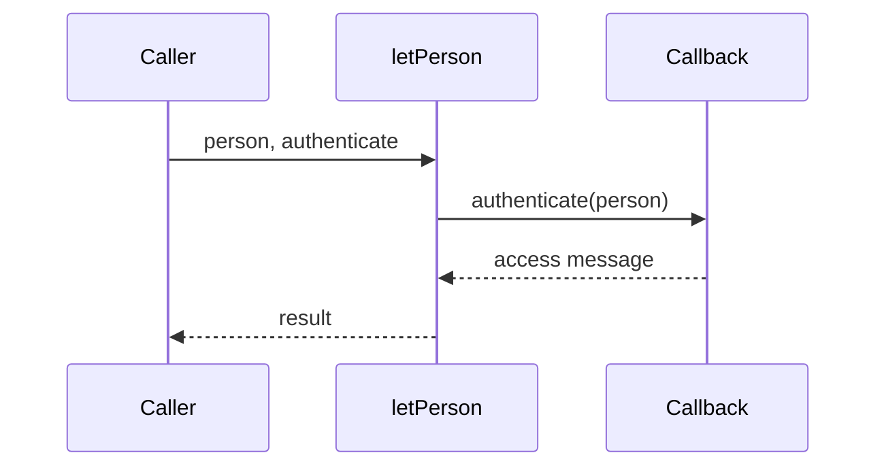
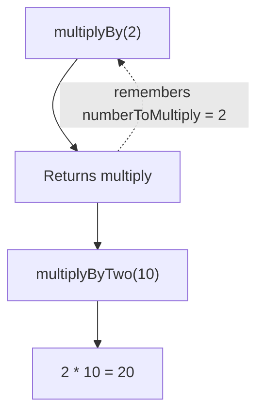
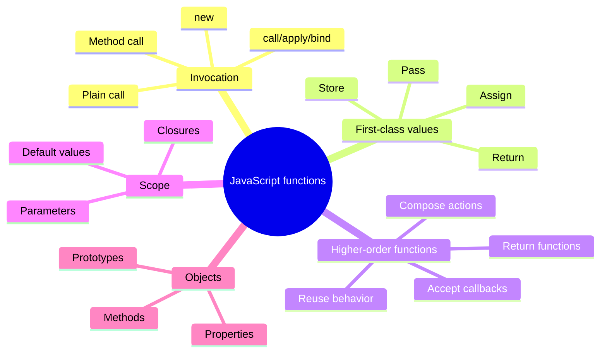

# The Two Pillars of JavaScript

JavaScript is often explained through two related ideas:

1. **Functions**: reusable behavior that can be called, passed around, and returned.
2. **Objects**: collections of data and behavior. Functions stored on objects are called methods.

Closures and prototype inheritance build on these two pillars.



## 1. Functions

A function is a reusable block of code. A function declaration can be called before its declaration because declarations are hoisted.

```js
sayHello();

function sayHello() {
  return "Hello";
}
```

### Function invocation

The way a function is invoked affects the value of `this`. A normal function also receives the `arguments` object automatically. Arrow functions do not create their own `this` or `arguments`.



#### 1. Plain function call

```js
function add(first, second) {
  return first + second;
}

add(2, 3); // 5
```

In strict mode, `this` is `undefined` in a plain function call. In non-strict mode, it is usually the global object.

```js
"use strict";

function inspectCall(value) {
  return {
    value,
    thisValue: this,
    argumentsCount: arguments.length,
  };
}

inspectCall("plain call");
```

#### 2. Method call

When a function is called through an object, the object before the dot becomes `this`.

```js
const user = {
  name: "Rohan",
  introduce() {
    return `Hi, I am ${this.name}`;
  },
};

user.introduce(); // "Hi, I am Rohan"
```

The call site matters. Assigning the method to a variable removes the object receiver:

```js
const introduce = user.introduce;

// In strict mode, this is undefined inside introduce.
introduce();
```

#### 3. `call`, `apply`, and `bind`

These methods let us choose the `this` value for a normal function.

```js
function describe(greeting, punctuation) {
  return `${greeting}, ${this.name}${punctuation}`;
}

const person = { name: "Maya" };

describe.call(person, "Hello", "!");
describe.apply(person, ["Welcome", "."]);

const describeMaya = describe.bind(person, "Hi");
describeMaya("!");
```

| Method  | Arguments                 | When the function runs               |
| ------- | ------------------------- | ------------------------------------ |
| `call`  | Comma-separated arguments | Immediately                          |
| `apply` | An array of arguments     | Immediately                          |
| `bind`  | Comma-separated arguments | Later, through the returned function |

#### 4. Constructor call with `new`

Calling a function with `new` creates an object, connects it to the function's prototype, binds `this` to the new object, and returns that object.

```js
function User(name) {
  this.name = name;
}

const firstUser = new User("Rohan");
firstUser.name; // "Rohan"
```

The `Function` constructor can create functions dynamically, but it is usually avoided because the code is evaluated at runtime and is harder to analyze safely.

```js
const returnFour = new Function("return 4");
const multiply = new Function("first", "second", "return first * second");

returnFour(); // 4
multiply(2, 3); // 6
```

### Functions are first-class values

In JavaScript, a function is data. It can be:

1. Assigned to a variable.
2. Stored as an object property.
3. Passed as an argument.
4. Returned from another function.

```js
// Assigned to a variable
const greet = function (name) {
  return `Hello, ${name}`;
};

// Stored as an object property
const actions = {
  greet,
};

// Passed as an argument
function run(action) {
  return action("Maya");
}

run(actions.greet); // "Hello, Maya"

// Returned from another function
function createCounter() {
  let count = 0;

  return function increment() {
    count += 1;
    return count;
  };
}

const counter = createCounter();
counter(); // 1
counter(); // 2
```

The returned `increment` function remembers `count` after `createCounter` has finished. This preserved surrounding state is a **closure**.



### Functions inside loops

Declare reusable functions outside a loop when the function does not depend on the current iteration. This avoids recreating the same function unnecessarily.

```js
function logIteration(iteration) {
  console.log(`Iteration ${iteration}`);
}

for (let iteration = 0; iteration < 5; iteration += 1) {
  logIteration(iteration);
}
```

When a callback needs the current loop value, `let` creates a new binding for each iteration:

```js
const callbacks = [];

for (let index = 0; index < 3; index += 1) {
  callbacks.push(() => index);
}

callbacks.map((callback) => callback()); // [0, 1, 2]
```

### Parameters and default values

An undeclared identifier causes a `ReferenceError`. Define the parameter and give it a default value when a fallback is appropriate.

```js
function getValue(value = 6) {
  return value;
}

getValue(); // 6
getValue(10); // 10
```

The default is used only when the argument is `undefined`, not for every falsy value:

```js
getValue(undefined); // 6
getValue(0); // 0
getValue(null); // null
```

## 2. Higher-Order Functions

A **Higher-Order Function (HOF)** is a function that does at least one of these things:

1. Accepts another function as an argument.
2. Returns another function as its result.

This works because JavaScript functions are first-class values.



### Why use a higher-order function?

Repeated functions often differ only in the data they use or the action they perform. Instead of writing one login function for every person, create a generic function and pass the changing values to it.

```js
// Repeated, specialized functions
function letAdamLogin() {
  return "Access Granted to Adam";
}

function letEvaLogin() {
  return "Access Granted to Eva";
}

// Generic behavior
const giveAccessTo = (name) => `Access Granted to ${name}`;

function letUserLogin(userName) {
  return giveAccessTo(userName);
}

letUserLogin("Eva"); // "Access Granted to Eva"
```

The generic version follows the **DRY** principle: the access message is defined once and reused with different data.

### Passing a function as an argument

In this example, `letPerson` receives both the person data and the function that should handle that person. The function passed as an argument is called a **callback**.

```js
function authenticate(person) {
  return `Access Granted to ${person.name}`;
}

function sing(person) {
  return `La la la, my name is ${person.name}`;
}

function letPerson(person, action) {
  return action(person);
}

letPerson({ level: "user", name: "Tim" }, authenticate);
// "Access Granted to Tim"

letPerson({ level: "admin", name: "Sally" }, sing);
// "La la la, my name is Sally"
```

`letPerson` controls **when** the callback runs, while the callback controls **what** happens to the person.



The callback can be selected dynamically:

```js
const person = { level: "admin", name: "Sally" };
const action = person.level === "admin" ? authenticate : sing;

letPerson(person, action);
```

### Returning a function

`multiplyBy` is also a higher-order function because it returns a function. The returned function remembers the value of `numberToMultiply`; this is a closure.

```js
function multiplyBy(numberToMultiply) {
  return function multiply(number) {
    return numberToMultiply * number;
  };
}

const multiplyByTwo = multiplyBy(2);
const multiplyByTen = multiplyBy(10);

multiplyByTwo(10); // 20
multiplyByTen(10); // 100
```



### A reusable HOF pattern

The same pattern appears throughout JavaScript APIs such as `map`, `filter`, and `reduce`: the method receives a callback and applies it to collection values.

```js
const numbers = [1, 2, 3, 4];

const doubled = numbers.map((number) => number * 2);
const evenNumbers = numbers.filter((number) => number % 2 === 0);
const total = numbers.reduce((sum, number) => sum + number, 0);

doubled; // [2, 4, 6, 8]
evenNumbers; // [2, 4]
total; // 10
```

### HOF checklist

- Does the function receive another function?
- Does the function return another function?
- What data is supplied to the callback?
- When and how many times is the callback called?
- Does the returned function close over surrounding variables?

## Quick summary



Keep these questions in mind when reading JavaScript:

- What function is being called?
- How is it being invoked?
- What will `this` refer to at that call site?
- Is the function being passed around as a value?
- Which variables can a returned function still access?
